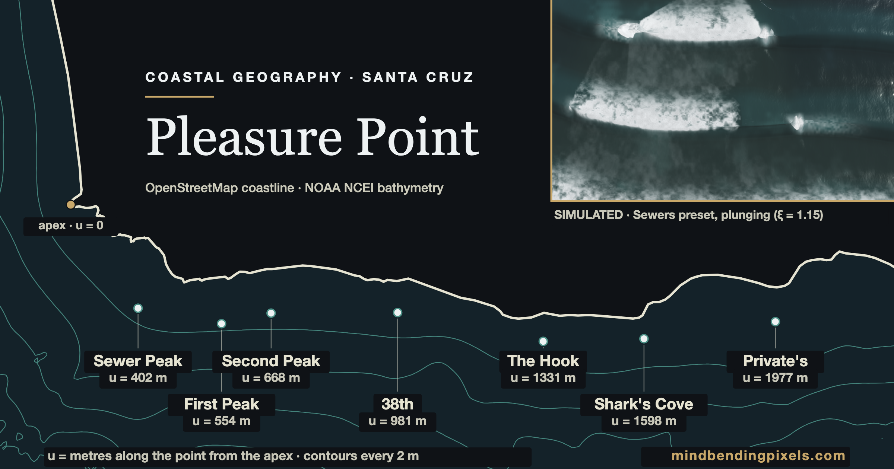

# pointbreak

A real-time model of the waves at Pleasure Point, a long point break on the east
side of Santa Cruz. Started 2026-08-09; it is early and unfinished.

[](https://mindbendingpixels.com/pleasurepoint/)

**Visual essay (live):** https://mindbendingpixels.com/pleasurepoint/ — the
geography, the data behind it, and the model embedded and labelled work in
progress.

## What this actually models

A *zipper*: a breaking point that travels along a crest, driven by a phase
running down an angled break line. On top of that, real survey data does the
following work:

- **Depth from a real seabed.** The NOAA NCEI 1/3 arc-second DEM is resampled
  onto each site's local frame; water depth is `(MSL + tide) − bed`.
- **Shoaling by Green's law**, `Ks = √(cg₀/cg)`, replacing a distance-based
  stand-in.
- **Depth-limited breaking**, `H = min(H₀·Ks, γh)` with γ ≈ 0.78 (McCowan).
  Depth decides *whether* a wave may break; the zipper still decides where the
  peel runs.
- **A shoreline**, as `max(bed, water)` — so the beach and cliff are a
  consequence of the data, not scenery. Cameras read the cliff height from the
  same terrain.
- **Coastline shape** from OpenStreetMap: the break line follows a cubic fit to
  the measured equal-elevation contour through each site's surf node.
- **Sets and lulls** from two beating spectral components, and section noise
  that breaks the crest into patches.
- **Tide** as a live control, which moves the breaking position while leaving
  the breaking *depth* fixed.

## What it does not model

This is the part worth reading before trusting anything it shows.

- **No fluid solver.** No Navier–Stokes, no Boussinesq, no shallow-water
  equations integrated. Nothing here conserves mass or momentum. It is a
  kinematic construction that produces wave-shaped motion.
- **Refraction is single-step Snell**, `sin φ_b = sin α · c_b/c₀`, not a ray
  trace: the crest field stays a plane wave so the zipper keeps its closed
  form. A depth-varying phase field (the eikonal Ψ bake) exists behind
  `#psi=1`, default off.
- **Peel angle is still authored per spot, and the authored numbers are the
  model's weakest input.** The break *line* is now emergent — the
  `H₀Ks ≥ γh` locus over the measured bed, default on — but each site's
  synthetic reef is fitted toward a target α that came from reading surf
  guides, not from any measurement. Checked against the refraction bound
  `sin α_max = c_b/c_s` (Henriquez 2004; `tests/peel-ceiling.test.js` runs it
  on this bank), **five of the seven authored targets exceed what this shelf
  can physically deliver at those spots' own breaking depths.** See
  `docs/research/SURF_SCIENCE_REFS.md` §2.3.2.
- **No currents, wind forcing, wave–wave interaction, swash or backwash.**
  (Wave setup/setdown — the set-driven shoreline breathe — is modelled.)
- **No validation, and none is currently possible from the literature.**
  Nothing has been compared against measured wave heights, breaking positions,
  or imagery of this break. Worse, as of a 2026-08-13 literature search there
  is **no published measured peel angle for any Santa Cruz break** — the USGS
  survey of this exact reef (OFR 2007-1270, whose camera ran for a year under a
  task named "Spatial and Temporal Variation in Breaking Wave Patterns") never
  computed one, and the 2025 Save The Waves study of 31 Santa Cruz breaks lists
  peel angle only as a template item for *future* assessments. The nearest thing
  to ground truth anywhere is one per-wave series at Raglan, NZ (Scarfe 2008) and
  one single-day estimate at an artificial reef (Cables, Perth, ~45°).
  "Looks plausible" is the entire claim.
- **Six of seven sites carry surveyed profiles.** Privates does not — its
  coastline defeats the cubic contour fit (16.5 m RMS), so it runs on a
  synthetic stage and says so in the app.
- **Deliberate exaggerations:** wave height is scaled ~3.2× against the terrain
  (true heights are near-invisible at landscape scale), and underwater sight
  distance is stretched well past Monterey Bay's real few metres.
- **The tidal datum is extrapolated.** MSL − NAVD88 = 0.905 m comes from NOAA
  CO-OPS 9413450 at Monterey, ~40 km away; the Santa Cruz gauge publishes no
  NAVD88 relationship.
- **"Today's ocean" is partial.** `web/` fetches CDIP and sets swell height and
  period. Direction and spectral width are not model inputs yet.

Do not use it for any decision about entering the water.

## The sites

Seven real Pleasure Point breaks, ordered apex → down-point, which is also the
gradient locals describe (bigger and faster toward the corner): **Sewers, First
Peak, Second Peak, Jack's (38th), The Hook, Sharks, Privates**. The preset bank
encodes that gradient twice — H₀ falls and authored peel angle rises down-point
— and the second half is now known to be misassigned: the measured coast
tangent is roughly constant down-point and the refraction bound *falls* as
waves get smaller, so the mellowing locals describe is sheltering (smaller,
weaker waves), not a slower peel. Retargeting the bank is open work
(`TODO.md` 1c'-c.7). The A-frame is a *parameter*, not a site — the wave that
demonstrates it is on Santa Cruz's west side.

## Layout

- `docs/MODEL.md` — the vehicle-independent parametrization (start here)
- `docs/research/` — data-access notes, surf-science citations, ground truth
- `docs/figures/` — the essay and its figure generators
- `data/osm/`, `data/bathy/` — raw pulls + processing (see each README)
- `data/climatology/` — transcribed surf-forecast.com break stats; a weak source, kept for provenance (see its README)
- `data/model/` — generated stage profiles and seabed patches read by both renderers
- `web/` — raymarched reference build (maintenance-only)
- `web-three/` — three.js displaced-grid build; the current vehicle
- `td/` — TouchDesigner build, not started

## Run it

No build step, plain ES modules:

```
cd pointbreak
python3 scripts/serve.py 8127
# http://localhost:8127/web-three/   (or /web/ for the raymarcher)
```

Use `scripts/serve.py`, not `python3 -m http.server`. The stdlib server sends no
`Cache-Control`, so Chrome heuristically caches ES modules across reloads and
you edit a file, reload, and see the old build — including import errors naming
exports that are present on disk. `scripts/serve.py` is the same server with
`no-store`.

Keys: `1`–`7` sites, `V` camera, `S` surfer, `C` cross-section, `M` audio,
`-` `+` wave size, `[` `]` tide, `D` condition day, `B` seabed mode,
`,` `.` move the section transect, `space` pause, `H` hide panels.

URL hash params drive the same build from outside:
`#preset=firstpeak&cam=cliff&section=1&bed=plane&tide=-0.5&hud=0`. The full
list — presets, condition days, quality tiers, and which flags are A/B reverts
vs gated features — is in [docs/CONTROLS.md](docs/CONTROLS.md).

```
npm test              # geo + depth model guards
npm run check:geo     # generated profiles match their sources
npm run check:depth   # generated seabed patches match theirs
```

## Status

`web-three/` is through M3 of `docs/WEB_THREE_SPEC.md` (shaded grid, pitching
lip, procedural surfer) plus the depth field described above. `web/` is the
depth-free reference raymarcher and stays that way. TouchDesigner not started.

The emergent break line and single-step refraction have since landed (default
on for mapped spots). Next, in rough order of how much they would change the
model: retargeting the authored peel angles inside the physics bound and
moving "mellow" into a sheltering field `H_eff(u)`, live CDIP direction, and a
contour representation flexible enough for Privates. See `TODO.md`.

## Related work

Most open surf tooling models **forcing** — what the ocean is doing offshore.
This models **transformation** — what one seabed does to that forcing. The two
compose rather than compete, and the forcing side is better solved elsewhere:

- [surfpy](https://github.com/mpiannucci/surfpy) (MIT, Python) — NDBC buoy data
  and WaveWatch III, with spectra and swell components. The natural source for
  the two things this model currently lacks: **swell direction**, which is why
  refraction is unmodelled, and **real spectral components**, since the two-
  component beat that produces sets here is invented rather than measured.
  Python fits our build-time pattern (a script emitting a generated data file,
  like `data/model/build_geo_profiles.py`), not the browser runtime.
  *Assessed from its module listing, not its internals — it shows no shoaling
  or breaking module, but that is not a careful reading of `wavemodel.py`.*
- [spitcast-api-docs](https://github.com/jackmullis/spitcast-api-docs) —
  California spot forecasts including Santa Cruz, NOAA-derived. Useful as a
  comparison reference; **no declared licence** and its own docs say uptime is
  not guaranteed, so not something to depend on.
- [Meta Surf Forecast](https://github.com/swellnet/meta-surf-forecast) —
  aggregates buoys and forecast sources.
- [Surfline's Pleasure Point cam](https://www.surfline.com/surf-report/pleasure-point/5842041f4e65fad6a7708807)
  — the visual ground truth `docs/WEB_THREE_SPEC.md` grades renders against.

The academic prior art the model actually derives from (Walker's peel angle,
Mead & Black's bathymetric components, Hutt's skill bands, Battjes' Iribarren
thresholds, McCowan's breaker index) is cited in `docs/MODEL.md`.

**On measurement**, the gap and the route to closing it
(full citations and verbatim-checked quotes in
`docs/research/SURF_SCIENCE_REFS.md` §2.3.1–2.3.2):

- No peel angle has ever been measured at a Santa Cruz break. The only
  published per-wave series at any point break is Raglan, NZ — α running
  0→69° within one eight-second ride, non-closeout mean ≈ 48°
  (Scarfe 2008 PhD, Waikato; Scarfe, Healy & Rennie 2009, *JCR* 25(3)).
- The refraction ceiling on a planar reef component,
  `sin α_max = c_b/c_s`, follows from Snell (Henriquez 2004, TU Delft MSc);
  Mead (2001, PhD, Waikato) gives the mechanism — enlarging a
  fixed-orientation wedge *increases* refraction before breaking and lowers
  the peel. `tests/peel-ceiling.test.js` evaluates the bound on this model's
  own dispersion code.
- The nearest engineering prior art is **modelled, not measured**: Integral
  Consulting (2023), *Topanga Surf Quality Impact Assessment Report* (Appendix
  B of M&N's *Shoreline Morphology Analyses*, Topanga Lagoon Restoration DEIR,
  SCH 2022050478) — XBeach 2D nonhydrostatic, 5 ft grid, α extracted per
  breaking wave over 35 min and reported as an alongshore profile. Validated
  only qualitatively, against a surfer focus group. Its section-averaged α runs
  **31–53° across twelve scenarios**, corroborating the Snell bound above and
  sitting well below this model's authored 58–70° targets. See
  `docs/research/TOPANGA_PEEL_ANGLE_2023.md`.
- Two modern methods measure peel angle from camera imagery: Wave Peel
  Tracking (Thompson, Zelich, Watterson & Baldock 2021, *Remote Sensing*
  13(17):3372) and CNN breakpoint+crest detection (Atkin, McIntosh & Bryan,
  ICCE 2022, ~1.6 M detections at Manu Bay). Both need a *frame sequence*.
- USGS OFR 2007-1270 ran a camera on this reef for a year (2006–07) and holds
  **30,317 8-megapixel stills** across five named Pleasure Point scenes plus
  **12,744 timex/variance video averages**, alongside a 14 m AWAC and a
  dedicated interferometric swath survey far finer than the 10 m DEM this
  model uses. The video products are 10-minute *averages*, so they suit
  breaking-position validation rather than peel angle; the **stills** are the
  peel-angle route, since one rectified oblique frame shows both the
  whitewater edge and the crest. The report is a description — its data files
  are obtained by contacting the project chief at USGS Pacific Science Center,
  not by download. Inventory and caveats: `docs/research/SURF_SCIENCE_REFS.md`
  §2.3.1.

## Licence

Code, docs and figures: **MIT** ([LICENSE](LICENSE)).

The data is not uniformly MIT and cannot be — the OpenStreetMap-derived files
carry ODbL's share-alike obligation. [LICENSES.md](LICENSES.md) gives the
file-by-file split: MIT for code/writing/renders, ODbL 1.0 for the OSM-derived
database files, public domain for the NOAA NCEI bathymetry, MIT for vendored
three.js.
