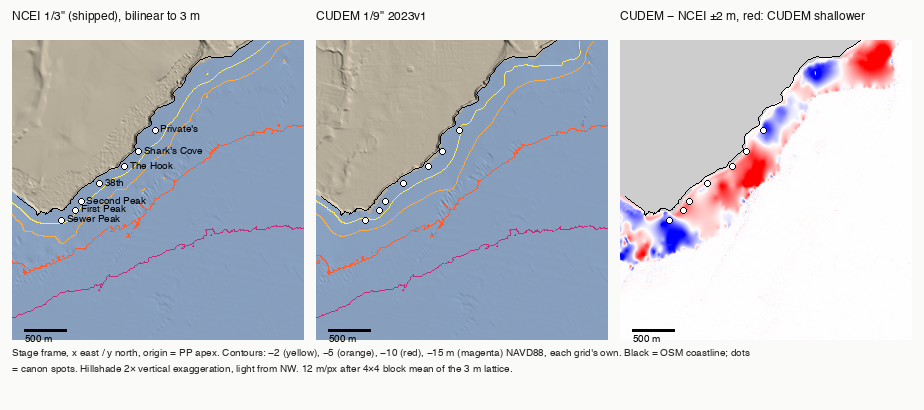

# Bathymetry sources for the Pleasure Point reef — survey, acquisition, comparison

*2026-09-01. Companion to `PP_MAP_GEOMETRY.md` (Seafloor), `MODEL.md` §2.6.3
(`N_ref`), `data/bathy/README.md`. Nothing here changes a runtime code path or
`pp_bathy.json`.*

## Why

The model's shelf is the NOAA NCEI Monterey Bay 1/3 arc-second DEM (~10 m
posts). The repo's own finding is that 10 m cannot resolve the contour
obliquity that sets the peel (0.31–0.93 m elevation residual → 22–70 m
break-crossing displacement; branch selection flipping on a criterion at
0.1–0.7 % of scale), and separately that the committed subset ends at
y = −682 m so the 15 m contour — where CDIP MOP SC116 sits — is off-grid for
the up-point spots. The only finer source the repo knew was USGS OFR
2007-1270, a data request. `data/bathy/README.md` also said no 1/9 arc-second
CUDEM tile existed here (2026-08-09). Both claims were re-checked against live
catalogues.

## 1. Candidates, verified

Every URL below was fetched on 2026-09-01; metadata values are quoted from the
source's own metadata file, not from memory.

### 1a. USGS California Seafloor Mapping Program (CSMP), Data Series 781 — 2 m swath grids

Pleasure Point is **not** in "Offshore of Santa Cruz". That block's bathymetry
metadata (`Bathymetry_OffshoreSantaCruz_metadata.txt`, at
https://cmgds.marine.usgs.gov/catalog/pcmsc/SeriesReports/DS_DDS/DS_781/XMLs_on_ScienceBase/F7TM785G_OffshoreSantaCruz/Bathymetry_OffshoreSantaCruz_metadata.txt)
gives `East_Bounding_Coordinate: -122.00`; the apex is at −121.976, 2.1 km
east of that edge. It is in **"Offshore of Aptos"** (−122.00…−121.80,
36.84…37.00). Data catalog page, with download links and metadata in
txt/xml/html/faq:
https://cmgds.marine.usgs.gov/data/csmp/OffshoreAptos/data_catalog_OffshoreAptos.html

| Product | Instrument, year | Grid | Datum | Size | Covers the reef? |
|---|---|---|---|---|---|
| `BathymetryA_USGS_OffshoreAptos.zip` | USGS 234 kHz SEA SWATHplus interferometric sidescan, 2009 | 2 m, 9047×9101, NAD83 / UTM 10N (EPSG:26910) | **NAVD88** m (`Altitude_Datum_Name`) | 108.1 MB zip, 334 MB TIFF float32 | Offshore only: "from about the 10-m isobath to beyond the 3-nautical-mile limit" |
| `BathymetryB_CSUMB_OffshoreAptos.zip` | CSUMB Seafloor Mapping Lab Reson 8101 multibeam, 2006 | 3 m, 5870×5943, same CRS | NAVD88 m | 2.7 MB zip, 142 MB TIFF | **No** — zero valid cells in the PP window |

Accuracy statements (both): horizontal "no less than 2 m", vertical "no less
than 20 cm". Licence (`Use_Constraints`): "USGS-authored or produced data and
information are in the public domain … marked with a Creative Commons CC0 1.0
Universal License." Attribution to USGS PCMSC requested. Data release DOI
10.5066/F7K35RQB (DataCite, verified); catalog DOI 10.3133/ds781 and companion
OFR 2016-1025 (CrossRef, verified). Field campaign: USGS DS 514
(doi:10.3133/ds514, verified). Bib keys: `dartnell2015aptosbathy`,
`cochrane2016aptos`, `cochrane2016santacruz`, `ritchie2010ds514`.

The Santa Cruz block (`Bathymetry_OffshoreSantaCruz.zip`, 127.2 MB) was not
downloaded: it does not reach the reef.

### 1b. CSUMB Seafloor Mapping Lab — offline

https://csumb.edu/undersea/sfml-data-library/ states "The SFML Library archive
is off-line. Please contact cbretz@csumb.edu with all data requests." The
legacy CSMP catalog page http://seafloor.otterlabs.org/csmp/csmp_datacatalog.html
still answers 200 but its links point back to `seafloor.csumb.edu`. The CSUMB
grid that matters here is redistributed by USGS as BathymetryB above, and it
does not cover the point. Not pursued further; a request would be email, which
this task does not send.

### 1c. NOAA NCEI CUDEM 1/9 arc-second — **exists here**

The bulk index https://chs.coast.noaa.gov/htdata/raster2/elevation/NCEI_ninth_Topobathy_2014_8483/CA/
lists 40 California tiles, including
`ncei19_n37x00_w122x00_2023v1.tif` (−122.00…−121.75, 36.75…37.00), which
contains every canon spot. File header (read over HTTP):
8112×8112 float32, nodata −9999, CRS `NAD83 + NAVD88 height` (EPSG:5498 =
4269 + 5703), 3.0864e-5° cells (≈2.75 × 3.43 m at 37° N), 202,085,134 bytes,
Last-Modified 2024-01-10. The NCEI DEM-extents feature service
(https://services2.arcgis.com/C8EMgrsFcRFL6LrL/arcgis/rest/services/ncei_dem_extents/FeatureServer/0)
queried at (−121.97, 36.955) returns the CUDEM 1/9" layer with
`VERTICAL_DATUM: NAVD88`, plus the two Monterey 1/3" DEMs (NAVD88 and MHW
editions) and nothing else finer than 1/3". So **the 2026-08-09 README claim is
wrong today**; whether it was wrong then or the tile was added since cannot be
told from the file (the name says 2023v1, the object date is 2024-01-10).

The dataset-level ISO metadata
(https://chs.coast.noaa.gov/htdata/raster2/elevation/NCEI_ninth_Topobathy_2014_8483/ncei_nintharcsec_dem_m8483_met_forHumans.html)
gives sources only generically — "NOAA Office of Coast Survey, NOAA National
Geodetic Survey, NOAA Office for Coastal Management, U.S. Geological Survey,
and the U.S. Army Corps of Engineers" — and the tile index shapefile carries
only `location, srs, MissionID, URL`. **What fed the surf zone of this tile is
not stated anywhere found.** DOI 10.25921/ds9v-ky35 (DataCite, verified);
methods paper Amante et al. 2023 (CrossRef, verified). Bib keys:
`cires2014cudem`, `amante2023cudem`. Licence: "Not subject to copyright
protection within the United States." Not for navigation.

### 1d. Wider 1/3 arc-second NCEI subset

Same THREDDS endpoint as the shipped subset, indices from the file's
GeoTransform (lat i = (φ − 35.699953703705)/9.259259e-05, lon
j = (λ + 122.420046296295)/9.259259e-05):
`Band1[13284:1:13770][4536:1:5292]` = 36.930…36.975 N, −122.00…−121.93 E,
487×757, 3.2 MB ASCII, fetched in 1.8 s. Seaward edge on the stage frame is
now y = −2679 m (was −682 m).

## 2. What was acquired and where it lives

| Path | What | Committed |
|---|---|---|
| `data/bathy/bathy_subset_wide.ascii` | widened NCEI 1/3" pull | yes |
| `data/bathy/pp_bathy_ncei13_wide.json` | the above on the stage frame, native lattice (8.2 × 10.3 m) | yes, 2.4 MB |
| `data/bathy/candidates/csmp_aptos/BathymetryA_USGS_OffshoreAptos_pp_clip.tif` | 2 m grid windowed to −122.0001…−121.930 × 36.930…36.975 (2530×3148), 15.4 MB | **no — gitignored.** Null at every canon spot, so a negative result; `candidates/csmp_aptos/README.md` keeps the recipe and the coverage numbers |
| `data/bathy/candidates/csmp_aptos/raw/` | both zips + extracted TIFFs (577 MB) | **gitignored** |
| `data/bathy/candidates/ncei_cudem19/ncei19_n37x00_w122x00_2023v1_pp_clip.tif` | CUDEM tile windowed to the same box (1458×2271), fetched by HTTP range requests through GDAL `/vsicurl/` — the full 202 MB tile was never downloaded | yes, 11.0 MB |
| `data/bathy/pp_bathy_cudem19.json` | the CUDEM clip resampled (bilinear) onto a 3 m stage lattice, x −300…3201, y −1500…2100 | yes, 8.9 MB |
| `data/bathy/pp_bathy_csmp_aptos.json` | the CSMP clip on the same lattice (8.4 MB); `build_candidate_grids.py csmp` regenerates it from the clip | **no — gitignored**, same reason. The CSMP columns in §6 were produced from it before it was dropped |
| `data/bathy/stage_frame.py` | projection + parser + sampler factored out of `process_bathy.py`; `process_bathy.py` still reproduces `pp_bathy.json` byte-for-byte (checked with `cmp`) | yes |
| `data/bathy/build_candidate_grids.py`, `compare_candidates.py` | builder (rasterio venv) and comparison (stdlib + numpy) | yes |

Each `candidates/<source>/README.md` records provenance, URL, fetch date,
datum, resolution, licence. No login, account or terms acceptance was needed
for anything fetched.

## 3. Datums — checked, not assumed

All three sources declare NAVD88. That was tested on the 3 m stage lattice:

| Pair | overlapping cells | mean diff (m) | RMS (m) | note |
|---|---:|---:|---:|---|
| CSMP 2 m − NCEI 1/3" | 790,593 | −0.001 | 0.076 | RMS 0.049 deeper than 15 m |
| CUDEM − CSMP | 790,593 | +0.006 | 0.071 | a ±2-cell shift test has its minimum at (0,0): registration is right |
| CUDEM − NCEI, deeper than 15 m | 370,990 | +0.005 | 0.018 | same lineage offshore |
| CUDEM − NCEI, −10…−5 m | 223,870 | +0.19 | 0.71 | the two DEMs part company in the surf zone |
| CUDEM − NCEI, −5…−2 m | 69,081 | +0.26 | 1.14 | |

No vertical shift applied. Horizontal: the stage frame is OSM/WGS84; CSMP and
CUDEM are NAD83 (~1 m apart here), not corrected — below every post spacing in
play. MSL sits 0.905 m above NAVD88 (CO-OPS 9413450) as elsewhere in the repo;
"the h m contour" below means elev_NAVD88 = −h.

## 4. Results on the stage frame

Full tables from `python3 data/bathy/compare_candidates.py` are appended in
§6. The summary:

**Coverage.** CSMP 2 m has no data at any canon spot; its nearest valid cell
is 325–565 m seaward, at −6.3 to −10.6 m. It is a check on the 10–30 m shelf
and nothing more. CUDEM covers everything, land included. The wide NCEI grid
reaches the 15 m contour at six of seven spots (the seventh, the Hook, traps
the walker in a closed low at −6.4 m, 485 m out, on both NCEI grids).

**Per-spot elevation (m NAVD88).**

| Spot | NCEI 1/3" (shipped) | NCEI wide | CUDEM 1/9" | CSMP 2 m | CUDEM − NCEI |
|---|---:|---:|---:|---:|---:|
| Sewer Peak | −1.53 | −1.54 | −2.86 | — | −1.33 |
| First Peak | −1.65 | −1.66 | −0.47 | — | +1.18 |
| Second Peak | −1.30 | −1.30 | −0.40 | — | +0.90 |
| 38th | −0.91 | −0.91 | −0.53 | — | +0.38 |
| The Hook | −0.74 | −0.74 | −0.10 | — | +0.64 |
| Shark's Cove | −0.69 | −0.69 | −0.10 | — | +0.59 |
| Private's | −0.52 | −0.53 | −1.69 | — | −1.17 |

The differences (0.4–1.3 m) are larger than the 0.31–0.93 m residual the
model already flags, and they are not one-signed: the CUDEM is deeper at
Sewers and Private's, shallower everywhere between. `PP_MAP_GEOMETRY.md`
finding 1 (the reef gets monotonically shallower down-point, −1.66 → −0.53 m)
**does not survive** the finer grid: on CUDEM it runs −2.86, −0.47, −0.40,
−0.53, −0.10, −0.10, −1.69. The Hook and Shark's Cove spot nodes sit at −0.1 m
NAVD88 on CUDEM — essentially MLLW — which is a reef that dries at low water.

**Seaward normal at the 10 m contour** (contour walk from each spot, ±40 m
boxcar, 5 m steps, bearing of −∇z at the stop):

| | NCEI shipped | NCEI wide | CUDEM |
|---|---|---|---|
| range, spots reached | 142.3–157.9° (6/7) | 143.1–158.0° (6/7) | 136.3–177.4° (6/7) |
| within 142–150° | 5 (38th at 158) | 5 | 1 (Private's, 148.7) |

Two things. First, this re-implementation gives 142–158° on the shipped grid
where MODEL.md §2.6.3 records 144.9–148.9°; that estimator's code was never
committed, so the ±6° it quoted is confirmed as real estimator spread, not
data. Second, the finer grid makes the walk *less* stable, not more
(136–177°): with real surf-zone structure under it the downhill path from a
spot no longer heads straight for the shelf. `N_ref = 146°` remains a
defensible 10 m figure on the NCEI grid at five of seven spots and is not
contradicted by CUDEM (Private's 148.7°), but it is not confirmed by it either.

**Seaward normal at the 15 m contour**, now reachable: NCEI wide
148.4–182.8° (6/7), CUDEM 130.4–173.2° (6/7), walks of 900–1570 m. The two
grids agree at Sewers (164/167), Second Peak (156/154), 38th (148/146) and
Private's (173/173) and disagree wildly at First Peak (183 vs 130). The 15 m
contour normal at this point is scattered over 35° by spot in both grids —
the contour is not coast-parallel out there — so "pin `N_ref` at 15 m" is not
a matter of a wider grid; it needs a different estimator (a fitted contour
segment, not a walk endpoint). The MODEL.md caveat that the 15 m readings
"may exceed ~157°" is now measured: three of six NCEI readings do.

**Breaking-depth contour (the one that sets the peel), h = 2 and 3 m:**

| Spot | coast normal | NCEI ±40 m @2/@3 | CUDEM ±40 m @2/@3 | CUDEM ±12 m @2/@3 |
|---|---:|---|---|---|
| Sewer Peak | 187° | 169 / 173 | 189 / 190 | 189 / 194 |
| First Peak | 123° | 132 / 133 | 138 / 141 | 139 / 142 |
| Second Peak | 133° | 135 / 136 | 124 / 130 | 124 / 130 |
| 38th | 147° | 137 / 134 | 151 / 151 | 151 / 151 |
| The Hook | 135° | 142 / 142 | 158 / 159 | 159 / 159 |
| Shark's Cove | 125° | 129 / 133 | 118 / 117 | — |
| Private's | 124° | 125 / 126 | 95 / 122 | 82 / 124 |

Grid-to-grid differences of 6–20° at six spots (Private's @2 m is a 30°
outlier in a closed pool). The whole peel-direction signal in MODEL.md is
4–8°. **So the finer data changes the breaking-depth contour orientation by
more than the signal being modelled, at every spot.** Smoothing width barely
matters on CUDEM (≤4° except Private's @2 m), so this is the surface, not the
filter.

**Shore-normal slope, 0–400 m:** NCEI 1:49–1:72, CUDEM 1:47–1:75; the same
spot moves by up to a factor 1.5 (Hook 1:51 → 1:75, Sewers 1:72 → 1:51). The
10 m and 15 m crossing distances agree within ~30 m on every grid (the CSMP
"d(−10)" values are where its data starts, not a crossing). No grid shows a
step larger than 1.6 m per 10 m in the first 600 m; the largest steps in NCEI
(1.1–1.5 m at 10 m or 450 m) are cliff-foot and outer-shelf edges that CUDEM
places at the same distances.

**Reef structure — does the finer grid show what 10 m smooths away?**

- Alongshore, at 60 m from the OSM coastline (u = 300–2100 m, 3 m steps),
  the 6–60 m-scale high-pass RMS is **0.133 m on CUDEM vs 0.041 m on NCEI**
  (3.2×); the raw alongshore range is 2.08 vs 0.95 m. At 100 m: 0.177 vs
  0.074 (2.4×); at 150 m: 0.205 vs 0.133 (1.5×); at 250 m they cross
  (0.229 vs 0.315). The take-off zone has alongshore texture at the 6–60 m
  scale in CUDEM that the 2012 DEM does not have.
- In 300 m disks around the spots, submerged cells only, the 2–80 m
  roughness (grid minus its own ±40 m boxcar) is 0.15–0.30 m on CUDEM
  against 0.11–0.32 m on NCEI: 1.4× at Sewers and First Peak, equal
  down-point. Yet RMS(CUDEM − NCEI) in the same disks is 0.56–1.44 m (p95
  1.0–2.6 m). The two grids therefore differ mostly at scales *longer* than
  80 m — a differently shaped surf-zone surface, not extra grain.
- The CUDEM − NCEI map (figure, right panel) is coherent, not speckle: a
  red band (CUDEM shallower, up to +2 m) hugs the inner reef from First Peak
  through 38th to Shark's Cove; a blue patch (CUDEM deeper) sits over Sewers
  and the apex, with blue again seaward of the Hook–Shark's stretch and at
  Private's. Patches are 100–300 m across — a differently shaped flat and
  edge, not the 2012 DEM's smooth 1:50 ramp with grain added.

So: the finer grid *does* show reef structure the 10 m grid lacks — a
shallower flat, a sharper outer edge, 2–3× the alongshore texture in the
take-off zone — and it changes the breaking-depth contour orientation by more
than the modelled signal. What it cannot do is arbitrate: the 2012 DEM had, as
far as its lineage shows, no surf-zone soundings here at all (the swath
surveys stop at ~10 m), and the CUDEM's surf-zone source is undocumented at
the tile level. Two unvalidated surfaces disagreeing by ~1 m is a resolution
finding, not a truth.

## 5. Consequences for the repo

1. `data/bathy/README.md` corrected: a 1/9" CUDEM tile covers the point.
2. The 15 m contour is now on-grid (`pp_bathy_ncei13_wide.json`). It does
   not rescue `N_ref`: at 15 m the walk estimator scatters 35° across spots
   on both grids. Pinning `N_ref` needs a contour-segment fit, and MODEL.md's
   "deep water is unreachable" argument (which needs N_ref < ~157°) is now
   genuinely in question at three of six NCEI 15 m readings.
3. The CUDEM grid is the candidate for `bed.js` if the reef is ever to be
   resolved — same datum, same frame, 3 m, and a 9 MB JSON already in the
   schema `pp_bathy.json` uses. Wiring it is a deliberate model change (the
   spot depths move by up to 1.3 m and the breaking contours rotate 6–20°),
   so it is recorded here and **not** done.
4. USGS OFR 2007-1270 (Storlazzi et al.) remains the only source that would
   put *surveyed* soundings under the break; the request stands as described
   in `SURF_SCIENCE_REFS.md`.
5. CSMP 2 m is not useful for this reef beyond confirming the offshore datum
   (−0.001 m mean against NCEI) — and confirming that the 2012 DEM and the
   CUDEM both inherit it offshore.

## 6. Full comparison output

`python3 data/bathy/compare_candidates.py`, 2026-09-01. Section numbers below
are the script's own.

## 1. Node elevation at the canon spots (m NAVD88, bilinear)

| Spot | u (m) | NCEI 1/3" (shipped) | NCEI 1/3" wide | CUDEM 1/9" | CSMP 2 m |
|---|---:|---:|---:|---:|---:|
| Sewer Peak | 402 |   -1.53 |   -1.54 |   -2.86 |       — |
| First Peak | 554 |   -1.65 |   -1.66 |   -0.47 |       — |
| Second Peak | 668 |   -1.30 |   -1.30 |   -0.40 |       — |
| 38th | 981 |   -0.91 |   -0.91 |   -0.53 |       — |
| The Hook | 1331 |   -0.74 |   -0.74 |   -0.10 |       — |
| Shark's Cove | 1598 |   -0.69 |   -0.69 |   -0.10 |       — |
| Private's | 1977 |   -0.52 |   -0.53 |   -1.69 |       — |

## 2. Seaward normal at the 10 m contour (elev = -10), contour walk, +/-40 m boxcar

| Spot | NCEI 1/3" (shipped) bearing / walk m | NCEI 1/3" wide bearing / walk m | CUDEM 1/9" bearing / walk m | CSMP 2 m bearing / walk m |
|---|---|---|---|---|
| Sewer Peak | 142.3° / 415 | 143.1° / 415 | 163.2° / 460 | — (off-grid/nodata at 0 m, z —) |
| First Peak | 143.8° / 410 | 143.8° / 410 | 158.0° / 415 | — (off-grid/nodata at 0 m, z —) |
| Second Peak | 146.0° / 445 | 146.1° / 445 | 158.5° / 480 | — (off-grid/nodata at 0 m, z —) |
| 38th | 157.9° / 615 | 158.0° / 615 | 177.4° / 570 | — (off-grid/nodata at 0 m, z —) |
| The Hook | — (trapped in a low at 485 m, z -6.4) | — (trapped in a low at 485 m, z -6.4) | 136.3° / 610 | — (off-grid/nodata at 0 m, z —) |
| Shark's Cove | 147.9° / 785 | 147.9° / 785 | — (trapped in a low at 670 m, z -7.8) | — (off-grid/nodata at 0 m, z —) |
| Private's | 149.7° / 675 | 149.7° / 675 | 148.7° / 675 | — (off-grid/nodata at 0 m, z —) |
| **range (reached)** | 142.3–157.9° (6/7) | 143.1–158.0° (6/7) | 136.3–177.4° (6/7) | — |

## 2. Seaward normal at the 15 m contour (elev = -15), contour walk, +/-40 m boxcar

| Spot | NCEI 1/3" (shipped) bearing / walk m | NCEI 1/3" wide bearing / walk m | CUDEM 1/9" bearing / walk m | CSMP 2 m bearing / walk m |
|---|---|---|---|---|
| Sewer Peak | 164.2° / 900 | 164.2° / 900 | 167.4° / 890 | — (off-grid/nodata at 0 m, z —) |
| First Peak | 182.8° / 940 | 182.8° / 940 | 130.4° / 925 | — (off-grid/nodata at 0 m, z —) |
| Second Peak | 156.1° / 1010 | 156.1° / 1010 | 153.5° / 1040 | — (off-grid/nodata at 0 m, z —) |
| 38th | 148.5° / 1130 | 148.4° / 1130 | 145.6° / 1115 | — (off-grid/nodata at 0 m, z —) |
| The Hook | — (trapped in a low at 485 m, z -6.4) | — (trapped in a low at 485 m, z -6.4) | 161.6° / 1175 | — (off-grid/nodata at 0 m, z —) |
| Shark's Cove | 176.6° / 1455 | 176.7° / 1455 | — (trapped in a low at 670 m, z -7.8) | — (off-grid/nodata at 0 m, z —) |
| Private's | 173.2° / 1570 | 173.2° / 1570 | 173.2° / 1560 | — (off-grid/nodata at 0 m, z —) |
| **range (reached)** | 148.5–182.8° (6/7) | 148.4–182.8° (6/7) | 130.4–173.2° (6/7) | — |

## 3. Shore-normal transect from the OSM coast point through each spot

| Spot | grid | z@100 | z@200 | z@300 | z@400 | slope 0–400 m | d(-10 m) | d(-15 m) | steepest 10 m step, 0–600 m |
|---|---|---:|---:|---:|---:|---:|---:|---:|---:|
| Sewer Peak | NCEI 1/3" (shipped) | -1.3 | -2.7 | -4.0 | -5.8 | 1:72 | 607 | 1058 | 0.35 m @ 600 m |
| Sewer Peak | NCEI 1/3" wide | -1.3 | -2.7 | -4.0 | -5.8 | 1:72 | 607 | 1058 | 0.35 m @ 600 m |
| Sewer Peak | CUDEM 1/9" | -2.4 | -4.4 | -6.0 | -7.5 | 1:51 | 608 | 1058 | 0.49 m @ 60 m |
| Sewer Peak | CSMP 2 m | — | — | — | — | — | 603 | 1057 | 0.79 m @ 600 m |
| First Peak | NCEI 1/3" (shipped) | -1.5 | -3.5 | -5.6 | -7.6 | 1:49 | 533 | 1158 | 1.16 m @ 10 m |
| First Peak | NCEI 1/3" wide | -1.5 | -3.5 | -5.6 | -7.6 | 1:49 | 533 | 1157 | 1.13 m @ 10 m |
| First Peak | CUDEM 1/9" | -0.3 | -2.8 | -5.2 | -7.3 | 1:47 | 558 | 1156 | 0.34 m @ 20 m |
| First Peak | CSMP 2 m | — | — | — | — | — | — | 1150 | — |
| Second Peak | NCEI 1/3" (shipped) | -1.2 | -3.0 | -5.1 | -7.1 | 1:52 | 555 | 1175 | 1.15 m @ 10 m |
| Second Peak | NCEI 1/3" wide | -1.2 | -3.0 | -5.1 | -7.1 | 1:52 | 554 | 1175 | 1.11 m @ 10 m |
| Second Peak | CUDEM 1/9" | -0.3 | -2.4 | -4.6 | -6.8 | 1:52 | 584 | 1176 | 0.38 m @ 10 m |
| Second Peak | CSMP 2 m | — | — | — | — | — | 618 | 1175 | — |
| 38th | NCEI 1/3" (shipped) | -1.3 | -3.2 | -5.3 | -6.6 | 1:56 | 678 | 1174 | 0.30 m @ 260 m |
| 38th | NCEI 1/3" wide | -1.3 | -3.2 | -5.3 | -6.6 | 1:56 | 678 | 1174 | 0.30 m @ 260 m |
| 38th | CUDEM 1/9" | -1.0 | -2.5 | -4.2 | -6.0 | 1:63 | 681 | 1178 | 0.32 m @ 10 m |
| 38th | CSMP 2 m | — | — | — | — | — | 682 | 1175 | — |
| The Hook | NCEI 1/3" (shipped) | -1.4 | -3.4 | -5.9 | -5.7 | 1:51 | 593 | 1297 | 1.47 m @ 450 m |
| The Hook | NCEI 1/3" wide | -1.4 | -3.4 | -5.9 | -5.7 | 1:51 | 592 | 1297 | 1.42 m @ 450 m |
| The Hook | CUDEM 1/9" | -0.3 | -2.1 | -3.5 | -4.2 | 1:75 | 592 | 1296 | 1.60 m @ 450 m |
| The Hook | CSMP 2 m | — | — | — | — | — | 588 | 1296 | 0.96 m @ 530 m |
| Shark's Cove | NCEI 1/3" (shipped) | -1.5 | -3.8 | -6.1 | -6.5 | 1:53 | 624 | — | 0.54 m @ 580 m |
| Shark's Cove | NCEI 1/3" wide | -1.5 | -3.8 | -6.1 | -6.5 | 1:53 | 624 | — | 0.54 m @ 580 m |
| Shark's Cove | CUDEM 1/9" | -0.1 | -2.1 | -4.1 | -5.7 | 1:61 | 623 | — | 0.54 m @ 590 m |
| Shark's Cove | CSMP 2 m | — | — | — | — | — | 623 | — | 0.75 m @ 550 m |
| Private's | NCEI 1/3" (shipped) | -0.6 | -2.1 | -4.4 | -7.2 | 1:54 | 764 | — | 0.32 m @ 360 m |
| Private's | NCEI 1/3" wide | -0.6 | -2.1 | -4.4 | -7.2 | 1:54 | 764 | — | 0.32 m @ 360 m |
| Private's | CUDEM 1/9" | -1.9 | -3.1 | -4.6 | -6.9 | 1:62 | 766 | — | 0.46 m @ 400 m |
| Private's | CSMP 2 m | — | — | — | — | — | 765 | — | 0.24 m @ 600 m |

## 4. Residual and roughness within 300 m of each spot (3 m lattice)

Submerged cells only (both grids < 0), so the cliffs do not count as reef texture.

| Spot | grid | n cells | RMS(grid − NCEI bilinear) | p95 abs | roughness RMS (grid − own ±40 m boxcar) | NCEI roughness on same cells |
|---|---|---:|---:|---:|---:|---:|
| Sewer Peak | CUDEM 1/9" | 23828 | 1.22 | 2.24 | 0.166 | 0.117 |
| Sewer Peak | CSMP 2 m | 0 | — | — | — | — |
| First Peak | CUDEM 1/9" | 22754 | 0.87 | 1.89 | 0.148 | 0.110 |
| First Peak | CSMP 2 m | 0 | — | — | — | — |
| Second Peak | CUDEM 1/9" | 20188 | 0.56 | 1.04 | 0.169 | 0.156 |
| Second Peak | CSMP 2 m | 0 | — | — | — | — |
| 38th | CUDEM 1/9" | 18979 | 0.81 | 1.55 | 0.228 | 0.222 |
| 38th | CSMP 2 m | 0 | — | — | — | — |
| The Hook | CUDEM 1/9" | 19155 | 1.44 | 2.64 | 0.153 | 0.153 |
| The Hook | CSMP 2 m | 0 | — | — | — | — |
| Shark's Cove | CUDEM 1/9" | 20203 | 1.27 | 2.41 | 0.214 | 0.237 |
| Shark's Cove | CSMP 2 m | 0 | — | — | — | — |
| Private's | CUDEM 1/9" | 22467 | 0.66 | 1.32 | 0.300 | 0.316 |
| Private's | CSMP 2 m | 0 | — | — | — | — |

## 5. Contour obliquity: seaward normal at the contour minus OSM coast normal at the spot

| Spot | coast normal | NCEI 1/3" (shipped) @5 m / @10 m | NCEI 1/3" wide @5 m / @10 m | CUDEM 1/9" @5 m / @10 m | CSMP 2 m @5 m / @10 m |
|---|---:|---|---|---|---|
| Sewer Peak | 187.1° | -48.4° / -44.8° | -48.3° / -44.0° | -9.0° / -23.9° | — / — |
| First Peak | 122.7° | +14.8° / +21.1° | +14.8° / +21.1° | +22.8° / +35.3° | — / — |
| Second Peak | 132.6° | +5.4° / +13.4° | +5.4° / +13.5° | +5.8° / +25.9° | — / — |
| 38th | 147.2° | -12.0° / +10.7° | -12.0° / +10.8° | +5.7° / +30.2° | — / — |
| The Hook | 135.2° | +4.5° / — | +4.5° / — | +30.4° / +1.1° | — / — |
| Shark's Cove | 124.9° | +11.5° / +23.0° | +11.5° / +23.0° | -12.1° / — | — / — |
| Private's | 123.5° | -8.7° / +26.2° | -8.8° / +26.2° | -1.9° / +25.2° | — / — |

## 6. Seaward normal at breaking-depth contours (elev = -2, -3 m), two smoothing widths

The peel is set by the contour at h_b ~ 1.5-3 m, not at 10 m. "±12 m" is ±4 posts on the 3 m
lattice (the MODEL.md recipe applied literally); "±40 m" is the same physical window as ±4 posts at 10 m.

| Spot | coast normal | NCEI 1/3" (shipped) ±40 m @2 m / @3 m | CUDEM 1/9" ±40 m @2 m / @3 m | CUDEM 1/9" ±12 m @2 m / @3 m |
|---|---:|---|---|---|
| Sewer Peak | 187° | 169° (35 m) / 173° (110 m) | 189° (0 m) / 190° (10 m) | 189° (0 m) / 194° (10 m) |
| First Peak | 123° | 132° (20 m) / 133° (70 m) | 138° (60 m) / 141° (95 m) | 139° (60 m) / 142° (95 m) |
| Second Peak | 133° | 135° (40 m) / 136° (95 m) | 124° (75 m) / 130° (120 m) | 124° (75 m) / 130° (125 m) |
| 38th | 147° | 137° (65 m) / 134° (115 m) | 151° (90 m) / 151° (155 m) | 151° (90 m) / 151° (155 m) |
| The Hook | 135° | 142° (70 m) / 142° (120 m) | 158° (120 m) / 159° (180 m) | 159° (120 m) / 159° (180 m) |
| Shark's Cove | 125° | 129° (70 m) / 133° (115 m) | 118° (145 m) / 117° (195 m) | — / — |
| Private's | 124° | 125° (115 m) / 126° (160 m) | 95° (25 m) / 122° (115 m) | 82° (20 m) / 124° (125 m) |

## 7. Alongshore elevation structure at fixed offshore distance (u = 300..2100 m, 3 m steps)

Elevation sampled along a line parallel to the OSM coastline at the given seaward offset,
then high-passed with a ±30 m running mean along u. RMS of the high-pass is the 6–60 m-scale
alongshore texture: peaks, gullies, section boundaries. Column "range" is max−min of the raw line.

| offset from coast | grid | n valid | RMS high-pass (m) | range (m) | mean (m) |
|---|---|---:|---:|---:|---:|
| 60 m | NCEI 1/3" (shipped) | 601 | 0.041 | 0.95 | -0.56 |
| 60 m | CUDEM 1/9" | 601 | 0.133 | 2.08 | -0.25 |
| 100 m | NCEI 1/3" (shipped) | 601 | 0.074 | 1.69 | -1.11 |
| 100 m | CUDEM 1/9" | 601 | 0.177 | 2.27 | -0.72 |
| 150 m | NCEI 1/3" (shipped) | 601 | 0.133 | 2.90 | -1.91 |
| 150 m | CUDEM 1/9" | 601 | 0.205 | 3.63 | -1.53 |
| 250 m | NCEI 1/3" (shipped) | 601 | 0.315 | 4.12 | -3.76 |
| 250 m | CUDEM 1/9" | 601 | 0.229 | 3.48 | -3.19 |
