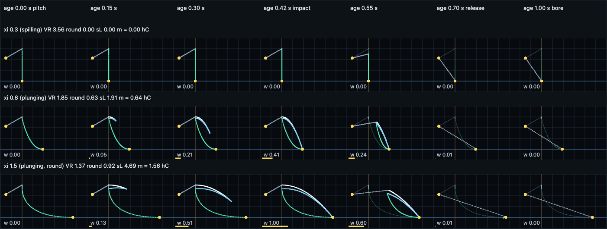

# Breaking-crest cross-section family — 2026-09-24

Track A of the crest-band work. Base `c1e78ab`. New files only; nothing in
`web-three/` imports the module, so the shipped page is unchanged.

## Finding

`shared/breaker-profile-glsl.js` exports one GLSL string with the two functions
Track B's swept ribbon is coded against:

```glsl
vec2  breakerProfile(float u, float age, float xi, float hC, float c);
float breakerProfileWeight(float age, float xi);
```

The curve is the whole free surface of the crest band at one alongshore
station, walked once from a back seam on the unbroken back face to a landing
seam on the trough ahead. The jet is a ballistic parabola, the face is a
concave Bezier whose roundness is the Mead & Black vortex ratio, and the clock
is the repo's shared lifecycle (`CRASH_PEAK_S` 0.42 s impact, release by
0.72 s). Over 1,632 GPU readback cases (17 ages × 8 ξ × 4 hC × 3 c, 129
samples of u each) every output is finite, both seams sit where the contract
says, the pre-impact curve never self-intersects and never dips below still
water, the weight is zero at both lifecycle ends and monotone into impact, and
the family is continuous across the impact instant.

Two things the physics says that the repo's authored constants do not:

1. **The shared clock runs a big lip's fall faster than gravity does.** Free
   fall from hC to still water takes √(2hC/g): 0.78 s for a 3 m lip, 0.42 s
   only for a 0.87 m fall. The profile keeps the ballistic *shape* and maps
   the shared clock onto it linearly in horizontal reach (which is how a
   horizontally launched body traverses its own parabola), so the picture is
   right and the tempo is the repo's. The warp is 1.86× at the sheet case.
2. **A lip launched at the phase speed lands a little past the authored
   receiver.** With c = √(gh) and hC = 0.8·0.78·h (the model's own
   depth-limited crest), the landing is a constant 1.79 hC ahead, for any
   depth. The repo's receiver is 0.9 hC (`CURT_REACH`) rising to 1.6 hC at
   full plunge (the descent experiment). At the sheet's (hC 3 m, c 6 m/s) the
   profile lands at 1.56 hC, inside the window; at depth-consistent pairs it
   is 12% past the top.



Rows: ξ 0.3 (spilling: no sheet, weight 0 throughout, the vertical face is
the degenerate limit nobody draws), ξ 0.8 (a short hook, landing 0.64 hC,
tube closes at impact), ξ 1.5 (full parabola to 1.56 hC, lens-shaped cavity
between jet and face, trailing edge clears along the parabola after impact,
cavity straightens to a chord by 0.70 s). Dim curve is the same station at
age 0; the yellow bar is `breakerProfileWeight`.

## The family

Frame: (s, y) in **physical metres**; s shoreward of the crest source point
(the grid's θ = 0 crest, which travels at c), y above still water. The caller
applies VIS; hC arrives as `breakerCeilM/VIS`.

| u | leg | what it is |
|---|---|---|
| 0 | back seam **B** | (−0.5 hC, hC(1 − 0.5 tan 30°)) = (−0.5 hC, 0.711 hC) |
| 0.00–0.10 | back face | B → apex A = (0, hC); after impact, B → the sheet's trailing edge |
| 0.10–0.45 | jet top | the parabola y = hC(1 − σ²), s = σ·sL, from the trailing edge σ₀ to the tip σ₁ |
| 0.45–0.80 | jet underside | the same parabola offset inward by the sheet thickness, tip back to the root |
| 0.80–1.00 | concave face | quadratic Bezier root → landing, control point on still water |
| 1 | landing seam **L** | (sL, 0), sL = plunge(ξ)·c·√(2hC/g) |

Leading edge σ₁ = clamp(age/0.42, 0, 1) — linear in age because horizontal
reach is linear in time for a horizontal launch. Trailing edge σ₀ = 0 until
impact, then `smoothstep(0.42, 0.72, age)`: the foot stays at the landing and
the upper edge clears toward it, the descent experiment's handoff. The tube is
the region between the underside leg and the face leg; before impact they
meet only at the root, so the curve is simple; at impact the tip reaches L and
the tube closes. Fixed u fractions keep ribbon topology stable across age.

`breakerProfileWeight = plunge(ξ) · (age/0.42)² · (1 − smoothstep(0.42, 0.72, age))`,
the same envelope as `breakerCurlCycle`, so the ribbon and the grid's bend
share one lifecycle. Zero for age ≤ 0 and age ≥ 0.72, so the modulo crossing
is continuous. Zero for ξ ≤ 0.45.

## Physics basis, term by term

| term | form | basis | reference status |
|---|---|---|---|
| jet trajectory | s = v t, y = hC − ½g t² ⇒ y = hC(1 − σ²) | free-falling jet launched horizontally from the crest (the plunging-jet picture) | Longuet-Higgins & Cokelet (1976), *The deformation of steep surface waves on water. I*, Proc. R. Soc. A 350; Peregrine (1983), *Breaking waves on beaches*, Annu. Rev. Fluid Mech. 15. **Not in refs.bib; cited by author/year/title, DOIs not checked here.** |
| launch speed | v = c · plunge(ξ) | the brief's model: at full plunge the lip leaves at the phase speed. plunge is the renderer's shared `smoothstep(0.45, 1.25, u_xi)`, byte-identical, so the profile agrees with the grid, curtain and splash about how plunging a site is | Battjes (1974) for the 0.4–0.5 boundary — **in refs.bib (verified proceedings)**; the 1.25 top is the renderer's inherited choice, not re-derived |
| landing | sL = v·√(2hC/g), at y = 0 | where the parabola meets still water; the contract fixes the seam at y = 0 | derived |
| face roundness | ρ = (VR(0.4) − VR(ξ)) / (VR(0.4) − VR(2.0)), VR = 0.821 + 0.065·X, X = 1/(ξ·√(H₀/L₀)) | Mead & Black's vortex length/width regression on orthogonal seabed gradient, converted back to a slope with the model-card steepness √(2.2/351) = 0.079; ramp endpoints are Battjes' inshore plunging band 0.4–2.0, so no free endpoint | Mead & Black (2001c), *Predicting the Breaker Intensity of Surfing Waves*, JCR SI 29, 51–65 — **in refs.bib (verified)**. X-as-run reading is the one `SURF_SCIENCE_REFS.md` 2.1 records and flags to confirm against the original figure |
| face shape | Bezier R → C → L, C = (mix(R.s, L.s, 0.5(1−ρ)), 0) | a face that always arrives at the landing horizontally (into the trough) cannot be crossed by the descending jet; ρ slides the control from mid-trough (almond) to under the root (round: vertical under the lip, then sweeping forward) | geometric closure; the Mead & Black dial only sets ρ |
| spilling | ρ·plunge, v·plunge, thickness·plunge → 0 | a spilling crest crumbles with no cavity and no thrown sheet | Battjes (1974) |
| back seam | (−0.5 hC, hC(1 − 0.5 tan 30°)) | Stokes' 120° limiting crest angle puts each flank 30° below horizontal | Stokes (1880), *Supplement to a paper on the theory of oscillatory waves*, Math. Phys. Papers vol. 1 — **not in refs.bib; cited by author/year/title** |
| sheet thickness | d(σ) = 0.12 hC · plunge · v/√(v² + (gt)²), tapered to 0 at the tip | mass-conserving stretching of a sheet whose particles share the launch speed; the leading edge is the oldest, most-stretched water | kinematics; the 0.12 hC root is the shipped classic crown band (MODEL.md silhouette experiment), an **in-repo authored** continuity choice — no lip-thickness measurement exists in this repo |
| post-impact | trailing edge advances σ₀: 0 → 1 over 0.42–0.72 s; ρ·(1−σ₀) | the descent experiment's verified handoff (foot fixed, upper edge clears), and the cavity straightening into a bore | `LIP_DESCENT_EXPERIMENT_2026-09-15.md` |

Ground-frame caveat on the launch speed. Measured plunging-jet tip speeds run
about 1.3–1.5 c in the ground frame (Bonmarin 1989, *Geometric properties of
deep-water breaking waves*, J. Fluid Mech. 209; Perlin, He & Bernal 1996, *An
experimental study of deep water plunging breakers*, Phys. Fluids 8 — **both
uncited in refs.bib, titles from memory, treat as unverified**). Since s is
measured from a crest source point that itself moves at c, "v = c relative
to the frame" is 2c in the ground frame, which is faster than any measured
tip. The relative-speed reading (0.3–0.5 c) would land the lip at 0.5–0.8 hC
plus the lip's initial forward lean. The brief's model was adopted because it
lands where the repo's receiver already sits; this is the main open physics
question for Track B to look at on the drawn surface.

## Landing table (hC 3 m, c 6 m/s, from the GPU readback)

| ξ | site with this character | plunge | vortex ratio | roundness | landing sL/hC |
|---|---|---|---|---|---|
| 0.30 | — | 0 | 3.56 | 0 | 0 (no sheet) |
| 0.45 | Sharks | 0 | 2.65 | 0.14 | 0 |
| 0.65 | Second Peak | 0.16 | 2.09 | 0.48 | 0.24 |
| 0.80 | The Hook | 0.41 | 1.85 | 0.63 | 0.64 |
| 1.15 | Sewers | 0.96 | 1.54 | 0.82 | 1.50 |
| 1.50 | — | 1.00 | 1.37 | 0.92 | 1.56 |
| 2.00 | — | 1.00 | 1.23 | 1.00 | 1.56 |

Depth-consistent pairs (c = √(gh), hC = 0.624 h) at full plunge land at
1.790 hC for h = 1, 2, 4, 6 m, with free-fall times 0.36, 0.50, 0.71, 0.87 s
against the 0.42 s clock. The field's one bracketed curtain-to-plume
transition (0.23–0.70 s, `FIELD_WAVE_MOTION_2026-09-15.md`) spans the
free-fall times of 0.3–2.4 m lips; it does not adjudicate the clock.

## Seam contract for Track B

- **u = 0** returns B = (−0.5 hC, 0.711 hC) at every age. This is the *assumed*
  height-field value at the seam (Stokes back slope), not a reading of the
  grid. Blend the ribbon's u = 0 row to the real `surfacePos` at the crest
  source point minus 0.5 hC along the wave direction; the 0.711 hC is what to
  expect there, and the residual is the measure of how far the grid's back
  face is from a limiting crest.
- **u = 1** returns L = (sL, 0) at every age, with
  `sL = bpPlunge(xi)*c*sqrt(2*hC/BP_G)`, exposed as `bpReach(xi, hC, c)`.
  Blend to `surfacePos` at the crest source point plus sL. Note this is
  *not* `breakerLandingFrameAt`'s zL (0.9–1.6 hC): the two agree only near
  full plunge at the sheet case.
- Both seams are age-independent, so the ribbon's edges never slide against
  the grid; only the interior moves.
- The leg boundaries are the constants `BP_U_APEX` 0.10, `BP_U_TIP` 0.45,
  `BP_U_ROOT` 0.80; bind vertex rows to legs once.
- `breakerProfileWeight` is the blend toward the profile; it is zero exactly
  where the grid should own the surface (spilling, before pitch, after
  release). Where it is small but nonzero (ξ 0.5–0.7) the sheet is a stub and
  the grid's face is most of what is drawn.
- Constants mirroring `model-glsl.js` carry a `BP_` prefix (`BP_G`,
  `BP_IMPACT_S`, `BP_SIGMA_S`) so the text concatenates after `MODEL_GLSL`
  without redefinition; `tests/breaker-profile.test.js` asserts they stay
  equal to `G`, `CRASH_PEAK_S`, `CRASH_SIGMA_S`.

## Limits

- The face leg is a stand-in so the section encloses a tube; the grid owns
  the real face. There is no model of the unbroken face slope, so at low
  plunge the stand-in is nearly vertical under the crest.
- The bore is not modelled. By 0.72 s the profile is a chord from B to L and
  the weight is zero; the grid's post-break height owns what comes next.
- The profile inherits the renderer's plunge ramp. If ξ 0.65 (Second Peak,
  the field footage's context) should throw a real lip, the ramp is the knob,
  and it is shared with the grid, curtain and splash — change it there, not here.
- The vortex ratio uses the model-card steepness (Sewers H₀ 2.2, T 15 s) to
  convert ξ to a slope; a per-preset √(H₀/L₀) would move ρ by a few percent.
- Nothing here is calibrated against the field video. The 16 s carrier and
  the 0.23–0.70 s bracket are context, not fitted constants.
- The cavity at full plunge is a lens (maximum vertical gap between the
  jet's underside and the face, read back at hC 3 m, c 6 m/s, age 0.42:
  0.55 hC at ξ 0.8, 0.62 hC at ξ 1.15, 0.64 hC at ξ 1.5), not the
  near-circular vortex Mead & Black's low ratios describe. With a
  parabolic roof and a face that cannot pass behind the root, a rounder
  cavity needs either a face that overhangs (the face bowing seaward of s = 0)
  or a slower relative launch; neither was added without a stated basis.

## Verification and reproduction

```sh
python3 scripts/serve.py 8131
node scripts/probe_breaker_profile.mjs            # writes qa/breaker-profile-2026-09-24/probe.json
npm test                                          # 242 pass, incl. tests/breaker-profile.test.js
```

From a worktree the sibling Playwright lookup misses; pass
`PLAYWRIGHT_DIR=/Users/andyed/Documents/dev/psychodeli-webgl-port/node_modules/playwright/index.mjs`.
The probe writes the sheet to `docs/research/assets/breaker-profile-2026-09-24/sheet.png`
(56 KB) and one explorer frame beside it, and records the module's SHA-256
(`4ec68b17…d831a302` for the numbers above). Interactive:
`http://127.0.0.1:8131/experiments/tube-profile.html` — sliders for age, ξ,
hC, c, a seconds-clock play button, readouts read back from the GPU; the
curve is drawn by the GLSL in a vertex shader, never from a JS copy.

Probe checks, all on the readback: finiteness of every value; both seams
within 10⁻³ hC of the contract; `sL` within 10⁻³ of the documented formula;
no proper intersection between any two non-adjacent non-degenerate segments
for 0 ≤ age < 0.42; min y ≥ −10⁻⁴ hC before impact; weight = 0 for age ≤ 0,
age ≥ 0.72, ξ ≤ 0.45, and non-decreasing over (0, 0.42]; max point
displacement between age 0.41 and 0.43 below 0.06(sL + hC), the tip's own
travel bound (the worst case reached 77% of it). The sheet PNG is under 1 MB.

The node test checks what node can: the two signatures verbatim, the BP_
constants equal to the model's, the plunge ramp equal to the renderer's, no
uniforms and no frame constants, no backticks or GLSL ES 3.00 reserved
identifiers inside the literal, balanced braces, the NaN guards present, and
that nothing under `web-three/js/` imports the module.
