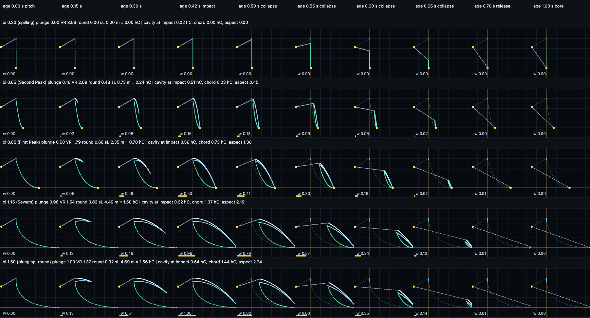
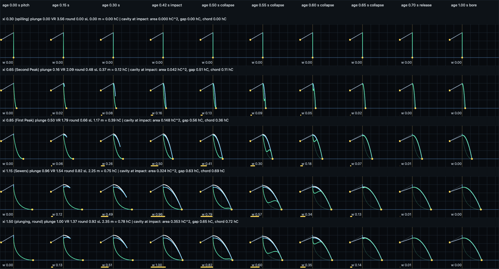
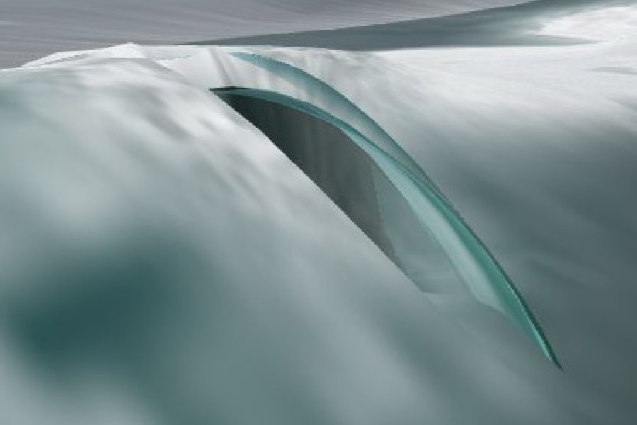
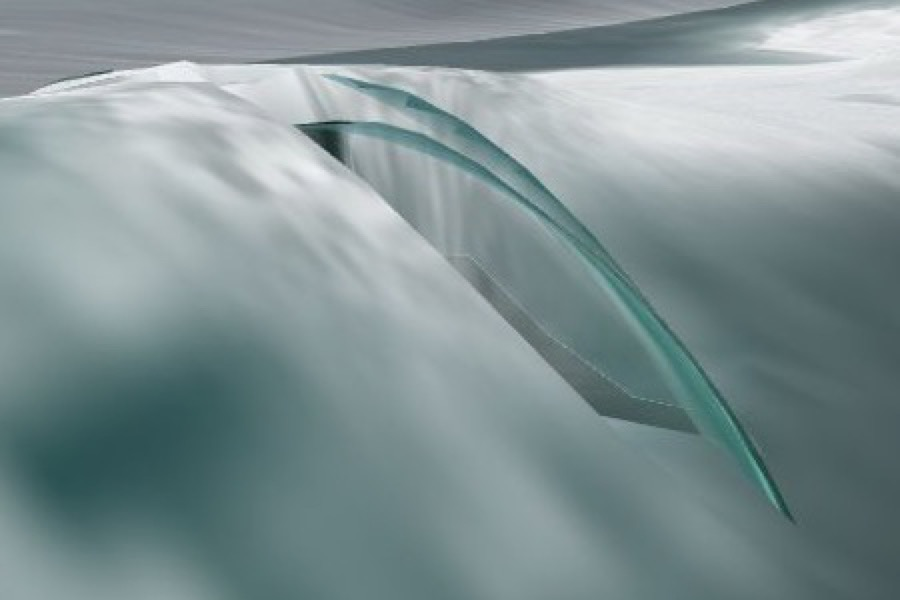
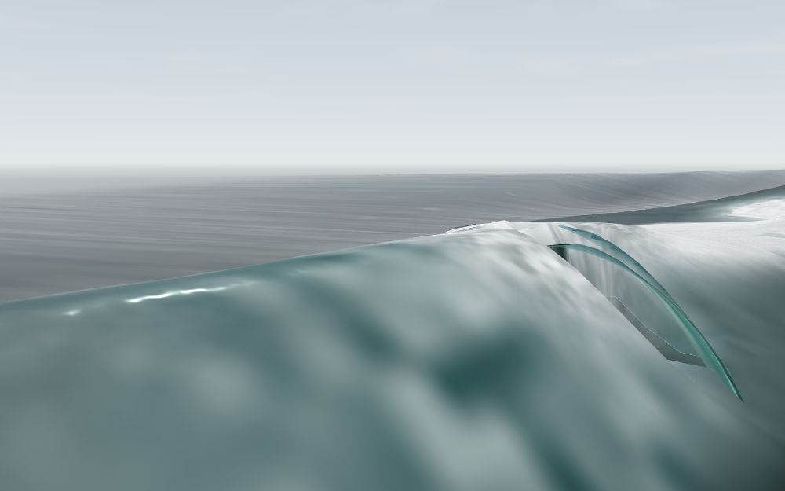
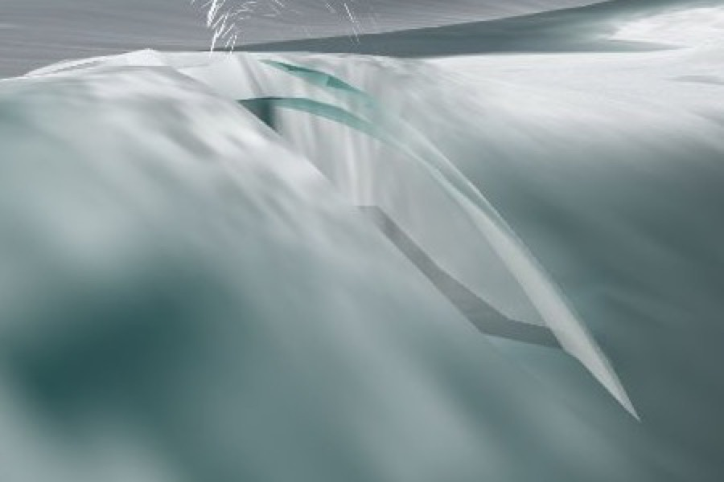
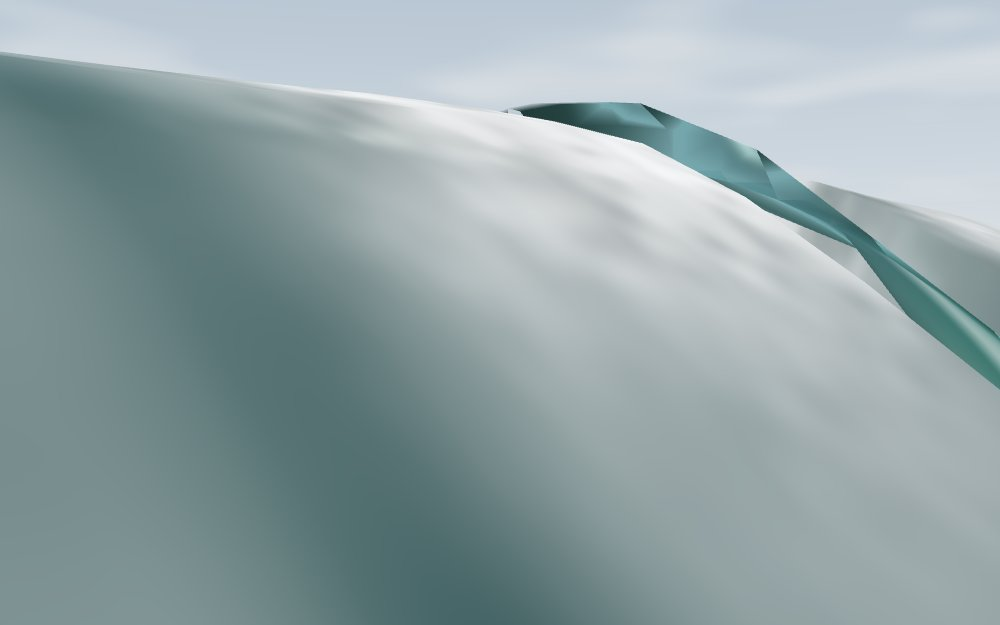
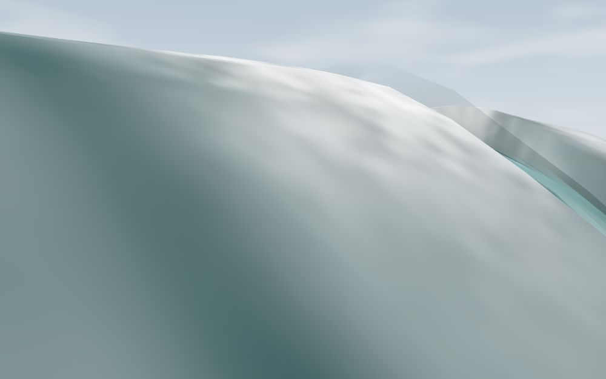

# Breaker profile v2 — a thinning roof, not a clearing edge; the landing frame — 2026-09-24

Track G of the second curl wave. Base `a3de204` (main). Revises the
cross-section family of [BREAKER_PROFILE_2026-09-24.md](BREAKER_PROFILE_2026-09-24.md)
in place: `shared/breaker-profile-glsl.js`, both signatures unchanged; the
explorer, the readback probe and the node tests follow. Nothing under
`web-three/` changed, and the profile is spliced only under `#ifdef TUBE`, so
the shipped default is untouched (the test suite asserts the guard).

## Finding

Three decisions, each taken against the field or the model's own numbers:

1. **After impact the lip is a roof that thins, not an edge that clears.** The
   v1 family slid the sheet's upper edge down the parabola to the foot over
   0.42–0.72 s, which the mesh drew as a flap sliding down the face (Track B's
   diagnosis, the Field seat's "glassy ribbon 1.0–1.5 face heights"). v2 keeps
   the sheet rooted at the crest, thins it to nothing from the top down, and
   closes the cavity from the landing side. The cavity's area falls
   monotonically from impact to release at every one of the 108 (ξ, hC, c)
   combinations probed; the apex never leaves s = 0 and never rises.
2. **The jet's reach is measured in the ground frame.** The v1 lip left the
   crest at the phase speed *relative to a point moving at the phase speed*,
   i.e. 2 c in the ground frame, and landed 1.5–1.8 hC ahead. v2 launches at
   `BP_LAUNCH_REL = 0.5` c relative to the crest (1.5 c ground), which lands a
   depth-limited lip at **0.895 hC for any depth — on the model's own
   `CURT_REACH` 0.9** — and puts Pleasure Point's presets at 0.12 hC (Second
   Peak), 0.32 (The Hook), 0.39 (First Peak), 0.75 (Sewers). The field's
   steady-head lip projects ≤ 0.1–0.3 face heights and its one section
   collapse throws a half-face curtain that lands on the face; the ground
   frame is the one that lands there.
3. **The spilling end should produce nothing from this family, and the
   plunge ramp stays.** At Second Peak the sheet is 0.019 hC thick and reaches
   0.12 hC — the field's "thin luminous lip, a few percent of H_f, crumble
   more than throw" in geometry; what it lacks is white material, which is the
   mesh's shading. Duncan's (1999) bulge is the right picture for the steady
   spilling head, but it is a thick aerated cap on the grid's own crest band
   with no cavity and no free tip, and a thrown-sheet family over a cavity is
   the wrong owner for it (the jury's Domain seat: build it as a foam problem,
   not a geometry problem). Where it should go is stated in §3.

What the mesh must change to match is in §5; the short version is that the
mesh still stretches the profile's landing onto the shared 0.9–1.6 hC
receiver, which is why the 52 s Sewers silhouette barely moved while the
section did.

## 1. Post-impact: the roof

**Before.** v1: trailing edge σ₀ = smoothstep(0.42, 0.72, age) advanced along
the parabola toward the landing; the apex left the crest, the back leg became
a chord from B to a point sliding down the jet, and the face straightened to a
chord by 0.72 s. In the sheet below (v1 family, v2 layout) the 0.50–0.65 s
columns are the flap.



**After.** v2: the trailing edge stays at the crest for the whole life. From
impact, `col = smoothstep(0.42, 0.72, age)` runs a collapse:

- the roof's **top** sags by `col` of the local sheet thickness onto its own
  underside (taper 1 − σ, the underside's), so at release the two coincide and
  the sheet is gone; the apex sags by the root thickness, ≤ 0.12 hC·plunge;
- the roof's **underside** — the cavity's ceiling — is fixed for all ages
  after impact, so the cavity is non-increasing everywhere;
- the **face** rises to the underside at the same σ behind a soft front
  (`bpFaceClosure`: width `BP_CLOSE_W` 0.5 in the face parameter) that runs
  from the landing back to the root over the release window. Ahead of the
  front the cavity keeps its section shape; it shortens, it does not flatten.



Rows are ξ 0.3 (spilling), 0.65 (Second Peak), 0.85 (First Peak), 1.15
(Sewers), 1.5 (round); the columns add 0.50, 0.60, 0.65 s to v1's ages so the
collapse is visible. The rising face reads as a hump travelling from the
landing toward the root at 0.55–0.60 s — the region where Peregrine's splash-up
stands — and the roof stays on the crest through release.

Basis. Peregrine (1983, `peregrine1983breaking`): the overturn → impact →
splash-up → bore sequence, in which the jet's root stays attached while the
landed water throws up and the trapped cavity is compressed. Kimmoun &
Branger (2007, `kimmounbranger2007piv`): the laboratory time series of the
free surface through impact and splash-up over a slope, the reference for a
collapsing arch rather than a clearing edge. Both are verified DOIs in
`refs.bib` (CURL_TRUTH §2.1); their stage vocabulary is what is used here, no
number is taken from either. The field agrees on the one thing this fixes: the
crest line is conserved through the collapse to within ~0.1 face heights
(CURL_TRUTH §1.3, "the plume does not go up; it goes forward"), so the roof's
root does not leave the crest. The thin-from-the-top choice is a stand-in that
makes the cavity's ceiling fixed; a real sheet thins from both surfaces.

Measured (GPU readback, `qa/breaker-profile-v2-2026-09-24/probe.json`, hC 3,
c 6; area in hC², vertical gap and chord in hC):

| age | ξ 0.85 area / gap / chord | ξ 1.15 (Sewers) | ξ 1.5 |
|---|---|---|---|
| 0.42 impact | 0.148 / 0.56 / 0.36 | 0.324 / 0.63 / 0.69 | 0.353 / 0.65 / 0.72 |
| 0.50 | 0.144 / 0.56 / 0.37 | 0.316 / 0.63 / 0.70 | 0.344 / 0.65 / 0.73 |
| 0.55 | 0.100 / 0.53 / 0.30 | 0.211 / 0.57 / 0.58 | 0.227 / 0.58 / 0.60 |
| 0.60 | 0.026 / 0.24 / 0.16 | 0.049 / 0.24 / 0.30 | 0.052 / 0.24 / 0.31 |
| 0.65 | 0.001 / 0.02 / 0.01 | 0.002 / 0.02 / 0.02 | 0.002 / 0.02 / 0.02 |
| 0.70 release | 0 | 0 | 0 |

Area is the invariant asserted (non-increasing at every step, below 0.5% hC²
by release); the vertical gap over-reads under a near-vertical face and is
reported, not asserted on.

## 2. The launch frame

s is measured from the crest source point, which travels at c. v1's "launch
at c" was therefore 2 c in the ground frame, faster than any measured jet tip,
and landed at 1.79 hC for depth-limited pairs (1.56 at the sheet case). v2:

```
sL = BP_LAUNCH_REL · plunge(ξ) · c · √(2 hC / g),   BP_LAUNCH_REL = 0.5
```

| ξ | site | plunge | v1 landing (crest frame) | **v2 landing (ground frame)** | field bracket |
|---|---|---|---|---|---|
| 0.30 | — | 0 | 0 | **0** | no throw (A, C) |
| 0.65 | Second Peak | 0.16 | 0.24 hC | **0.12 hC** | lip ≤ 0.1 H_f (C), ≤ 0.3 (B) |
| 0.80 | The Hook | 0.41 | 0.64 | **0.32** | — |
| 0.85 | First Peak | 0.50 | 0.78 | **0.39** | — |
| 1.15 | Sewers | 0.96 | 1.50 | **0.75** | curtain 0.5–0.6 H_f at a section (B) |
| 1.50 | — | 1.00 | 1.56 | **0.78** | — |
| depth-limited, any h | — | 1.00 | 1.79 | **0.895** | `CURT_REACH` 0.9 |

Basis, in the order it was weighed:

1. **Kinematics.** Longuet-Higgins (1981, `longuethiggins1981overturning`,
   verified DOI; CURL_TRUTH §2.1's summary) gives the detached jet as a
   free-fall parabola whose horizontal velocity is of the order of the crest
   speed in the ground frame; the excess over c is what carries the lip clear
   of the crest. A crest-relative launch at c doubles that. Bonmarin (1989,
   `bonmarin1989geometric`) reports jet geometry as ratios of wave height and
   would be the number to check this against; it is in `refs.bib` but was not
   re-read, and no figure is taken from it. The v1 note's "1.3–1.5 c
   ground-frame tip speeds" (Bonmarin; Perlin, He & Bernal 1996) remains
   unverified and is not relied on here beyond the bracket it suggests.
2. **The field** (CURL_TRUTH §1.2–1.3). The steady head projects its lip
   ≤ 0.1 (event C) to ≤ 0.3 (event B) face heights ahead of the face plane;
   the one throw in 60.8 s is a section collapse whose curtain is 0.5–0.6 H_f
   tall and lands on the face in 0.13–0.40 s; no lip lands clear of the face.
   In the model H_f ≈ 1.25 hC (crest 0.8 H above still water for a
   depth-limited breaker), so those are ≤ 0.13–0.38 hC and ~0.6–0.75 hC. The
   crest frame's 1.5 hC at Sewers and 0.24 at Second Peak sit outside that
   bracket; the ground frame's 0.75 and 0.12 sit inside it.
3. **The model's receiver.** `CURT_REACH` 0.9 was authored in `model-glsl.js`
   from the classical picture ("about a face height ahead"). At depth-limited
   pairs (c = √(g h), hC = 0.8·GAMMA·h) the ground-frame landing is
   `0.5·√(2/(0.8·0.78))` = 0.895 hC regardless of depth — the two agree to
   0.5% without a second constant, which is why 0.5 rather than another value
   in the (1)–(2) bracket. `tests/breaker-profile.test.js` asserts this
   coincidence from the constants (a formula check, not a twin) and the probe
   asserts it on the readback at h = 1, 2, 4, 6 m.

The free-fall warp is unchanged: the clock still runs a 3 m lip's fall 1.86×
faster than gravity. The sheet thins by `v/√(v² + (g t)²)` with v the
crest-relative launch speed, so at a given σ the v2 sheet is thinner than
v1's (the same water stretched over a steeper arc).

**The cavity.** With the shorter reach the lens is compact rather than long:
at Sewers the axis-aligned box is 0.69 hC wide by 0.63 hC tall (v1: 1.37 by
0.62), area 0.324 hC². New's (1983) ellipse has axis ratio ≈ √3 along its own
tilted axes, which an axis-aligned box does not measure; the readback is in
`probe.json` for whoever fits the ellipse. Roundness (the Mead & Black dial)
is unchanged: 0.48 at Second Peak, 0.66 at First Peak, 0.82 at Sewers.

## 3. PP's ξ range and the spilling end

The family at hC 3 m, c 6 m/s, at impact:

| ξ | site | reach | root thickness | cavity area | reads as |
|---|---|---|---|---|---|
| 0.30 | spilling | 0 | 0 | 0 | a vertical wall under the crest; weight 0, never drawn |
| 0.65 | Second Peak | 0.12 hC | 0.019 hC | 0.042 hC² | a thin curtain hugging the face; weight ≤ 0.16 |
| 0.85 | First Peak | 0.39 hC | 0.060 hC | 0.148 hC² | a short hook with a small pocket; weight ≤ 0.50 |
| 1.15 | Sewers | 0.75 hC | 0.115 hC | 0.324 hC² | a lip over a compact cavity; weight ≤ 0.96 |

Against CURL_TRUTH §1.2 ("thin luminous lip, crumble more than throw"; the
lip line "a few percent of H_f thick"; projection ≤ 0.1–0.3 H_f): the Second
Peak section is the right geometry — 2% of hC thick, projecting 0.12 hC, and
landing on the face — and it is faint (weight ≤ 0.16) by the shared plunge
ramp. What the footage has that this does not is the *material*: the lip is
white. That is the ribbon's shading and the grid's aeration key, not the
section.

**Should the spilling end produce a bulge?** No, not from this family. The
steady spilling head in the footage (event A, 7.5 s of peel) is Duncan's
(1999, `duncan1999gentle`) bulge and Longuet-Higgins & Turner's (1974)
aerated wedge: a thick cap on the forward face just below the crest with a
toe, no free tip and no cavity, that collapses into turbulence and reforms
every 0.5–1 s. Three reasons it does not belong here:

- the family's spilling limit has no face slope to bulge from (the face leg
  is a vertical stand-in under the crest; the grid owns the real face), so a
  bulge authored here would sit inside the grid's crest;
- the region between the underside and face legs is the cavity by contract,
  and a bulge has none — it would be a zero-area strip drawn over the grid;
- the weight is the mesh's blend *and* the grid's lip-aeration key under
  TUBE; a nonzero weight at ξ ≤ 0.45 would draw a ribbon at Sharks and
  Privates, which are exactly zero today by design.

Where it belongs: the grid's crest band (the `0.35 hC` band the TUBE aeration
key already uses), as a displacement plus aeration term keyed on a spilling
character — the same place the jury's "knuckle at the head, thick bore behind
it" work goes (CURL_JURY §4.2). The plunge ramp `smoothstep(0.45, 1.25, ξ)`
therefore stays: it is shared with the grid, curtain and splash, and its
zero at the spilling end is the right amount of nothing from *this* family.

## 4. In the mesh

Frames from `scripts/capture_tube_ab.mjs` at the Sewers card day (Sewers
close camera, eye [12, 11, −190] → [−52, 4, −229] stage coordinates,
1000 × 625, camera drift 0.000 m between arms at every clock), on/off in
`qa/profile-v2-2026-09-24/`, the receiver arms in `receiver/`, the
down-the-line pose in `downline/`.

**52 s, `#tube=1&classic=1&descent=1`, head crops (v1 left is the jury's
frame, v2 right):**




Having opened them: the silhouette — a glassy arc from the crest to a point
low on the face — is the same in both, because the mesh maps the profile's
landing onto the shared receiver (§5.1); the ribbon is still ~hC·VIS tall
because the landing seam is at still water by contract (§6). What changed is
the interior. v1's arc encloses a near-black hollow — the cleared sheet's
shadow, the "dry barrel" the Domain seat named. v2's arc is two glassy edges
(the roof's top and underside, 0.34 m physical apart, 1.1 m at VIS) over a
pale translucent panel: at the older stations the face has risen onto the
underside and the mesh draws the coincident face leg as a second lit surface.
That panel is the mesh's to remove (§5.3); the hollow it replaces was the
defect.



The frames above are the glass ribbon: they were captured before Track H's
aerated material landed on main (on the merged tree they are the
`&tubelook=0` arm). After merging main the same rig was run once more, so
"what the 52 s frame shows now" is the v2 section under Track H's material:



Having opened it: the arc is the same v2 roof — two edges from the crest to
the landing — now grey-white and aerated instead of teal glass, over a pale
interior; the glass arm's hard-edged panel is gone under the whitening, and
the shipped spray's strokes stand above the crest (Track I1's cull fix). The
interior is uniformly pale rather than dark-ahead-of-the-front and
white-behind-it, which is §5.3.

At **50 s** the head is young and the ribbon is a short glassy sliver at the
crest, as in v1. At **54 and 56 s** the head has run past this fixed camera:
the frames show the broken bore in the foreground and the head at or beyond
the right edge, with nothing of the ribbon legible. The jury's "52 s is the
legible clock" holds; later clocks need a camera that tracks the head.

**Down the line, 48 s** (Track B's diagnostic pose, eye [−36, 6, −222] →
[−48, 6, −233]; v1 left from `qa/tube-2026-09-24/diag_downline_receiver_48.jpg`,
v2 right):




v1 is the diagonal teal flap Track B described: a strip leaving the crest and
running down and away with the age gradient along the line. v2 is a level
ledge along the crest — a pale roof with a teal underside running toward the
horizon — because every station from impact to release keeps its roof at the
crest instead of handing its upper edge down to the foot. It is a roof along
the line, which is what was asked for; it is a shallow one, because the
cavity under it (0.63 hC by the vertical measure at Sewers) is drawn at the
default arm's compressed reach in this pose. On the merged tree
(`downline-merged-tubeclassic-48.jpg`, opened) the same ledge is whiter under
Track H's material, with a thin teal underside line and spray above the
crest.

**`#tube=1` alone** (default landing) is unchanged in kind: the small teal
wedge at the head, 0.35–0.5 hC of drawn reach, as Track B measured. The
profile's reach fell but the mesh stretches it to the same D.

**Second Peak, Lookout, "field day"** (`day=big&h0=1.4&tide=0.732`): on/off
frames at 42–52 s are three parallel glassy walls with a small break at the
far right — the jury's frame. Track J
([SECONDPEAK_FIELDDAY_2026-09-24.md](SECONDPEAK_FIELDDAY_2026-09-24.md), landed
while this track ran) shows why that frame says nothing about the site:
`cam=lookout` is the absolute 38th Ave pose, 478 m from the Second Peak node,
so the walls are Jack's water off the reef window and the Second Peak line
is the 4 px break at the right edge; the forcing is the morning loop's, not
the clip's. This rig inherited the jury's hash and the same fault. The ten
frames were captured (0.35 MB) and are not committed; the arm to judge the
ribbon at Second Peak is the one Track J names (`cam=cliff` at the clip's
forcing), where the profile's weight is ≤ 0.16 by the shared ramp.

## 5. Receiver contract for the mesh (Track B; not edited here)

1. **The landing seam must follow the profile's landing.** `tube.js` sets
   `sigma = D/sL` with `D` the drawn distance from the crest to
   `breakerLandingFrameAt`'s `zL` (0.9 hC displayed, 1.6 under classic
   descent) and `sL` the profile's own reach. With v2's reach that stretch is
   1.2–2.1× at Sewers and ~7× at Second Peak (0.9/0.12), and it does not scale
   with plunge because the shared frame's `zL` does not. The mesh should place
   the landing at `bpReach(u_xi, hC, c)·VIS` along the sweep axis from the
   crest source (σ = VIS, the same anisotropy `breakerLandingFrameAt` already
   uses, since its hC is displayed) and evaluate `surfacePos` there for the
   seam. For the deposit, roller and spray to land under the ribbon's foot,
   the shared frame's receiver should become plunge-scaled,
   `zL = zc + CURT_REACH·hC·plunge`, and the classic 1.6 extension retired
   under TUBE: at full plunge that is within 0.5% of the profile at
   depth-limited pairs and 15% at the sheet case. That is a `model-glsl.js`
   change and is only stated here.
2. **The back seam stays attached for the whole life.** `wB` releases the
   back seam after impact (`1 − smoothstep(0, 0.25, clearP)`) because v1's
   trailing edge left the crest. v2's root never leaves the crest, so the
   release should go; with it, the u = 0 row can drift off `surfacePos` after
   0.42 s.
3. **Key the face leg's material on the closure, not the clock.** Track H
   ([TUBE_LOOK_2026-09-24.md](TUBE_LOOK_2026-09-24.md), landed while this
   track ran) whitens the whole face leg as the collapsing bore over
   `smoothstep(0.40, 0.60, age)` and keeps the cavity green-black while the
   lip is in the air. With v2 the face leg *is* the bore exactly where it has
   risen onto the underside and still the cavity's wall where it has not, and
   `bpFaceClosure(u, age)` (new, in the spliced text) is that fraction per
   vertex: 1 where the face leg coincides with the underside, 0 where the
   lens is open. Using it in place of the age window puts the bore's white
   behind the front and the cavity's dark ahead of it, at every station, and
   removes the pale panel the glass arm draws over the collapsed lens (the
   52 s crop).
4. **`scripts/probe_tube.mjs`** asserts the profile's landing inside
   [0.9, 1.6] hC (line 189) and will fail on v2 at every station; it should
   assert `landRatio` equals `bpReach/hC` instead. Its cavity floor
   (`> 0.3 h_C`, line 208) is still met at Sewers (0.63 by the same vertical
   measure).
5. **The grid's carve** under TUBE (`1.03 − 1.4·√(dzC/hC)` ahead of the crest
   phase) opens the cavity over ~4 m; with the landing at 0.75 hC·VIS its
   extent should follow `bpReach` too, or the carve outruns the ribbon.
6. **The plume moved with the reach.** Track I1
   ([CRASH_DRAW_2026-09-24.md](CRASH_DRAW_2026-09-24.md)) anchors the
   `#crash=1` plume's contact at the drawn lip plus `bpReach(xi, hC/VIS, c)`
   along the sweep axis, floored at `PLUME_REACH_MIN_HC`. That anchor now
   reads 0.75 hC at Sewers and 0.12 hC at Second Peak instead of 1.50 and
   0.24, so the plume stands where the v2 lip lands — forward and close, which
   is where the field puts it (CURL_TRUTH §1.3). `scripts/probe_crash.mjs`
   should be re-run to confirm the contact against the drawn lip.
7. **Unchanged:** `breakerProfileWeight` (so the ribbon's gate, the grid's
   handover `tubeChar` and the lip-aeration key all read as before), both
   seams' positions, the leg boundaries `BP_U_*`, and the `BP_` constants
   mirroring the model.

## 6. Limits

- **The ribbon is hC tall by contract.** The landing seam is at still water,
  so the drawn ribbon spans the full crest height (≈ 0.8 H_f). The field's
  half-face curtain lands on the face ~0.5 H_f below the crest, which would
  need `L = (sL, yL)` with `yL > 0` — a seam-contract change the mesh must
  agree to, not made here. Until then the Field seat's "too tall" reading
  stands for both v1 and v2.
- `BP_LAUNCH_REL` 0.5 is authored inside the bracket §2 gives; the
  ground-frame tip speed it implies (1.5 c) is not checked against Bonmarin
  or Perlin et al., whose numbers were not read.
- The roof is a parabola that persists; a real landed sheet sags, aerates and
  breaks up. Thinning from the top down is the stand-in that keeps the
  cavity's ceiling fixed; the apex sag it produces (≤ 0.12 hC·plunge over
  0.3 s) is inside the field's ≤ 0.1–0.15 H_f crest-line tolerance.
- The face's rise is a `mix` along a smoothstep front, which reads as a
  splash-up hump but models none of the splash-up's dynamics.
- The cavity's vertical gap over-reads under a near-vertical face and is
  undefined at the curled root of a short-reach section; the probe truncates
  the underside at its backward fold and asserts on area, not gap.
- The sheet's cells are isotropic (30 px/m) so the lens reads at its true
  aspect; v1's sheet was also isotropic but at a wider window.
- The site test has not been run on this family: the Lookout frames here
  stand at 38th Ave (Track J, above), and the Sewers frames are a plunging
  card, not the footage's spot. Judging the v2 section against the clip means
  `#preset=secondpeak&cam=cliff` at the clip's forcing, 52–56 s, with a
  camera that keeps the head in frame.

## 7. Verification and reproduction

```sh
python3 scripts/serve.py 8142
export PLAYWRIGHT_DIR=/Users/andyed/Documents/dev/psychodeli-webgl-port/node_modules/playwright/index.mjs
BASE_URL=http://127.0.0.1:8142 node scripts/probe_breaker_profile.mjs        # qa/breaker-profile-v2-2026-09-24/probe.json + the sheet
BASE_URL=http://127.0.0.1:8142 RIGS=sewers_close,secondpeak_lookout node scripts/capture_tube_ab.mjs qa/profile-v2-2026-09-24
BASE_URL=http://127.0.0.1:8142 RIGS=sewers_close SIMS=50,52,54,56 \
  'ARMS=classicdescent:&classic=1&descent=1,tubeclassic:&tube=1&classic=1&descent=1' \
  node scripts/capture_tube_ab.mjs qa/profile-v2-2026-09-24/receiver
BASE_URL=http://127.0.0.1:8142 RIGS=diag_downline SIMS=48,52 \
  'ARMS=off:,on:&tube=1,tubeclassic:&tube=1&classic=1&descent=1' \
  node scripts/capture_tube_ab.mjs qa/profile-v2-2026-09-24/downline
npm test                                                                     # 244 pass (248 after merging main)
```

The `qa/profile-v2-2026-09-24/` frames were captured on `a3de204` + this
track, before Track H's aerated material landed; on the merged tree the same
commands render the aerated ribbon, and `&tubelook=0` on each `tube=1` arm
reproduces the glass frames. `merged/` holds the tube+classic arm re-captured
after the merge (Sewers close and down-line, 48 and 52 s).

Probe: 2,052 GPU readback cases (19 ages × 9 ξ × 4 hC × 3 c, 129 samples of u
each) plus the sheet case and four depth-limited pairs. All outputs finite;
both seams within 10⁻³ hC of the contract at every age; the reach equal to
the documented formula; no proper self-intersection and nothing below still
water before impact; the apex within the root thickness of (0, hC) and
nothing above hC at any age; the tip on the landing from impact on; the face
never above the roof's underside (steepness-aware tolerance); cavity area and
chord non-increasing from 0.42 to 0.72 s and gone by release; weight zero at
both lifecycle ends and for ξ ≤ 0.45, monotone into impact; the family
continuous across the impact instant (worst jump 77% of the tip's own travel
bound). Depth-limited full-plunge landing 0.895 hC at h = 1, 2, 4, 6 m against
`CURT_REACH` 0.9. The sheet is 130 KB; the explorer frame at ξ 1.15, age
0.55 s (Sewers mid-collapse) is beside it. The v1 sheet in the v2 layout
(`sheet-before-v1.png`) was captured by swapping main's GLSL into the served
tree for one screenshot; its landing table is v1's (Second Peak 0.24, First
Peak 0.78, Sewers 1.50, round 1.56 hC).

Interactive: `http://127.0.0.1:8142/experiments/tube-profile.html` — the
readout now shows the launch speed in both frames and the cavity's area, gap
and chord; `?sheet=1&ages=…&xis=…` sets the sheet's layout.
