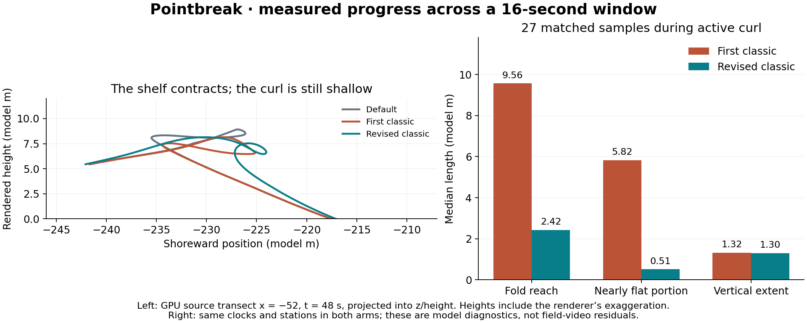

# Classic wave: changes, measured progress, and field-evidence hints

Recorded September 14 Pacific / September 15 UTC, 2026. Working tree based on
`ba06fc7`; implementation remains uncommitted. `#classic=1` is opt-in and has
not received visual acceptance or default promotion.

## Finding

The revised convergence meaningfully shortens the broad shelf while retaining the stronger classic bend. It has not made a deep, continuous barrel. The next shape question is the vertical path and attachment of the falling lip, rather than another increase in bend angle.

## Implemented changes

[MODEL.md](../MODEL.md#classic-wave-silhouette-experiment-2026-09-14) and
[CONTROLS.md](../CONTROLS.md) describe the `#classic=1` switch.
[main.js](../../web-three/js/main.js) owns the default-off uniform and boot
flag; [shaders.js](../../web-three/js/shaders.js) owns the shape in `choppyPos`.
The canonical depth, wave-height, dispersion, and break-route model in
`shared/model-glsl.js` was not changed.

The visual references were [Hokusai's Great Wave](https://www.metmuseum.org/art/collection/search/45434)
and [Clark Little's wave photography](https://clarklittlephotography.com/pages/clark-little-the-art-of-waves):
a broad arcing crown, hooked upper lip, readable hollow, and foam concentrated
at the edge. These are cultural shape references, not local physical targets.

- **First classic:** scale by the site's plunging blend; widen the crown band
  by up to `0.12*hCrest`, increase curvature by up to 32%, stretch horizontal
  arc reach by up to 35%, and extend bend release from 0.72 to 1.40 seconds.
  Birth and impact retain the existing clock. The elliptical stretch gives up
  arc-length preservation. Foam, splash and spray timing were not retuned.
- **Revised classic:** replace full-height-gradient convergence with smooth
  carrier-phase convergence, blended to full weight at plunging blend 0.45.
  Its displacement is `S/k * sin(phase)` along the existing `rayPhase` gradient.
  This changes horizontal positions across the wave shoulder as well as the
  lip. It retains the contour/Psi phase authority and final offset bound.
- Both retain the 132-degree mesh backstop and depth-derived crest reference;
  neither lifts water above the original height. Pure spillers receive zero
  classic weight, and `curl=0` bypasses the new path. Omitting `classic` retains
  the previous renderer.

No renderer changes were made during the later measurement/documentation pass.

## Diagnosis and trials that were not integrated

Increasing the bend exposed a large white plate. Controlled renderer variants
isolated its main driver: horizontal convergence differentiated the entire
`oceanH` field, so foam-mound and chop slopes also pushed the surface sideways.
Suppressing that convergence removed most of the plate. Smooth carrier-phase
convergence retained the broad wave direction without those local excursions.

| Trial | Observation and disposition |
|---|---|
| Disable separate falling-water curtain | Plate remains; not its main source. |
| Disable bend/earning/aeration separately; set amplification to 1 | Plate persists; those switches alone do not solve it. |
| Four times the grid vertices | Softer edges, underlying shelf remains; not integrated. |
| Weaker or phase-shifted carrier convergence | Normal carrier-phase version chosen; no need for extra phase offset. |
| Aeration darkening/ribs, wider/no bend band, weaker bend | No convincing continuous barrel; not integrated. |
| Crest-consistent curvature with an extra height query | Small edge change without convincing shape gain; not integrated. |

These trials used temporary browser shader substitution, not alternate shipped
implementations. The **remaining jagged lip is unresolved**. Sparse source-grid
sampling is a plausible contributor; it is not a demonstrated complete cause.

## Fresh measurement: three revisions across simulation time

Sewers card day, H0 2.20 m, T 15 s. Sampled simulation 40–56 s every 0.25 s at seven source transects x = −84, −68, −52, −36, −20, −4, 12. Each transect has 512 GPU surface samples over 100 m around the local break line. This is 1,365 transects / 698,880 points across three arms. Captured 51 matched rendered frames at whole seconds. Source hashes, protocol, camera and summary are preserved in [summary.json](assets/classic-wave-2026-09-15/summary.json). Full rows, selected dense traces, frame clocks and ocean state remain in local ignored `qa/classic-motion-2026-09-15/motion.json`.

The table uses the **same 27 station/time pairs** in both classic arms: a breaking section with pocket ≥ 0.5 and bend output > 27° in the first classic. It does not let an arm exclude its difficult samples. These are descriptive samples from one carrier window, not independent trials or a set-cadence estimate.

| Median geometry diagnostic | First classic | Revised classic | Change |
|---|---:|---:|---:|
| Horizontal reach of largest upper fold | 9.56 | 2.42 | −75% |
| Nearly flat part of upper folds | 5.82 | 0.51 | −91% |
| Vertical extent of largest upper fold | 1.32 | 1.30 | approximately unchanged |
| Bend output | 108.7° | 108.7° | unchanged |

Lengths are **model metres**, with the renderer's vertical exaggeration. Horizontal fold reach sums reverse travel in z along a source transect; nearly flat means |dy/dz| < 0.15 (about 8.5° in rendered geometry). The curve is a projection into z/height, so a crossing is not proof of a 3D self-intersection. These numbers are not field residuals or a percentage realism score.

Across all 167 qualifying breaking station/time pairs, the 90th percentile reverse travel outside the active turn fell from 5.09 to 0.02 model m. The default has 13 samples above 27°; both classic arms have 27. The longer release makes the bend present at more sampled instants, while the shoulder change leaves the sampled bend output and crest heights unchanged within 0.0001.



## What the existing field evidence adds

The saved [August 15 field frames and provenance](PLEASURE_POINT_CAPTURE_2026-08-15.md) show a narrow irregular luminous lip, a dark standing face, quiet lanes, and broad whitewater that opens into holes. They do not require every crest to form a large barrel. The original comparison uses Second Peak; the pronounced classic experiment above uses the more plunging Sewers.

I also recaptured the documented comparison forcing at Second Peak: `day=big&h0=1.4&tide=0.732`, T=17 s, at 42/48/54/58 s, classic off/on. [field-context.json](assets/classic-wave-2026-09-15/field-context.json) records the eight images and verifies identical cameras per pair. The current scene still has broad shining faces and similarly prominent repeated bands; that distracts from the thin crest/dark-face structure in the saved field frames. Camera pose, exposure and forcing are not calibrated to the afternoon clip, so this is an appearance hint, not a numerical fidelity comparison.

### Prioritized next experiments

1. **Shape the falling lip through more of the face.** The measured fold is shorter but still has only ~1.3 model m of vertical extent. Test one coherent upper-face-to-lip-to-impact curve against these same station/time pairs. Preserve the depth/break field. Increasing the rotation scalar again is not the first test.
2. **Separate sampling from shape.** At x=−52, t=48 s, the revised reverse run spans 5.28 source metres: about 3.25 high-quality grid intervals; at 48.5 s it spans about 2.77 intervals. That can contribute to the angular edge. Check actual mesh chords and normals against the dense GPU curve, then concentrate resolution where needed. Earlier four-times-vertex trials did not remove the underlying shelf, so density alone is not an explanation for the whole defect.
3. **Restore the field's visual hierarchy.** Keep the unbroken face dark and calm under diffuse light, put irregular bright foam on the crest/impact, and let aftermath open into lace. Test this in the recorded Second Peak context as well as Sewers. This has stronger support in the available field frames than a larger barrel everywhere.
4. **Use the continuous clip for the transition test.** Track the same head from feathering through fall and impact; measure duration and continuity of lip attachment. Do not infer that motion from the saved stills.

## Video availability and limits

**Restored later in this session:** both original and clean video were found
in `/Volumes/andyed/Movies/desktop-captures-2026-09/`, with hashes and sizes
verified against this record. See the [fresh field-motion results](FIELD_WAVE_MOTION_2026-09-15.md)
for approximately 16 s recurrence, a local collapse sequence and its limits.
The backup was unavailable during the model measurements above. These former
Desktop paths remain absent:

- `/Users/andyed/Desktop/Screen Recording 2026-08-15 at 3.28.48 PM.mov`
- `/Users/andyed/Desktop/pointbreak-pleasure-point-2026-08-15-1528-unique-clean.mp4`

The repo retains three field stills and the analysis record. Its earlier video measurement reports a 16.25 s carrier from two crest intervals. The restored-video follow-up uses a newly specified window and finds approximately 16 s again; it does not claim an exact replay of the old calculation. The roughly five-minute source repeats about 61 s of ocean and includes page scrolls. The recorded clean interval is source 40.9–101.7 s. Repeated loops must not count as independent sets.

These identities were recovered from the earlier capture record and then
freshly recomputed after the backup became available:

| File | Recorded media / size | SHA-256 |
|---|---|---|
| Original `.mov` above | H.264, 2288 × 1286, variable frame rate, 320.490125 s; 1,334,915,124 bytes | `adab8793bab2b2e4dc7687eded12101d94606168e39f853449d7265d59255f92` |
| Clean `.mp4` above | H.264, 2288 × 1286, 30 fps, 60.833333 s; 56,658,381 bytes | `11428e3fa283bea0834c724c7a6c79d6bb6b506ae9e0885525d43ee08e962695` |

The original filename has a narrow no-break space (U+202F) before `PM`.
Historical crest arrivals were 50.0, 65.9 and 82.5 s: only two intervals,
15.9 and 16.6 s. The recovery pass verified file identity and actual moving frames, then
inspected feather → fall → impact within the unique clean interval.
Do not infer metres without camera calibration or set cadence from repeated
copies of the same minute. The afternoon field forcing has not been calibrated
to either current renderer comparison.

## Verification and limits

- `npm test`: **185 passed, 0 failed** after the final shader edit, including
  shader-literal checks; `git diff --check` passed.
- [Seven-site GPU verification](assets/classic-wave-2026-09-15/seven-site-verification.json):
  41,472 points per site at simulation 48 s; finite geometry, no raised water
  vertices, unchanged sampled depth, crest reference, break line, section
  mask, reef window and impact peak. These bounds were sampled at one clock.
- `curl=0` sampled geometry was identical on every site. Sharks and Privates
  were unchanged between classic arms. Sewers' maximum sampled bend at valid
  breaking stations rose from 87.1° to 114.2° in the classic experiment.
- Matched unflagged Sewers and Sharks captures were byte-identical to their
  respective controls. Fixed-camera views at 46/48/49/50/52/54/60 s confirmed a
  smaller shelf but a remaining angular lip, especially at close range at 52 s.
- The later 698,880-point sequence and eight Second Peak context captures
  completed without browser errors. Review sliders, image loading and layout
  were checked at desktop and 390 px mobile widths. The live preview was
  reloaded with the classic flag.

This establishes a narrower geometric shelf, not a continuous barrel, field
motion fidelity, a device performance budget, or accepted visual quality.
Retain the opt-in flag while the lip attachment and sampling questions remain.

Documentation checks: both promoted browser instruments passed `node --check`;
the promoted Python analyzer reproduced every saved summary statistic and
matched sample exactly from the existing GPU data. Evidence JSON parsed, the
current shader hash matched the measured revision, and this note's local
links resolved. GPU captures were not rerun for the documentation-only pass.

## Reproduction

With the canonical server on 8127:

```sh
node scripts/measure_classic_wave.mjs
MPLCONFIGDIR=/tmp/pointbreak-mpl python3 scripts/analyze_classic_wave.py
node scripts/capture_classic_field_context.mjs
```

Run from the repository root, with `python3 scripts/serve.py` running on port
8127. All three commands accept an optional output directory; default is
`qa/classic-motion-2026-09-15`. Browser instruments also accept `BASE_URL` and
`PLAYWRIGHT_DIR` (path to Playwright's `index.mjs`). They use the repository's
existing sibling/local Playwright lookup and Python numpy/matplotlib. The
first-classic shader is reconstructed by removing only the smooth-convergence
block from the current source. No repository source is altered. All original
capture sessions completed without browser errors. Raw evidence stays in
ignored `qa/`.

The camera is fixed at eye `[12, 11, -190]`, target `[-52, 4, -229]`, 1000 ×
625 viewport. The instrument signals a controls-start event before `setView`
to stop the authored camera path, then waits two animation frames after each
`setSim` and asserts the shader clock. These are posed simulation snapshots,
not a measured real-time frame-rate sequence. Use the GPU `curlProbe`; the
CPU twin is not the geometry authority.

Reproduction runs against the working source. Compare its recorded SHA-256
with the preserved summary before treating a future run as the same revision.
The first-classic reconstruction removes just the coherent-shoulder block;
it requires the retained marker comments and will fail if they disappear.
The projected reach divided by `u_cell.y` is **not** a source-grid cell count;
the separate ~3-interval observations above use the actual source `z0` span.

### Durable and local evidence

- Durable: this note, linked compact JSON results and plot, and the three
  reproduction instruments in `scripts/`.
- Local ignored evidence: `qa/classic-motion-2026-09-15/`, including all 51
  whole-second Sewers captures, eight Second Peak captures, dense traces and
  raw diagnostic rows. Rerunning into this directory replaces generated data;
  choose a fresh output directory to retain another revision.
- Local interactive review:
  `/Users/andyed/.codex/visualizations/2026/09/15/01a0a275-85dc-7890-9bb9-afe32b09c86c/pointbreak-motion-progress/index.html`.
- Earlier local verification log: `/tmp/pointbreak-classic-v3-tests.log`.
  Temporary captures/logs are not permanent evidence storage.
