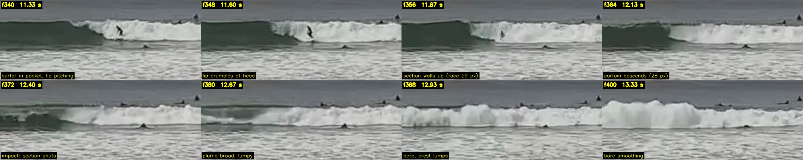
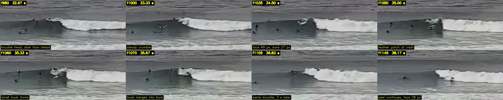
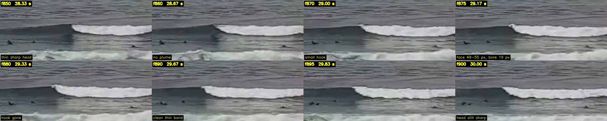
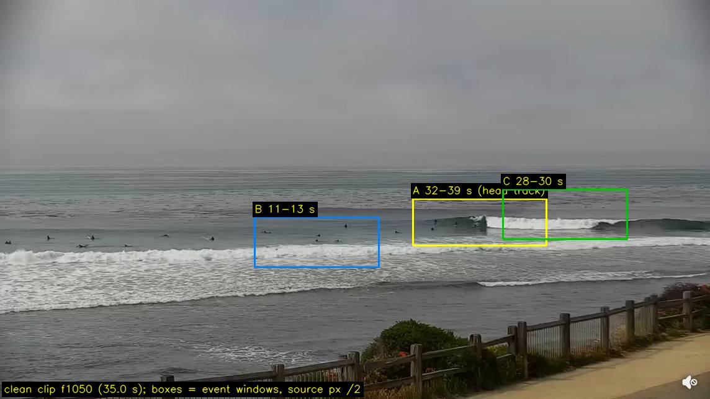

# Curl truth — what a breaking wave at Pleasure Point actually does

2026-09-24. Track F of the six-agent curl pass. Establishes the *target* before
the geometry tracks tune anything: what the lip does in Andy's own footage,
what the verified literature says the overturning profile is, and at which
spots a plunging lip is physics rather than a look decision.

Inputs: the restored clean clip
`pointbreak-pleasure-point-2026-08-15-1528-unique-clean.mp4` (SHA-256
`11428e3f…962695` re-verified today, 1,825 frames, 30 fps, 2288 × 1286,
60.83 s; Second Peak / cliff-rail view, 3–5 ft observed, 16 s SSW, incoming
tide ~+0.73 m — [capture note](PLEASURE_POINT_CAPTURE_2026-08-15.md));
[PHYSICS_CORE_AUDIT_2026-09-23](PHYSICS_CORE_AUDIT_2026-09-23.md) R3/R5;
[FIELD_WAVE_MOTION_2026-09-15](FIELD_WAVE_MOTION_2026-09-15.md);
`shared/params.js`; the two climatology notes.

## Headline

**Pleasure Point on this footage is a spilling wave with a thin, short-lived
pitching lip at sections and closeouts. No tube opens in 60.8 s. No lip lands
clear of the face.** The sustained head is a compact aerated knuckle
(Longuet-Higgins & Turner's entraining wedge, Duncan's collapsing bulge), not
a thrown jet. The one discrete "crash" in the clip is a *section shutting
down*: a 1–2 face-height stretch walls up, a curtain descends about half the
face height, and the whole section becomes a lumpy bore in about a second.
That is what "real curl and crashing" looks like here, and it is what the
bed's ξ₀ (0.11–0.44, spilling at every card state) predicts. Plunging with a
cavity is available at First Peak on a large long-period winter day and at
Sewers only on a very long-period one; everywhere else it is a look decision
and should be authored as a *section* event, not the steady-state head.

---

## 1. Field reference sheet

### 1.1 Inventory of lip events in the unique interval

Method: per frame, "new white" = luma > 185 now and < 150 ten frames earlier,
in the water band y 540–1000; connected components with height ≥ 18 px and
area ≥ 200 px, grouped when within 20 frames / 150 px. This finds *births* of
whitewater (lip throws, section collapses, head advances), not the persistent
bore. Inventory in
[`assets/curl-truth-2026-09-24/sheet-manifest.json`](assets/curl-truth-2026-09-24/sheet-manifest.json)
(crop provenance) and the scratch inventory reproduced below.

| id | clean time | source px (x → x, y) | what it is | samples |
|---|---|---|---|---|
| **A** | 32.0–39.5 s | 1711 → 1332, 699–722 | one outer wave, **7.5 s of continuous peel**, head marching image-left at 1.68 px/frame | 42 |
| **B** | 11.2–13.3 s | 1060 → 880, 745–800 | mid-frame **section collapse**: pitching lip with surfer, wall, curtain, plume, bore (the FIELD_WAVE_MOTION event) | 5 tall + manual |
| **C** | 28.3–30.0 s | 1790 → 1770, 680 | outer **thin sharp head**, small hook, no plume | 3 |
| — | 13.8–14.2 s | 606 → 595, 768 | inner reform, short | 3 |
| — | 18.2–18.3 s | 71 → 88, 803 | inner reform at frame edge | 3 |
| — | 29.0–29.5 s | 880 → 828, 760 | surfer taking off in crumbling lip (mid) | 3 |
| — | 34.3–34.7 s | 4 → 28, 811 | inner reform at frame edge | 3 |

Three events are clear enough to read: A, B, C. Sheets (Andy's own footage
only, 8 head crops each, 400 × 160 source px at 1.75×, labels boxed for
contrast; ≈ 0.54 MB total):

### 1.2 What a Pleasure Point lip does (read off the sheets)

**A — the steady head (the normal case).** The break is a white *knuckle*
40–80 px wide sitting at the left end of a thick, round-topped bore. Ahead of
it the face is dark, readable and sloped, and it feathers only within about
one face-height of the knuckle. The bore top sits level with the unbroken
crest. Every 0.5–1 s a pale patch appears on the crest at the knuckle, forms
a small hook (f1050–f1065), and merges into the bore without ever detaching
— 15–20 frames from patch to merge. Over 7.5 s the head never throws, never
opens a cavity, and never stops. The face height falls from ~50 px to ~28 px
as the wave runs down-point; the bore thins with it. This is Longuet-Higgins
& Turner's aerated wedge and Duncan's bulge-collapse, not an overturning jet.

**B — the section (the crash).** A surfer is in the pocket under a *pitching*
lip at f336–f352: the lip is a thin bright line curling forward, it projects
at most ~0.3 face-heights ahead of the face plane (eyeballed at the frame's
resolution limit), and it crumbles into the knuckle within 8–12 frames. Then
the section ahead of the surfer **walls up**: 59 px of near-vertical dark face
(f356), the crest darkens, and a **curtain** descends from it (f364–f368,
28 px, half the wall). At f372 the whole 1–2 face-height section shuts at
once — this is a closeout, not a peel — and a broad, lumpy **plume** stands
where the wall was (f376–f384). By f388 it is a bore with crest lumps whose
top sits where the wall crest was; by f400 it is smoothing. The dark face
persists *ahead* of the collapsing section throughout.

**C — the clean thin head.** At 28–30 s an outer head runs without any
plume: face 49–55 px, bore only 19 px of saturated white (0.35–0.4 face),
top level with the crest, a small hook at f870–f875 that is gone by f880.
This is the "thin luminous lip over a dark face" of `field_010`.

**Does a tube ever open?** No. In 1,825 frames no frame shows a lip landing
clear of the face with dark cavity behind it. The `field_010`, `field_035`
and `field_050` stills from the 08-15 note agree: one active head each, thin
white crest line, small pitched lip (010 and 035), surfer riding under a
crumbling lip with a lumpy bore behind (050). None shows a barrel.

### 1.3 Ratios (image plane; no metres)

The camera is uncalibrated and looks obliquely seaward from ~11 m. Vertical
pixels are proportional to true heights up to one common scale per event;
along-crest pixels are foreshortened by the oblique view; shoreward (throw)
distance is toward the camera and cannot be measured. Ratios within one frame
are therefore honest for *heights*, lower bounds for *lengths*, and silent
on throw depth. Face height H_f = the longest run of luma < 95 in a 20–40 px
column through the unbroken face; bright bands = longest run of luma > 185.
Raw numbers in
[`assets/curl-truth-2026-09-24/measurements.json`](assets/curl-truth-2026-09-24/measurements.json).

| quantity | A (outer peel) | B (section collapse) | C (thin head) |
|---|---|---|---|
| unbroken face H_f at the head, px | 49–56 (f1000–f1070), 28 by f1145 | 57–59 (f344–f360) | 49–55 |
| pitched-lip projection ahead of face / H_f | no throw | ≤ 0.3 (eyeballed, f344–f352) | ≤ 0.1 |
| curtain height / H_f (throw phase) | — | 0.5–0.6 (28 px / 45–57 px, f364–f368) | — |
| saturated bore band / H_f | 0.5–0.65 (27–33 px) | 0.4–0.55 (21–31 px) | 0.35–0.4 (19 px) |
| bore top vs unbroken crest | level (≤ 5 px, ≤ 0.1 H_f below) | 13 px (0.2 H_f) below the standing wall | level (680 vs 678–681) |
| plume top vs pre-collapse crest | — | ≤ 0.15 H_f: bore lumps at f396 (750) vs wall crest at f356 (743) | — |
| hook lifetime, frames | 15–20 (0.5–0.67 s) | 8–12 (0.27–0.4 s) | ≤ 10 (≤ 0.33 s) |
| throw → impact (curtain → plume), frames | — | 8 ± 4 (0.13–0.40 s) | — |
| impact → collapsed bore, frames | — | 16 ± 4 (0.40–0.67 s) | — |
| wall standing → bore smoothing, total | — | ~44 frames (1.5 s) | — |
| knuckle width / H_f | 0.8–1.5 | — | 0.5–0.8 |
| feather zone ahead of knuckle / H_f | ~1 | — | ~0.5 |
| head advance in image | 1.68 px/frame = ~1.0 H_f per second (foreshortened; a lower bound) | — | — |

Two things the table says that matter for the renderer:

1. **The plume does not go up; it goes forward.** Nothing in the clip rises
   more than ~0.15 face-heights above the crest line that preceded it. The
   crest line is approximately conserved through the collapse; what changes
   is material (dark → saturated white → lumpy grey-white) and thickness.
2. **The curtain is half a face, not a face.** The thrown water at B is
   0.5–0.6 H_f tall and lands within a fraction of a second; the classic
   descent in the renderer (`CRASH_PEAK_S = 0.42`, release extension to
   1.40 s) is already inside the field bracket for the *impact*, and the
   earlier FIELD_WAVE_MOTION bracket (0.23–0.70 s) is reproduced here as
   8 ± 4 frames on a differently-specified event. Do not set a constant to
   either midpoint; the definitions still differ from the model's.

**Sewers footage.** None exists on the volume. `/Volumes/andyed/Movies/
desktop-captures-2026-09/` holds only the 08-15 morning clip
(`pleasure-point-2026-08-15-0736-cleaned.mp4`), the 08-15 afternoon original
and its clean derivative (this one), and the social exports. Both PP clips are
the Second Peak cliff view. No third-party footage was sought or used.

---

## 2. Verified literature on the overturning profile

All DOIs resolved against api.crossref.org today; author, title, container and
year returned as cited. Entries added to [`refs.bib`](refs.bib) under the
2026-09-24 block; `battjes1974surf` gained its DOI in place. The one-line
"what it gives us" summaries are from the papers' well-known results and
abstracts; none was re-read end to end this session (same status as the
Carini note in the physics audit).

**Four first-guess DOIs resolved to unrelated papers** (a Jones integral paper,
a copper-aluminium yield-stress paper, a floating-hemisphere paper, and a
motion-blending SCA paper). They were replaced by CrossRef bibliographic
search before anything was written. This is why the verify step exists.

### 2.1 The plunging profile family (for Track A, profile shape)

| key | gives us |
|---|---|
| `longuethigginscokelet1976deformation` — Proc. R. Soc. A 350:1–26, 10.1098/rspa.1976.0092 | The canonical computed overturning sequence: crest steepens, front face passes vertical, a jet forms and falls. Every profile family is compared against these frames. |
| `longuethiggins1981overturning` — Proc. R. Soc. A 376:377–400, 10.1098/rspa.1981.0098 | Analytic forward face as a rotating hyperbola; the detached jet is a free-fall parabola to first order. A **jet trajectory law**: horizontal velocity ~ crest speed, vertical ~ g t. |
| `longuethiggins1982parametric` — JFM 121:403–424, 10.1017/S0022112082001967 | Closed-form parametric free-surface families reproducing tube and jet. The nearest thing to a **one-parameter analytic overturning profile**. |
| `longuethiggins1980corners` — Proc. R. Soc. A 371:453–478, 10.1098/rspa.1980.0092 | Local shape law for the lip **tip** (the sharp corner). Tip only. |
| `new1983elliptical` — JFM 130:219–239, 10.1017/S0022112083001068 | The tube cavity fits an **ellipse of axis ratio ≈ √3**. This is the theoretical counterpart of Mead & Black's vortex ratio; a shape parameter with a physical anchor. |
| `peregrine1983breaking` — Annu. Rev. Fluid Mech. 15:149–178, 10.1146/annurev.fl.15.010183.001053 | The vocabulary and sequence: overturning → jet → impact → **splash-up** → bore. Spilling vs plunging as ends of one continuum. The acceptance criteria below use its stages. |
| `peregrine1980approaching` — ICCE 17, 10.9753/icce.v17.31 | Overturning profiles *on a slope*, the beach counterpart of 1976. |
| `basco1985qualitative` — JWPCOE 111(2):171–188, 10.1061/(ASCE)0733-950X(1985)111:2(171) | Stage sketches for both breaker types including the **splash-up vortex** and its rebound; the "plume" in the field clip is his splash-up, and it goes forward. |
| `bonmarin1989geometric` — JFM 209:405–433, 10.1017/S0022112089003162 | Tank measurements of front-face steepness, crest asymmetry and jet geometry **as ratios of wave height** — the same dimensionless form as §1.3, and the only classical source that reports them. Compare our field ratios to his before authoring numbers. |
| `dommermuth1988plunging` — JFM 189:423–442, 10.1017/S0022112088001089 | Computed profiles overlaid on photographs through jet formation: potential-flow overturning is right up to impact. Licence to use an inviscid profile family for the lip. |
| `yasuda1997kinematics` — Coastal Eng. 29:317–346, 10.1016/S0378-3839(96)00032-4 | Jet shape and impact point as functions of slope and relative height; breaker type from the kinematics. |
| `kimmounbranger2007piv` — JFM 588:353–397, 10.1017/S0022112007007641 | A full laboratory plunging sequence over a slope with velocity fields: reference **time series** of the free surface through overturning, impact, splash-up and bore. |
| `vinjebrevig1981numerical` — Adv. Water Resour. 4:77–82, 10.1016/0309-1708(81)90027-0 | Early finite-depth overturning including a jet over a sloping bed. Historical anchor. |

### 2.2 The spilling profile family (for the spots the bed says are spilling)

| key | gives us |
|---|---|
| `longuethigginsturner1974plume` — JFM 63:1–20, 10.1017/S002211207400098X | The spilling breaker as a turbulent aerated wedge riding on the front face: the **knuckle** of event A. A shape (wedge on a slope) and a mechanism (entrainment). |
| `duncan1999gentle` — JFM 379:191–222, 10.1017/S0022112098003152 | Measured spilling crest profiles: a **bulge** forms on the front face, a toe advances down it, the bulge collapses to turbulence. The patch-hook-merge cycle at A's knuckle in profile form. |
| `duncan2001spilling` — Annu. Rev. Fluid Mech. 33:519–547, 10.1146/annurev.fluid.33.1.519 | The review for the spilling side; pairs with Peregrine 1983. |

### 2.3 Breaker type thresholds

| key | gives us |
|---|---|
| `galvin1968breaker` — JGR 73(12):3651–3659, 10.1029/JB073i012p03651 | The four-class taxonomy and the offshore parameter H₀/(L₀ tan²β) that Battjes re-expressed as ξ. |
| `battjes1974surf` — ICCE 14, 10.9753/icce.v14.26 (**DOI newly found**) | ξ₀ bands: spilling < 0.5, plunging 0.5–3.3. The number the physics audit uses. |
| `grilli1997breaking` — JWPCOE 123(3):102–112, 10.1061/(ASCE)0733-950X(1997)123:3(102) | An independent slope-parameter threshold set (solitary waves) to sanity-check the Battjes bands. |
| `meadblack2001predicting` (existing; **no DOI exists** — JCR SI 29 is not in CrossRef; JSTOR/secondary only) | Vortex ratio Y = 0.065·X + 0.821 (R² 0.71) on orthogonal seabed gradient. Under the repo's stated reading of X as the run of a 1:X slope, the audit's β_line 0.7–2.7° (X ≈ 21–80) gives Y ≈ 2.2–6.0: the flattest, mushiest end of their scale. **Confirm the direction of X against their figure before hard-coding** (SURF_SCIENCE_REFS §2.1 already says so). |

### 2.4 Graphics ancestors (for Track B, mesh / sweep)

| key | gives us |
|---|---|
| `mihalef2004breaking` — SCA '04, 10.1145/1028523.1028565 | A **library of precomputed 2-D breaking slices swept along a 3-D crest** under artist control ("wave curves"). The closest published ancestor of a swept-profile approach; cite it as such. |
| `thurey2007breaking` (existing) — PG 2007, 10.1109/PG.2007.33 | Steep-front detection in a shallow-water height field spawning a connected particle sheet for the lip plus spray/foam. Real-time; a lip as a *separate layer* over a height field. |
| `fournierreeves1986ocean` — SIGGRAPH '86, 10.1145/15922.15894 | Gerstner trochoids whose orbits flatten with depth and whose phase is pushed crest-forward so the loop folds in shallow water: a **breaking-looking profile with no fluid solve**, the original height-field trick. |

### 2.5 Unverified — do not cite

Nothing in the task list failed verification. Two things were considered and
left out rather than stretched: Mead & Black's regression *direction* (not a
citation problem, an interpretation problem — see 2.3), and any quantitative
claim about Bonmarin's jet ratios beyond "he reports them" (not re-read).

---

## 3. Per-spot barrel expectations

Bed ξ₀ at the drawn line from the audit's R3 (tide 0, ladder ×0.7/×1/×1.3),
authored ξ from `shared/params.js`. Because ξ₀ = tan β/√(H₀/L₀) and
L₀ = gT²/2π, at fixed line position ξ₀ ∝ T/√H₀; the line also walks seaward
onto steeper wedge as H₀ rises (audit §0.2), which is why local ξ₀ *rises*
with H₀ at five spots. The "T needed" column scales the best ladder rung to
the Battjes 0.5 threshold at fixed slope — first order, since changing T also
moves the line slightly. Tide: TIDE_FLOOR shows the reef's floor moving
0.53–0.65 m of H₀ per metre of tide, so a **lower tide moves the line
seaward the way a bigger wave does** (≈ −0.5 m tide ≈ +0.3 m H₀ in line
position), which is favourable to plunging up to where the line leaves the
wedge; above a spot-specific tide (Sharks +0.33, Jack's +0.51, Second Peak
+0.63, The Hook +0.65, First Peak +0.66 m) the card does not break on the
reef at all. The sign is an inference from TIDE_FLOOR's mechanism, not a
measured ξ₀(tide).

| spot | authored ξ | bed ξ₀ ×0.7 / ×1 / ×1.3 (T) | gap at card | plunging would need | climatology | honest render |
|---|---|---|---|---|---|---|
| **Sewers** | 1.15 | 0.23 / **0.38** / 0.31 (15 s) | authored 3.0× bed | T ≳ 20 s at 2.2 m, or tan β ≥ 0.040 at the line (2.3° vs 1.73° measured); size alone does not help (×1.3 is *flatter*) | Jan p90 Hs 1.70 m at the break; ≥ 18 s groundswell days exist in winter but are a few per season | **Spilling head with pitched-lip sections.** The obvious plunging candidate is only marginally so: the closest to threshold at card, but it needs period, not size. Author the barrel as a section event on long-period days. |
| **First Peak** | 0.85 | 0.20 / 0.44 / **0.54** (14 s) | 1.9× at card; **crosses at ×1.3 on its own** | H₀ ≳ 2.3 m at 14 s, or ≥ 16 s at the 1.8 m card; a low tide helps | a January p90+ day (21.5 % of Jan hours ≥ 1.3 m; 2.3 m is rarer) | **The one physics barrel.** Plunging on big winter days, spilling the rest of the year. The preset's ξ is right in kind on those days and 1.9× too high on the card day. |
| **Second Peak** | 0.65 | 0.23 / 0.30 / 0.30 (14 s) | 2.2× | T ≳ 23 s — not a real ocean | the field clip *is* this spot: H₀ 1.4 m, 16–17 s, tide +0.73 → scaled ξ₀ ≈ 0.37, spilling, and the footage shows a spilling knuckle | **Spilling, always.** The clip is the ground truth: knuckle head, thin hook, section collapses. Authored plunging here is a look decision and the footage says it is the wrong one. |
| **Jack's (38th)** | 0.50 | 0.23 / 0.37 / 0.45 (13 s) | 1.4× at card, 1.1× at ×1.3 | ≥ 14.5 s at 1.43 m; ≥ 17.6 s at the 1.1 m card | 14–15 s is the modal MOP peak band; possible on a solid day | **Borderline.** Nearest the threshold per unit size; a gentle plunge on head-high 15 s days is defensible, spilling on the card. |
| **The Hook** | 0.80 | 0.29 / 0.34 / 0.42 (13 s) | 2.4× at card, 1.9× at ×1.3 | ≥ 15.5 s at 1.95 m; ≥ 19 s at the 1.5 m card | big long-period winter day | **Spilling on the card**, plunging only on a big long-period day. Authored ξ is the second-most inflated. |
| **Sharks** | 0.45 (spilling) | 0.19 / 0.27 / 0.34 (13 s) | 1.6× (both spilling) | ≥ 19 s at 1.3 m | rare | **Spilling.** Authored class is already right; the value is still 1.6× the bed. |
| **Privates** | 0.35 (spilling) | 0.13 / 0.11 / 0.19 (12 s) | 1.8–3.1× (both spilling) | never (would need T ≈ 32 s) | — | **Spilling, mushy.** The peel here is the DEM's, not a reef's (MODEL §2.1). |

**Is "real curl at Pleasure Point" a physics outcome or a look decision?**

It is a physics outcome at **First Peak on large long-period winter days**
(ξ₀ crosses 0.5 at ×1.3 on the measured bed) and marginally at **Sewers on
very long-period days** (needs ~20 s, which the ocean does deliver a few
times a season). At **Second Peak, Jack's, The Hook, Sharks and Privates** on
any realistic day it is a look decision, and at Second Peak the footage says
the honest look is spilling. That does not make "crashing" unavailable: the
field's own crash is the **section collapse** — wall, half-face curtain,
forward plume, lumpy bore in ~1.5 s — and that is available at every spot as
a *local* event without lying about the head. The `sections` parameter is the
right owner for it, not `xi`.

---

## 4. Acceptance criteria for the jury

Written against the claim "this reads as Pleasure Point breaking", not
against the mechanics. A rendered PP head passes when a juror who has seen
the three sheets would accept it as the same wave.

**Must show (every spot, every day):**

1. **A dark, readable, sloped face ahead of the break**, at least one
   face-height long before it feathers. The face is the subject; the break is
   its edge.
2. **A compact knuckle head**, 0.8–1.5 face-heights wide, whose top is level
   with the unbroken crest (within 0.1 H_f). Not a wall of white, not a fold.
3. **A thin, irregular lip line** along the crest at the head: a bright edge a
   few percent of H_f thick, scalloped, short-lived (hooks live 0.3–0.7 s and
   merge; they do not detach and they do not repeat on a metronome).
4. **A bore behind the head that is thick and round-topped**, 0.4–0.65 H_f of
   saturated white over a grey base, level with or slightly below the crest,
   thinning as the wave runs down-point.
5. **Whitewater that ages into lace**: saturated → lumpy grey-white with crest
   bumps → perforated foam field, over seconds, not a uniform blur.
6. **One active subject per wave.** Prior bores and reforms are subordinate in
   value; they do not compete with the live head.

**Must show when a section shuts (the "crash"), at any spot via `sections`:**

7. **A wall first**: 1–2 face-heights of crest go dark and near-vertical for
   ~0.3 s *before* anything falls.
8. **A curtain of ~0.5 H_f**, not a full-height sheet, descending from the
   wall crest and reaching the foot in 0.13–0.4 s.
9. **A plume that goes forward, not up**: nothing rises more than ~0.15 H_f
   above the prior crest line; the plume is broad and lumpy and becomes bore
   in 0.4–0.7 s.
10. **The face ahead of the shutting section stays dark** through the collapse.

**Must show only where §3 allows it (First Peak big/long-period, Sewers
very-long-period; elsewhere it is a flagged look decision):**

11. **A pitched lip with a cavity**: lip projecting more than ~0.3 H_f ahead of
    the face, an elliptical cavity (axis ratio around √3, New 1983) visible
    behind it, landing clear of the face. If this appears at Second Peak in
    a default preset, the render fails the site test: the footage never
    shows it.

**Must not show (fails the site test outright):**

- a lip that stands more than 0.15 H_f above the crest line before falling;
- a full-height sheet or "flap" folding over the whole face;
- a smooth pale face with a dark folded ribbon (the 08-15 `sim_current_058`
  defect);
- a head that is a bright horizontal band rather than a knuckle;
- a cavity at any spot on a card day.

---

## Reproduction

Scratch instruments (session scratchpad; promote if reused): `overview.py`
(1 fps sheet + bright-water signal), `crops.py` (new-white event inventory +
head-following crops), `measure.py` (luma-run face/bore/plume heights, with
annotated check crops), `finalsheets.py` (the four committed assets +
manifest), `crossref.py` / `crsearch.py` (DOI resolution and title search).
Source: the clean clip on the backup volume, SHA-256 verified before
decoding. OpenCV 4.13, numpy 2.4; no shader, model or preset was changed.
