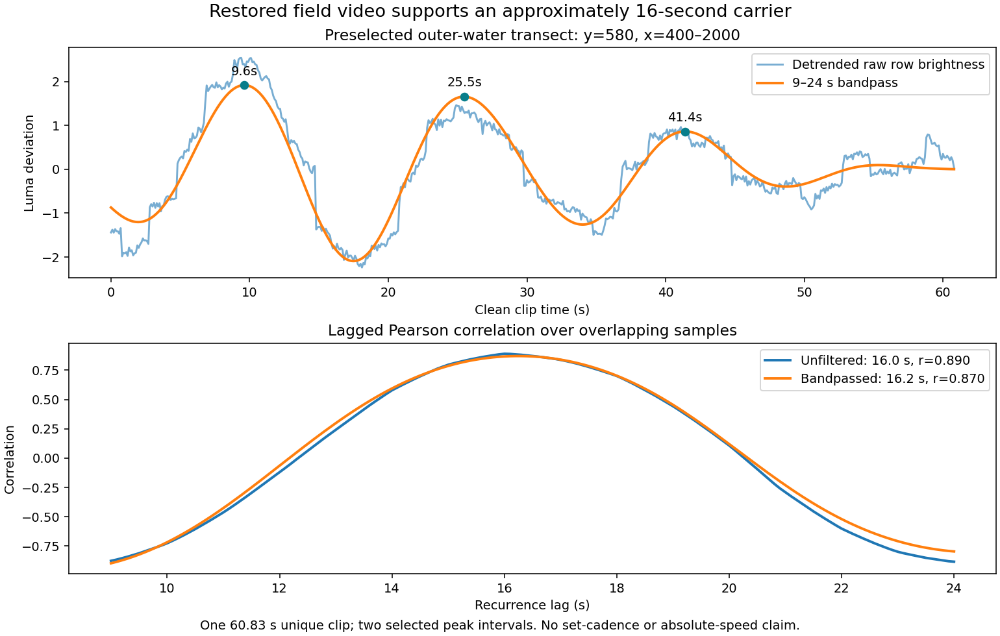

# Restored field video: motion measurements and classic-wave hints

September 14 Pacific / September 15 UTC, 2026. Continues the
[classic-wave experiment](CLASSIC_WAVE_PROGRESS_2026-09-15.md).

## Finding

The restored clip supports an approximately **16-second carrier** and shows a
localized lip collapsing rapidly into whitewater while the dark face remains
readable ahead of the breaking front. One inspected curtain-to-impact-plume
transition is bracketed at **0.23–0.70 s**. This is an image-observed transition
in one patch, not a water-particle fall time or a universal breaking constant.

The useful next experiment is the **lip's attachment and handoff to impact**.
The earlier 75% reduction in modeled fold reach and 91% reduction in nearly
flat folding remain model diagnostics. This footage has not converted them
into a field-fidelity score, and does not justify a deeper barrel everywhere.
No renderer settings or shader code were changed in this field-analysis pass.

## Restored sources and verification

Both clips were found under:

```text
/Volumes/andyed/Movies/desktop-captures-2026-09/
```

Both SHA-256 hashes and byte sizes match the earlier capture record:

| File | Bytes | SHA-256 |
|---|---:|---|
| `Screen Recording 2026-08-15 at 3.28.48 PM.mov` | 1,334,915,124 | `adab8793bab2b2e4dc7687eded12101d94606168e39f853449d7265d59255f92` |
| `pointbreak-pleasure-point-2026-08-15-1528-unique-clean.mp4` | 56,658,381 | `11428e3fa283bea0834c724c7a6c79d6bb6b506ae9e0885525d43ee08e962695` |

[Verified source manifest](assets/field-wave-2026-09-15/source-manifest.json).
The original filename uses U+202F before `PM`. The clean file has 1,825 frames
at 30 fps, 2288 × 1286, duration 60.833333 s. It retains source 40.9–101.7 s;
clean time plus 40.9 gives the original recording time to the documented trim
precision. The original remains unchanged on the backup. A hash-identical
local analysis copy is in ignored `qa/field-motion-2026-09-15/field-clean.mp4`.

The original five-minute recording repeats this approximately one-minute
scene. Analysis used the unique clean clip, with no intervals across scrolls
or restarts. The morning cleaned clip and social exports were also found but
were not used in these measurements.

## Motion and camera checks

The instrument decodes the clean CFR clip and samples every third source
frame: **609 samples at 10 Hz**, 608 adjacent comparisons. Coordinates below
are in the 2288 × 1286 source image unless stated otherwise.

- Water motion ROI: full width, y=680–880, downsampled by two. All **608/608**
  steps exceed the existing motion-gate threshold of 1.5 grey levels. Median
  absolute change is **3.57**, tenth percentile **2.51**.
- Fixed fence ROI: x=600–1100, y=1140–1240. Phase correlation between adjacent
  frames has response above 0.5 in all 608 comparisons. The 95th percentiles
  of absolute translation are **0.18 px horizontally, 0.28 px vertically** in
  original-image units per 0.1 s. These are local camera-stability diagnostics,
  not wave speed or proof of zero total drift.
- Ordered whole-wave strips and a finer local sequence confirm actual ocean
  evolution. The clip is not a frozen player or a page-scroll sequence.

## Carrier: fresh result, not an exact replay of the old analysis

The previously documented y=580 transect was selected before this analysis.
The new fully specified signal averages x=400–2000 and rows y=577–583. The
older note did not preserve its exact x window, so numerical identity with
its 16.25 s estimate was not assumed.

| Diagnostic at y=580 | Fresh result |
|---|---|
| Detrended, unfiltered recurrence | **16.0 s**, overlapping-sample Pearson r=0.890 |
| 9–24 s bandpassed recurrence | **16.2 s**, r=0.870 |
| Selected filtered maxima, clean time | 9.6, 25.5, 41.4 s |
| Consecutive maxima intervals | 15.9, 15.9 s |



The filter is a third-order Butterworth applied forward/backward, with a
linear detrend first. Peaks are separated by at least 11 s, require prominence
of 0.65 filtered standard deviations, and are retained only at t=4–54 s.
Recurrence is searched over 9–24 s. The raw-signal result is a check that the
filter did not manufacture the 16 s recurrence. These maxima are image-luma
features, not individually tracked water parcels.

The result is sensitive to which water is sampled: the six tested rows
560/580/600/620/640/660 have filtered recurrence maxima spanning 16.2–20.7 s,
with r ranging 0.31–0.90. They are all preserved in
[measurements.json](assets/field-wave-2026-09-15/measurements.json). Do not
average dissimilar bands or claim all rows measure the same carrier. The
preselected row supports approximately 16 s, consistent with the historical
result and the recorded afternoon swell report; it still supplies only two
selected crest-like intervals and cannot establish set cadence.

## What the continuous sequence adds to the shape brief

All times here are clean-clip time. The private review page includes native
video controls and exact jump points; no retimed video was encoded.

1. **Keep the unbroken face intact ahead of the head.** In the 2–12 s and
   34–44 s sequences, the bright breaking front progresses image-left while
   the dark face remains ahead and whitewater occupies the already-broken
   portion. This is a direction observation in this camera view, not a
   calibrated alongshore velocity or peel angle.
2. **A new local patch can break ahead of the existing front.** In the
   11–13.57 s detail sequence, a feathering patch develops on the standing
   face, becomes a descending curtain, then joins the existing whitewater.
   A single rigid curl translated along the whole crest would miss this
   local birth and merging.
3. **The curtain-to-plume handoff is quick.** Inspect source frames 351/358
   (clean 11.700/11.933 s) around the first distinct descending white curtain,
   and 365/372 (12.167/12.400 s) around the broad impact plume at its foot.
   These visual brackets imply 0.23–0.70 s between those two visible events.
   By 12.633 s the patch has become merged whitewater. The brackets are
   recorded in [manual annotations](assets/field-wave-2026-09-15/lip-event-annotations.json).
   They include the seven-frame sampling uncertainty, not a statistical
   confidence interval or every ambiguity of visual interpretation.
4. **Bright water changes material character after impact.** The thin,
   scalloped lip becomes a thick plume and then a perforated moving foam
   field. The dark face, short-lived lip, impact and aftermath should remain
   distinguishable in the renderer. The clip's lighting supports a look
   reference, not a cross-renderer brightness residual.

### A tracker failure worth preserving

A trial thresholded white components in fixed y=680–810 at luma thresholds
150, 170 and 190, closed five-pixel gaps, and selected a large component
extending to x>1750. At lower thresholds it frequently joined the **older
foreground bore**; at 190 it followed the current whitewater in some frames
but switched subjects in others. The overlaid result was visually rejected.
No peel speed or lip duration is reported from that tracker. A future tracker
must follow the same crest and distinguish current impact from prior foam;
threshold selection alone cannot establish subject identity.

## Consequences for the next renderer experiment

- Retain smooth carrier-phase convergence: the existing GPU experiment shows
  that it removes most of the unwanted broad shelf without losing the hook.
- Test a coherent upper-face → falling-lip → impact path at the active head,
  with local secondary break patches. Compare continuity and vertical travel,
  not only the maximum bend angle.
- Audit the classic release extension (ends at 1.40 s) against the existing
  impact clock (`CRASH_PEAK_S=0.42`). The field's short local transition makes
  a lingering post-impact hook a useful failure case. **Do not set a constant
  to the observed 0.47 s midpoint:** the field event definitions and model
  birth/impact definitions are not yet aligned, and the footage is Second
  Peak context while the pronounced classic test is Sewers.
- Compare dense GPU curves with actual mesh chords/normals near the lip before
  spending more on uniform mesh density. The earlier three-grid-interval
  observation and the remaining angular edge still need resolution.
- Keep `classic=1` opt-in. Camera pose, field forcing and radiometry are not
  calibrated, and the current 17 s Second Peak comparison is a documented
  appearance context, not a model fitted to this afternoon's 16 s swell.

## Reproduction and evidence retention

From the repository root, with OpenCV, numpy, scipy and matplotlib available:

```sh
MPLCONFIGDIR=/tmp/pointbreak-mpl python3 scripts/measure_field_wave.py \
  '/Volumes/andyed/Movies/desktop-captures-2026-09/pointbreak-pleasure-point-2026-08-15-1528-unique-clean.mp4' \
  --out qa/field-motion-repeat
```

The script requires the exact reference hash and verifies 30 fps / 1,825
frames. It streams decoded frames; it does not load a full-resolution video
cube into memory. Its output includes numeric signals, summaries, plots and
private contact sheets, including the exact twelve-frame local audit crop.
Manual event labels are declared separately from automatic measurements.

Durable: this note, the instrument, source identities, numeric measurements,
manual event brackets and the derived carrier plot. Raw frames, source video,
failed-tracker overlays and the interactive review stay in ignored
`qa/field-motion-2026-09-15/`. No third-party video or new field frames were
added to the repository's tracked artifact set. No commit or deployment was
performed.

Verification: the promoted instrument was rerun into a separate output
directory and reproduced every numeric result exactly, including the source
hash, sample count, motion checks and all six carrier rows. The fine-frame
audit was regenerated. Script syntax, evidence JSON, local report links and
`git diff --check` passed. The private playback review decoded and advanced
the native video; event seeks, quarter-speed playback, keyboard activation
and the 390 px mobile layout passed without page errors.

Local playback review: `http://127.0.0.1:8127/qa/field-motion-2026-09-15/`.
