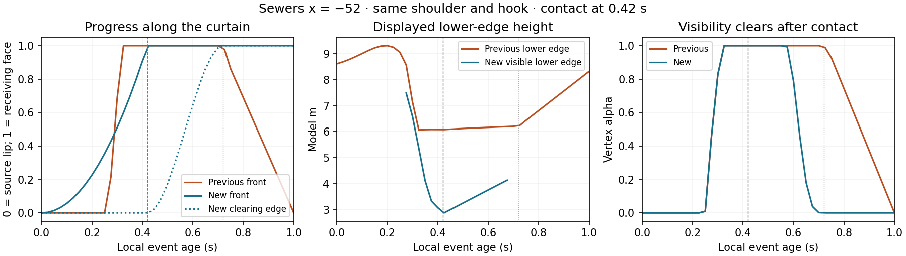

# Lip descent and impact experiment — 2026-09-15

## Hypothesis recorded before implementation

The curtain uses the current curl/section/fade gate for both opacity and
geometric reach (`vG = v*gate`). As bend strength releases, that rule pulls the
sheet back toward its crest. Partial section strength also prevents a visible
sheet from reaching its landing. The field video instead shows a short local
curtain-to-plume transition and subsequent whitewater.

The exact existing CURTAIN_VERT body was run on the GPU as a readback pass,
sharing the live renderer and uniforms. Local age was sampled every 0.05 s
from 0 to 1.50 at Sewers stations x=-84,-52,-20, H0=2.2, T=15. Each station's
birth was computed separately and checked against the GPU phase age. At
x=-52 the lip height rises from 5.19 model m at age 0.60 to 7.41 at 0.80;
curtain reach drops from 1.00 to 0.48, then to zero by 1.00 s. At x=-84 the
maximum reach is only 0.573 because section strength is included in reach.

There is an additional limitation: during strong overturn, the sampled
receiving face can be above or behind the lip. At x=-52, age 0.40, the tip is
(y=5.42,z=-223.42), but the old foot is (y=6.08,z=-226.53). A parameter moving
forward along that curve is not automatically falling in world space.

First bounded experiment: keep the existing grid/shoulder/peak-hook geometry,
separate the curtain's local-age progress from visibility, clear the sheet
from its upper end after impact, and use the existing canonical impact
landing. Keep invalid upward/backward spans visible to diagnostics and
prevent them from drawing as falling water. This does not yet fix the grid's
own upward recovery; it isolates the curtain handoff before altering another
surface authority.

Baseline evidence is local ignored `qa/descent-2026-09-15/baseline/probe.json`.
The original sources are preserved beside it in `before/` for exact A/B.

## Result: an opt-in curtain handoff, not a finished barrel

Enable `#classic=1&descent=1`. Curl, onset and the curtain must also be enabled
(they are enabled by default). Remove `descent` or set it to `0` to recover the
previous classic experiment. No defaults were promoted.

The first candidate merely suppressed invalid spans and was rejected: it
removed almost the entire falling sheet. Surface transects showed why. The
classic hook reaches beyond the old source-space landing. Extending that
landing only by the crown/ellipse proportions was still insufficient at two
of the three stations. The retained receiver uses **1.6 crest heights at full
plunge**, blended from the previous 0.9 by the existing plunging character.
This is an authored contact hypothesis in wave-relative units, not a physical
ratio measured from the uncalibrated field video.

The retained implementation:

1. **Separates travel from opacity.** The leading edge advances with squared
   local age to the existing `CRASH_PEAK_S = 0.42 s`. Section strength and
   curl decide visibility; a partial section can now reach the receiving face.
2. **Clears from the upper end after contact.** From impact to the existing
   curl-release endpoint `0.42 + 1.5*0.20 = 0.72 s`, the upper edge advances
   toward the foot. The leading edge remains at the foot. Its position follows
   the receiving surface after contact; it is not a tracked water parcel.
3. **Stops the source pulling the airborne sheet back up.** After impact the
   curtain retains the source's impact pose. The grid itself remains unchanged
   with roller off, including its existing post-impact upward recovery.
4. **Uses one source-space landing.** `breakerLandingFrameAt` exposes the
   existing landing/clock without requiring the roller build.
   `impactLandingAt` reads it, so optional deposit, roller, splash-up and spray
   consumers share the revised source coordinate and unchanged impact time.
   The curtain interpolates full displaced XYZ endpoints, rather than replacing
   their displaced X coordinate with source X. Control points are bounded to
   keep visible spans downward and shoreward; invalid spans fade out.

No carrier period, peel route, set envelope, wave height or field-derived
fall-time constant was changed. The video suggested the lifecycle question;
it did not supply the numerical tuning above.

## Measured outcome

The retained GPU instrument executes the exact `CURTAIN_VERT` text as a float
readback pass, sharing the page's live uniforms and textures. It samples all
13 vertices along the sheet at three Sewers stations, with 0.025 s steps from
age 0 to 0.75 s, plus 1, 1.5 and 14.95 s: **102 matched poses per arm**.

| Observable | Previous classic | Descent experiment |
|---|---:|---:|
| x=-84 geometric reach at age 0.425 | 0.573 | **1.000** |
| x=-52 receiving point at age 0.400 (y, z), model m | (6.084, -226.533) | **(2.758, -222.379)** |
| x=-52 lip at age 0.400 (y, z), model m | (5.418, -223.419) | **same** |
| x=-52 lower edge at age 0.300 → 0.400, model m | 7.142 → 6.084 | **6.589 → 3.085** |
| x=-52 leading/clearing progress at age 0.600 | leading 1.000, clearing 0 | **leading 1.000, clearing 0.648** |
| Curtain visible after age 0.720 | can remain visible | **zero** |

At these stations the new vertex alpha exceeds 0.02 over sampled ages
0.275–0.675, 0.275–0.675 and 0.250–0.675. These are sampled shader-visibility
windows, not field-measured fall durations or proof every vertex is unoccluded.



The new lower edge descends before contact. After contact its height rises
with the receiving face while the upper edge clears. A monotonically advancing
curve parameter must not be reported as monotonically falling world-space
water throughout the entire event.

## Verification

- Every sampled visible curve progresses downward and shoreward. Before impact
  the top equals its sampled source tip; after impact the bottom equals its
  sampled receiving point. Both travel parameters are monotonic within the
  event. The modulo boundary is checked for invisibility separately because
  Float32 can represent the exact boundary as age T rather than age zero.
- **Nine out-of-order seeks reproduce the exact same positions** (max error 0).
- **Seven presets × two roller builds**, each with active, classic-off,
  curl-off and onset-off modes at sim 48: finite surface values, no browser or
  shader errors. With roller off, toggling descent changes **zero sampled grid
  fields**. Inert combinations and pure spillers also retain identical curtain
  readback, including in roller builds. The optional roller's active contact
  field can change intentionally; this is not a whole-grid parity claim there.
- Saved pre-change shaders versus the new disabled path, Sewers/Sharks/Privates
  × classic off/on × roller off/on at sim 48: **zero changed GPU fields** over
  768 surface samples per case. PNGs differ by at most **1/255** in a channel;
  no pixels differ by more than eight levels. This is near-exact image parity,
  not a claim of identical image hashes.
- `npm test`: **185 passed**, including shader-literal checks and the complete
  hash-control documentation check. `git diff --check` is the final whitespace
  gate (passed). The GPU checks above test the rendered equations, beyond source tests.

[Durable measurements and source hashes](assets/lip-descent-2026-09-15/measurements.json).
[Interactive matched-age review](../../qa/descent-2026-09-15/index.html) was checked
with all six image pairs decoded, keyboard input, a 390 px viewport, and no
browser errors.

Raw readbacks, exact pre-change sources and matched images remain in ignored
`qa/descent-2026-09-15/`.

Reproduce the retained arm against descent off:

```sh
node scripts/measure_lip_descent.mjs
```

The script uses a running server at `http://127.0.0.1:8127` by default and
accepts `BASE_URL`, `PLAYWRIGHT_DIR` and an output-directory argument. The
12-case comparison to saved pre-change sources is a session-specific QA rig
at `qa/descent-2026-09-15/parity.mjs`.

## Remaining limitations and next coding lesson

The close rendered sequence now has a short sheet extending below the hook;
it still exposes the angular/faceted grid lip. **This is a verified local
handoff mechanism, not a demonstrated overall realism improvement.** The
shoulder and peak-hook geometry remain the previous classic experiment.

The grid's own upward recovery remains. Retaining the impact pose avoids
pulling the airborne curtain back up, but after release the upper edge is no
longer attached to the live, recovering grid. The curve is an authored strip,
not volume-conserving fluid. Contact direction was measured at three strong
Sewers events, not proven over every tide, height or site.

The optional roller shares the source-space landing, but the curtain material
still omits the roller's surface-mound compilation, as before this experiment.
Consequently exact attachment to the roller-raised grid is **not established**
by the curtain endpoint test; the two-build matrix checks finite rendering and
inert-mode parity. A later attachment pass should evaluate the same transported
surface in both passes and directly measure that gap before promoting a bundle.

Next: resolve the grid's post-impact recovery and the curtain/transported-grid
attachment together, using actual surface readback. Preserve the clean shoulder
and peak hook, and require ordered rendered proof before increasing whiteness,
barrel reach or changing the shared clock again.
