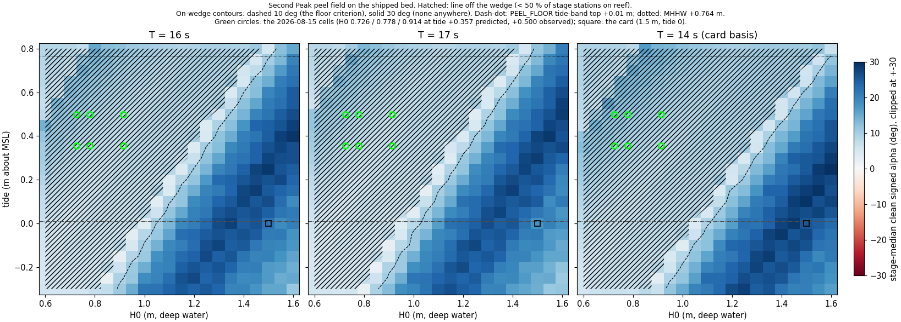

# The Second Peak peel field against the 2026-08-15 day — 2026-09-24

FIDELITY_AUDIT_2026-09-23 ranked action 1. On 2026-08-15 15:28 PDT the real
Second Peak peeled cleanly (SURFLINE_CAM_POSE: Vp 4.7–6.7 m/s, c 3.8–5.3,
α 55–73° on the clean crest) at +0.36…+0.50 m of tide and 0.73–0.91 m of
deep-water H0, where the model (a) declares `PEEL_FLOOR.secondpeak`'s tide
band closed (top +0.01 m) and (b) bakes a closeout (α 3.9°, Vp 37 m/s). The
question was whether the band is simply too tight or the direction machinery
is wrong at that state. Instrument: `scripts/measure_peel_band_field.mjs`,
headless, on the bake's own code, gated bit-for-bit against the shipped
`bed.js` import at the twelve observed cells before anything is reported.
Assets: `docs/research/assets/peel-band-2026-09-24/` (`field.json`, the
heatmap). Model at `590edaa`, NCEI 1/3" 2012 interpolant.

## Finding

Neither: the band is closed for the right reason and the machinery is not
what fails, because at every observed cell the synthetic wedge is **inert** —
0 % of stage stations sit on it, reef and no-reef bakes are identical, and the
line is a contour-following bore on the natural DEM 30–82 m *shoreward* of
the wedge crest datum, since a 0.73–0.91 m wave at 16–17 s breaks in 1.63–2.01
m of water while the wedge crest is 2.10 m below MSL and the −0.5 m NAVD88
ceiling invariant forbids any wedge crest shallower than 1.605 m, which under
+0.36…+0.50 m of tide is still 1.96–2.10 m down. No knob inside the shipped
invariants moves the SC116 cell at all (α 9.7°, on-reef 0, Vp 24 m/s across
every crest delta −1.6…+1.0 m and every strike 5–80°), and no cell of the
whole (H0 0.6–1.6) × (tide −0.3…+0.8) field at T 14, 16 or 17 reaches
Walker's 30° (maximum 29.9°). A wedge that *does* reproduce the day — crest
0.6–0.8 m below MSL (−0.1…+0.3 m NAVD88, an intertidal shelf) at a 45°
strike — gives α 41°, Vp 5.9–6.4 m/s, c 4.2 m/s at both observed cells,
keeps the card at 27–31° (25.8° shipped) and every Sentinel-2 Second Peak cell consistent,
leaves Jack's untouched, and breaks exactly one thing: the ceiling invariant
(208–256 wet posts raised above −0.5 m NAVD88). **Verdict: REEF FIT WRONG AT
DEPTH**, with the binding constraint named — the crest datum against the
shoreline ceiling, not the strike.

## 1. The day, twice over

Two tide values exist for the hour and both are carried: **+0.357 m** is the
4.0 ft MLLW page reading T6 used, which is the CO-OPS *prediction*; **+0.500
m** is the CO-OPS 9413450 *verified* water level (FORCING_AUDIT §3, non-tidal
residual +0.127 m). Three heights: 0.914 m (Surfline "3 ft", T6's bake),
0.778 m (SC116 Hs, the `#day=live` convention H0 := Hs), 0.726 m (Hs
de-shoaled from the 15.03 m MOP depth at T 16; 0.709 at T 17, not baked
separately). Period: SC116's 16.67 s band is `day=overhead` (T 16) or
`day=big` (T 17); the card basis is T 14.

Reef arm, stage domain (x −47…147 m, the floor's own grid), every reduction
the floor uses: stage-median clean signed crest-relative α, on-reef fraction,
median |Vp| along the line, median c; "z − zc" is the line's shore-normal
distance from the wedge crest line (negative = seaward). The last column is
T6's domain (every non-gap station of the 600 m bake), which reproduces the
published 3.9° / 37.0 m/s exactly at 0.914 / +0.357.

| T | H0 | tide | α med [q1, q3] | on-reef | Vp med [q1, q3] | c | line / crest bearing | z − zc | depth | healthy | full-bake α / Vp |
|---|---|---|---|---|---|---|---|---|---|---|---|
| 16 | 0.726 | +0.357 | 8.6 [1.2, 13.6] | **0.00** | 26.6 [17, 46] | 4.01 | 4.5 / −4.0 | +59 | 1.63 | no | 3.8 / 29.3 |
| 16 | 0.778 | +0.357 | 8.1 [1.3, 13.3] | **0.00** | 29.2 [18, 53] | 4.14 | 3.8 / −4.2 | +52 | 1.72 | no | 3.7 / 30.9 |
| 16 | 0.914 | +0.357 | 7.3 [1.4, 12.3] | **0.00** | 34.7 [21, 63] | 4.43 | 2.6 / −4.7 | +33 | 1.96 | no | **3.9 / 37.0** |
| 16 | 0.726 | +0.500 | 11.1 [2.7, 14.4] | **0.00** | 20.6 [16, 51] | 4.00 | 7.1 / −4.0 | +73 | 1.63 | no | 3.4 / 26.6 |
| 16 | 0.778 | +0.500 | 9.7 [2.4, 14.3] | **0.00** | 24.2 [17, 46] | 4.12 | 5.5 / −4.2 | +64 | 1.72 | no | 4.3 / 28.8 |
| 16 | 0.914 | +0.500 | 8.2 [2.1, 13.4] | **0.00** | 30.8 [19, 52] | 4.42 | 3.5 / −4.7 | +44 | 1.96 | no | 4.3 / 33.7 |
| 17 | 0.726 | +0.357 | 8.1 [0.9, 13.2] | **0.00** | 28.4 [18, 50] | 4.07 | 4.4 / −3.8 | +56 | 1.67 | no | 3.5 / 29.8 |
| 17 | 0.778 | +0.357 | 7.5 [1.1, 12.9] | **0.00** | 30.7 [19, 55] | 4.19 | 3.6 / −4.0 | +48 | 1.76 | no | 3.3 / 32.0 |
| 17 | 0.914 | +0.357 | 7.3 [1.1, 11.9] | **0.00** | 35.1 [22, 67] | 4.48 | 2.9 / −4.4 | +30 | 2.01 | no | 3.6 / 38.2 |
| 17 | 0.726 | +0.500 | 10.1 [2.4, 14.0] | **0.00** | 22.9 [17, 49] | 4.05 | 6.4 / −3.8 | +69 | 1.67 | no | 3.3 / 27.3 |
| 17 | 0.778 | +0.500 | 8.9 [1.5, 13.8] | **0.00** | 26.8 [18, 47] | 4.17 | 5.0 / −3.9 | +60 | 1.76 | no | 4.1 / 30.4 |
| 17 | 0.914 | +0.500 | 7.4 [1.9, 12.7] | **0.00** | 34.5 [20, 54] | 4.47 | 3.0 / −4.3 | +40 | 2.01 | no | 3.9 / 36.1 |
| 14 | 0.778 | +0.357 | 9.5 [2.1, 14.5] | **0.00** | 24.2 [16, 44] | 4.02 | 4.5 / −4.9 | +59 | 1.63 | no | 4.8 / 29.5 |
| 14 | 0.778 | +0.500 | 11.9 [3.6, 15.3] | **0.00** | 19.3 [15, 45] | 4.01 | 7.0 / −4.9 | +72 | 1.63 | no | 4.1 / 26.1 |
| 14 | 0.914 | +0.357 | 8.2 [2.6, 13.6] | **0.00** | 29.9 [18, 50] | 4.31 | 2.8 / −5.4 | +41 | 1.86 | no | 4.9 / 33.6 |
| 14 | 0.914 | +0.500 | 9.6 [2.9, 14.8] | **0.00** | 25.6 [17, 50] | 4.30 | 4.2 / −5.4 | +52 | 1.86 | no | 5.3 / 30.6 |

Three things are settled by this table alone. The **reef and measured (no
reef) arms are bit-identical** at every one of the 18 observed cells (16
shown; the JSON carries all three arms at all 18; T6 saw the same at its two
cells), so the wedge does nothing on this day. The **plane arm is a closeout too** (α 2.6–4.5°, Vp 55–83 m/s). And the
stage-domain α is 7–12° against T6's 3.4–5.3° on the full bake
(MEASUREMENT_LESSONS 8c: the 600 m median is dominated by flank stations);
both are closeouts, and the stage number is the one the floor is defined on.
Crest speed agrees with the cam at every cell (4.0–4.5 vs 3.8–5.3 m/s; the
line sits in 1.63–2.01 m, and √(gh) = 4.0–4.4 m/s), which is T6's "right on
locus, wrong on peel" row restated.

**Set-wave arms** (the FORCING reading — the drawn line is the significant
wave's, the cam's crests may be set waves): H1/10 = 1.27·Hs is never healthy
at either tide (on-reef 0.00–0.54, α 4–9°); E[Hmax] = 1.53·Hs makes a peel
only from the Surfline height (1.40 m) — α 21.2° / Vp 9.0 at +0.357 and
13.8° / 11.4 at +0.500, healthy by the floor's criterion, never 30°. From the
SC116 height (1.19 m) E[Hmax] stays off the wedge at the verified tide and
reaches it at the predicted tide as a 4° closeout (on-reef 0.51–0.60).

## 2. The (H0, tide) field

Stage-median α (on-reef %) on the shipped bed; `*` = healthy by the floor's
criterion (α ≥ 10° with the authored handedness, ≥ 50 % of stage stations on
the wedge); `**` would be Walker's 30° and appears **nowhere**. 0.05 m grid
in both axes in `field.json` (483 cells per T); every other rung printed.
Tides above +0.764 m (MHHW) are outside the range the model accepts and are
baked for the shape only.



**T = 16 s** (`day=overhead`)

| tide \ H0 | 0.60 | 0.70 | 0.80 | 0.90 | 1.00 | 1.10 | 1.20 | 1.30 | 1.40 | 1.50 | 1.60 |
|---|---|---|---|---|---|---|---|---|---|---|---|
| −0.30 | 6(0) | 6(0) | 7(49) | 11*(80) | 22*(84) | 24*(85) | 24*(85) | 24*(81) | 20*(79) | 16*(77) | 11*(74) |
| −0.20 | 5(0) | 6(0) | 6(0) | 6(61) | 15*(83) | 20*(85) | 26*(85) | 26*(84) | 21*(81) | 17*(78) | 15*(76) |
| −0.10 | 6(0) | 6(0) | 7(0) | 8(38) | 10*(78) | 19*(85) | 23*(85) | 27*(85) | 25*(81) | 20*(80) | 17*(77) |
| +0.00 | 7(0) | 6(0) | 7(0) | 7(0) | 4(58) | 14*(81) | 21*(85) | 27*(86) | 25*(84) | 22*(81) | 21*(79) |
| +0.10 | 7(0) | 6(0) | 7(0) | 7(0) | 7(17) | 10(75) | 19*(84) | 24*(86) | 28*(85) | 27*(84) | 19*(81) |
| +0.20 | 9(0) | 7(0) | 7(0) | 8(0) | 7(0) | 4(53) | 12*(80) | 23*(85) | 26*(85) | 26*(85) | 24*(81) |
| +0.30 | 10(0) | 8(0) | 7(0) | 7(0) | 8(0) | 8(0) | 7(61) | 16*(83) | 22*(86) | 28*(86) | 26*(84) |
| +0.40 | 12(0) | 10(0) | 8(0) | 7(0) | 8(0) | 8(0) | 10(41) | 12*(77) | 20*(85) | 25*(86) | 29*(85) |
| +0.50 | 8(0) | 12(0) | 9(0) | 8(0) | 8(0) | 9(0) | 8(0) | 5(58) | 14*(80) | 22*(85) | 27*(86) |
| +0.60 | 8(0) | 13(0) | 11(0) | 9(0) | 8(0) | 9(0) | 9(0) | 9(19) | 10(71) | 20*(84) | 25*(86) |
| +0.70 | 8(0) | 7(0) | 12(0) | 10(0) | 9(0) | 8(0) | 9(0) | 9(0) | 6(51) | 13*(79) | 22*(86) |
| +0.80 | 9(0) | 8(0) | 15(0) | 12(0) | 10(0) | 9(0) | 9(0) | 10(0) | 9(0) | 5(59) | 15*(81) |

**T = 17 s** (`day=big`)

| tide \ H0 | 0.60 | 0.70 | 0.80 | 0.90 | 1.00 | 1.10 | 1.20 | 1.30 | 1.40 | 1.50 | 1.60 |
|---|---|---|---|---|---|---|---|---|---|---|---|
| −0.30 | 5(0) | 5(0) | 2(57) | 13*(81) | 20*(85) | 25*(86) | 25*(84) | 20*(81) | 17*(78) | 15*(76) | 12*(74) |
| −0.20 | 5(0) | 6(0) | 6(4) | 9(76) | 18*(85) | 22*(85) | 27*(85) | 24*(81) | 20*(80) | 16*(77) | 12*(74) |
| −0.10 | 5(0) | 6(0) | 6(0) | 2(54) | 11*(80) | 20*(85) | 26*(86) | 24*(84) | 21*(81) | 19*(79) | 15*(77) |
| +0.00 | 6(0) | 6(0) | 7(0) | 6(0) | 8(72) | 16*(83) | 23*(86) | 27*(85) | 26*(83) | 18*(80) | 18*(78) |
| +0.10 | 7(0) | 6(0) | 7(0) | 7(0) | 8(47) | 11*(80) | 22*(85) | 25*(85) | 25*(85) | 25*(81) | 21*(80) |
| +0.20 | 8(0) | 7(0) | 6(0) | 7(0) | 7(0) | 4(60) | 15*(83) | 21*(86) | 27*(86) | 26*(84) | 19*(81) |
| +0.30 | 10(0) | 8(0) | 7(0) | 7(0) | 8(0) | 9(35) | 11*(77) | 20*(85) | 24*(86) | 28*(85) | 24*(83) |
| +0.40 | 11(0) | 9(0) | 8(0) | 7(0) | 8(0) | 8(0) | 4(58) | 13*(80) | 21*(85) | 28*(86) | 26*(85) |
| +0.50 | 12(0) | 11(0) | 9(0) | 8(0) | 8(0) | 8(0) | 8(14) | 9(72) | 19*(84) | 24*(86) | 28*(86) |
| +0.60 | 7(0) | 12(0) | 10(0) | 9(0) | 8(0) | 9(0) | 8(0) | 5(52) | 13*(79) | 21*(86) | 27*(86) |
| +0.70 | 8(0) | 11(0) | 12(0) | 10(0) | 9(0) | 8(0) | 9(0) | 9(0) | 6(60) | 15*(81) | 23*(86) |
| +0.80 | 8(0) | 8(0) | 13(0) | 11(0) | 9(0) | 8(0) | 9(0) | 9(0) | 10(35) | 12*(75) | 21*(84) |

**T = 14 s** (the card basis of `PEEL_FLOOR`)

| tide \ H0 | 0.60 | 0.70 | 0.80 | 0.90 | 1.00 | 1.10 | 1.20 | 1.30 | 1.40 | 1.50 | 1.60 |
|---|---|---|---|---|---|---|---|---|---|---|---|
| −0.30 | 6(0) | 7(0) | 7(0) | 7(67) | 15*(81) | 21*(85) | 27*(86) | 25*(84) | 22*(81) | 21*(79) | 16*(77) |
| −0.20 | 6(0) | 7(0) | 7(0) | 8(39) | 11*(78) | 20*(85) | 24*(86) | 28*(85) | 27*(83) | 21*(81) | 18*(78) |
| −0.10 | 7(0) | 6(0) | 7(0) | 7(0) | 4(57) | 12*(80) | 24*(85) | 26*(85) | 26*(85) | 26*(81) | 21*(80) |
| +0.00 | 8(0) | 7(0) | 7(0) | 8(0) | 8(7) | 9(72) | 17*(83) | 22*(86) | 28*(86) | 26*(84) | 23*(81) |
| +0.10 | 9(0) | 8(0) | 7(0) | 8(0) | 8(0) | 8(49) | 12*(78) | 21*(85) | 25*(86) | 29*(85) | 28*(84) |
| +0.20 | 11(0) | 9(0) | 8(0) | 8(0) | 9(0) | 8(0) | 5(59) | 15*(80) | 22*(85) | 27*(85) | 27*(85) |
| +0.30 | 11(0) | 10(0) | 9(0) | 8(0) | 9(0) | 9(0) | 9(26) | 11*(74) | 20*(84) | 25*(86) | 29*(86) |
| +0.40 | 12(0) | 12(0) | 10(0) | 9(0) | 8(0) | 9(0) | 9(0) | 5(53) | 14*(79) | 22*(85) | 26*(86) |
| +0.50 | 8(0) | 13(0) | 11(0) | 10(0) | 9(0) | 9(0) | 10(0) | 9(0) | 6(60) | 16*(81) | 23*(85) |
| +0.60 | 9(0) | 10(0) | 13(0) | 11(0) | 10(0) | 9(0) | 10(0) | 10(0) | 11(31) | 12*(74) | 21*(84) |
| +0.70 | 9(0) | 9(0) | 15(0) | 13(0) | 11(0) | 10(0) | 10(0) | 10(0) | 10(0) | 6(54) | 14*(79) |
| +0.80 | 9(0) | 9(0) | 8(0) | 14(0) | 12(0) | 11(0) | 10(0) | 11(0) | 11(0) | 10(0) | 7(60) |

Where the wedge comes into play and where the floor's criterion first holds,
per tide row (0.05 m resolution), with the row's best α:

| T | tide | first on-wedge H0 | first healthy H0 | row max α (at H0, Vp) |
|---|---|---|---|---|
| 16 | −0.30 | 0.85 | 0.90 | 25.3 (1.15, 7.7) |
| 16 | 0.00 | 1.00 | 1.05 | 28.0 (1.35, 8.2) |
| 16 | +0.35 | 1.20 | 1.25 | 27.6 (1.55, 8.8) |
| 16 | +0.50 | 1.30 | 1.35 | 26.5 (1.60, 8.7) |
| 16 | +0.75 | 1.45 | 1.50 | 20.2 (1.60, 10.1) |
| 17 | 0.00 | 0.95 | 1.05 | 26.7 (1.30, 8.2) |
| 17 | +0.35 | 1.15 | 1.25 | 27.1 (1.60, 8.6) |
| 17 | +0.50 | 1.25 | 1.35 | 28.4 (1.60, 9.0) |
| 14 | 0.00 | 1.05 | 1.15 | 28.8 (1.45, 8.0) |
| 14 | +0.35 | 1.30 | 1.35 | 27.2 (1.60, 8.4) |
| 14 | +0.50 | 1.40 | 1.45 | 23.0 (1.60, 9.3) |

Readings. (1) The field is one diagonal band: the healthy region begins at
H0 ≈ 1.05 + 0.6·tide at T 16 (1.15 + 0.6·tide at T 14), which is
TIDE_FLOOR §3's 0.53–0.65 m/m slope re-measured on a 0.05 m grid, and the
tide-0 floor 1.11 m sits on it (1.15 at the 0.05 m step). The band declared
in `PEEL_FLOOR` is therefore a correct statement *about the model*: at +0.50
m nothing peels below 1.35 m, and the day was 0.73–0.91 m. (2) The T
dependence is 0.05–0.10 m of H0 — the day's 16–17 s lowers the threshold
one to two rungs relative to the card's 14 s and does not reach the day.
(3) **No cell reaches 30° at any T** (maximum 29.9° at 1.6 m / +0.25 / T 14;
29.2° at T 16); the card itself reads 25.8°, as PHYSICS_CORE_AUDIT R4 found.
The observed 55–73° (36–49° on the sectiony crest) is outside the shipped
wedge's range at every state in the accepted window, not only at the day's.

## 3. Where the line sits on the observed cells

The fork was: has the line walked seaward off the wedge's oblique band
(R4's mechanism), or is it on the wedge with the wrong obliquity? Neither.
Per-station profile at the SC116 cell (0.778 m, T 16, +0.500 m; every fifth
stage station; full profiles for three cells in `field.json` → `profiles`):

| x | z | z − zc | on-reef | depth | line brg | crest brg | α | c | Vp |
|---|---|---|---|---|---|---|---|---|---|
| −47 | 56 | +202 | 0 | 1.80 | 9.3 | −7.5 | 16.8 | 4.25 | 14.7 |
| −27 | 59 | +174 | 0 | 1.79 | 8.1 | −7.1 | 15.1 | 4.20 | 16.1 |
| −7 | 62 | +145 | 0 | 1.77 | 8.0 | −6.5 | 14.4 | 4.16 | 16.7 |
| 13 | 65 | +116 | 0 | 1.75 | 8.2 | −5.8 | 14.0 | 4.13 | 17.1 |
| 33 | 68 | +88 | 0 | 1.74 | 6.4 | −5.0 | 11.3 | 4.10 | 20.9 |
| 53 | 69 | +58 | 0 | 1.72 | 5.2 | −4.0 | 9.2 | 4.08 | 25.6 |
| 73 | 71 | +28 | 0 | 1.70 | 3.2 | −2.9 | 6.1 | 4.09 | 38.4 |
| 93 | 72 | −3 | 0 | 1.69 | 1.9 | −1.8 | 3.6 | 4.09 | 64.8 |
| 113 | 72 | −34 | 0 | 1.67 | −1.1 | −0.5 | −0.6 | 4.12 | 392 |
| 133 | 71 | −67 | 0 | 1.66 | −4.6 | 1.0 | −5.6 | 4.16 | 42.6 |

Against the card (1.5 m, T 14, tide 0), where the line is on the wedge at
83 % of stations, z − zc = −82 m, line bearing 34–47° over x 13–83 m and
α 38–54° there.

The line on the day is the **1.7 m isobath of the natural DEM**: z rises 56
→ 72 m over 140 m of stage (bearing 9° falling to −5°), the refracted crest
bearing runs −7.5° → +1° with it, and α is their difference, 17° at the top
of the stage tapering through 0° at x ≈ 105 m. It sits shoreward of the wedge
crest line (z − zc > 0 over the up-point two thirds) and never on the uplift:
the wedge lifts the bed *toward* a crest datum 2.10 m below MSL, so wherever
the natural bed is already shallower than that datum — the whole 1.7 m
contour — the lift is zero by construction (`makeReefFn`: `lift = min(max
(targetEl − em, 0), AMP)`). The day's breaking depth (1.63–2.01 m) is
shallower than the crest datum plus the tide, so the wave breaks inside the
wedge on a bed the wedge does not touch. R4's seaward walk-off is the same
"point fit in depth" seen from the other side: the wedge is oblique in a band
around the depth it was fitted at, and this day is inside that band, not
outside it. The direction machinery is doing exactly what the bed under the
line supports — a shore-parallel contour gives a shore-parallel line — so
**"reef fit wrong at this depth"** is the branch, with the bed (the DEM's
shore-parallel inner contour, BATHY_SOURCES §7) as the co-suspect the model
cannot separate from the fit.

## 4. What the observed peel would require

`bed.js` is served through a load hook with per-spot knobs (the script's
`PATCHES`, each asserted to occur exactly once): `crest`, metres added to
the wedge crest depth `clamp(0.75·h_b, 1.2, 3.0)` (the sensitivity
instrument's knob, keyed by spot); `beta`, a strike override applied after
the fit loop through the fit's own `evaluate()`; and, hypothetical, `ceil`,
metres added to the −0.5 m NAVD88 ceiling at the crest target and the post
clamp (the dry-post gate stays). Zero knobs reproduce the shipped bake
bit-for-bit (gate: max |Δz| 0, max |Δα| 0, Δβ 0 at 12 cells).

**Inside the shipped invariants nothing moves the SC116 cell.** At 0.778 m /
+0.500 m / T 16, α is 9.7°, on-reef 0.00 and Vp 24.2 m/s at every crest
delta from −1.6 to +1.0 m and every β from 5° to 80°, and on the 6 × 8 grid of
both. The arithmetic: `targetEl = min(MSL − crestDepth, REEF_CEIL_EL − 0.2)`
caps the crest at −0.7 m NAVD88 = **1.605 m below MSL**; under +0.500 m of
tide that is 2.105 m of water, under +0.357 m 1.962 m, and the day's waves
break in 1.63–2.01 m. Any crest delta below −0.5 m is absorbed by the ceiling
(crest depth reads 1.60 at −0.5 … −1.6) and the fit collapses to β 3° with a
derived 15° against 41 (the card's 2.8 m breaking depth is then seaward of
the wedge and the wedge no longer owns the card's line). At the T6 cell
(0.914 m / +0.357 m) the ceiling-bound crest just reaches the breaking depth:
on-reef 0.43–0.49 at every β, α 3–13° (best at β 10–20°), Vp ≈ 19 m/s —
below the floor's 50 % and a third of Walker at best.

| knob, Second Peak only | crest depth | fit β / derived vs 41 | SC116 cell α / on-reef / Vp | T6 cell α / on-reef / Vp | inside invariants |
|---|---|---|---|---|---|
| shipped | 2.10 | 57.6 / 41.0 | 9.7 / 0.00 / 24.2 | 7.3 / 0.00 / 34.7 | yes |
| crest −0.2 … +0.7 | 1.90–2.80 | 35–61 / 40.4–41.7 | 9.7 / 0.00 / 24.2 | 7.3 / 0.00 / 34.7 | yes |
| crest ≤ −0.5 (ceiling-bound) | 1.60 | 3.0 / 15.1 (off) | 9.7 / 0.00 / 24.2 | 12.3 / 0.43 / 18.9 | ceiling holds, fit off target |
| crest −0.5 + β 10 | 1.60 | 10 / 11.4 (off) | 9.7 / 0.00 / 24.2 | 12.6 / 0.45 / 18.6 | ceiling holds, fit off target |
| β 5 … 80, shipped crest | 2.10 | (off except 55–60) | 9.7 / 0.00 / 24.2 | 7.3 / 0.00 / 34.7 | fit off target |

**Outside them, the day is reproducible with one change.** Ceiling lifted by
L with the crest riding it (crest depth 1.605 − L m below MSL), strike
overridden; the shipped invariant these arms break is counted as wet posts
raised above −0.5 m NAVD88 (`reefAudit.aboveCeil`; dry posts stay untouched
in every arm):

| lift L | crest below MSL | NAVD88 | β | SC116 cell α / on-reef / Vp / c | T6 cell α / on-reef / Vp / c | card α / on-reef / Vp | posts above ceiling |
|---|---|---|---|---|---|---|---|
| 0.2 | 1.41 | −0.50 | 45 | 9.7 / 0.00 / 24.2 / 4.12 | 23.8 / 0.81 / 7.9 / 4.48 | — | 48 |
| 0.4 | 1.21 | −0.30 | 45 | 14.8 / 0.41 / 16.3 / 4.18 | **38.6 / 0.83 / 6.8 / 4.39** | — | 174 |
| 0.6 | 1.00 | −0.10 | 45 | 16.7 / 0.56 / 9.0 / 4.22 | 41.5 / 0.83 / 6.2 / 4.30 | 33.8 / 0.93 / 6.6 | 208 |
| **0.8** | **0.81** | **+0.10** | **45** | **40.7 / 0.63 / 6.4 / 4.18** | **41.6 / 0.84 / 6.0 / 4.14** | **30.7 / 0.93 / 6.6** | 235 |
| 1.0 | 0.60 | +0.31 | 45 | 41.6 / 0.66 / 5.9 / 4.18 | 41.4 / 0.84 / 5.7 / 3.96 | 27.2 / 0.93 / 7.0 | 256 |
| 1.0 | 0.60 | +0.31 | 60 | 39.3 / 0.62 / 6.8 / 4.17 | 44.6 / 0.88 / 5.6 / 4.05 | — | 247 |
| 1.0 | 0.60 | +0.31 | fit (3°) | 15.6 / 0.69 / 14.8 / 4.25 | 10.6 / 0.99 / 17.8 / 4.62 | — | 200 |

Observed: Vp 4.7–6.7 m/s, c 3.8–5.3, α 55–73° (36–49° on seqA). So a wedge
whose crest sits **0.6–0.8 m below MSL (−0.1 … +0.3 m NAVD88) at a ~45°
strike** reproduces the day at both cells on Vp (5.9–6.4) and c (4.1–4.2) and
puts α at 41° — inside seqA's bracket and 14–30° under seqB's, which the
unsolved focal length also moves (SURFLINE_CAM_POSE: α is the number most
exposed to f). Which tide/height pair is taken decides how shallow: the T6
pair (0.914, +0.357) is served from a 1.2 m crest; the SC116 pair with the
verified tide (0.778, +0.500) needs 0.8 m. The strike must be overridden —
the shipped fit's legacy metric (mean line bearing over five stations at
x −16…16 at the card) reads 1–4° for these wedges and sends β to its 3° or
80° clamp, while the canonical stage α says the same wedges give the card
31–34° (vs the shipped 25.8°). That is the MIGRATION GUARD split
(`bed.js` `reefFitFor`) showing up as a fit that rejects the wedge which
serves the card best. A crest at +0.1 … +0.3 m NAVD88 is exposed at MLLW
(−0.862 m about MSL, i.e. +0.04 m NAVD88): the wedge that peels this day is
an intertidal shelf, which is what the ceiling invariant exists to forbid.

## 5. Consistency with the other observations

Per-spot knobs leave Jack's untouched by construction; the global form of the
in-invariant crest rule also leaves it untouched because Jack's is already
ceiling-bound (REEF_ACTIVATION §1). The Sentinel-2 replica reproduces
`residuals.md`'s shipped score exactly (reef 4 contradicted / 24 consistent
/ 6 closest; plane 12/16/8; measured 10/18/1) before any knob is applied.

| arm | S2 all spots, reef contradicted / consistent / closest | S2 Second Peak, H1/10 offsets (4 scenes) | Jack's line at T3 forcing (raw / deshoal15 / set1.27 / set1.53, z median) | card α / on-reef |
|---|---|---|---|---|
| shipped | 4 / 24 / 6 | +10, −124, +16, +12 — all consistent | −4 / +15 / −40 / −59 | 25.8 / 0.83 |
| crest −0.5 (ceiling-bound) | **6** / 22 / 4 | +12, −102, **+17**, **+21** — 2 contradicted | unchanged | **10.4** / 1.00 |
| crest −0.5 + β 10 | **6** / 22 / 4 | +10, −101, +21, +21 — 2 contradicted | unchanged | 14.8 / 1.00 |
| crest −0.5 at every spot | **5** / 23 / 6 | as above | unchanged | 10.4 / 1.00 |
| hypothetical L 0.6, β 45 | 4 / 24 / 6 | +9, −114, +13, +12 — all consistent | unchanged | 33.8 / 0.93 |
| hypothetical L 0.8, β 45 | 4 / 24 / 6 | +9, −112, +13, +15 — all consistent | unchanged | 30.7 / 0.93 |
| hypothetical L 1.0, β 45 | 4 / 24 / 6 | +9, −110, +16, +16 — all consistent | unchanged | 27.2 / 0.93 |

Two readings. The **in-invariant** shallower crest is worse everywhere: it
does nothing for the day, flips two Second Peak Sentinel-2 cells to
contradicted (the H1/10 line moves 5–9 m shoreward, over the 16 m threshold),
and drops the card to 10–15° — a single-datum wedge trades the big days for
nothing on the small one. The **intertidal-shelf** wedge with a 45° strike
passes every check the repo has: Second Peak stays consistent on all four
frames (offsets move ≤ 6 m), the down-point and apex scores are unchanged
(4/24/6), Jack's T3 residual is untouched, and the card improves. Mechanism:
with a 45° strike the wedge's seaward flank (the ±80 m cross-strike feather
down to the natural bed) carries the 2.8 m card break obliquely while the
crest carries the 1.7 m break, which is the sloping-shelf geometry a single
2.1 m crest datum cannot express. The one thing it breaks is the ceiling, and
the ceiling is a shoreline invariant, not a reef one (`REEF_CEIL_EL`: "the
reef must never move the shoreline"). The T3 inner miss at Jack's is a
separate forcing-statistics question (LOOKOUT_LOCUS_RESIDUAL §4) and is not
moved by anything here.

## 6. Verdict

**REEF FIT WRONG AT DEPTH.** Not BAND TOO TIGHT: the shipped wedge does not
peel at the observed state under *any* criterion — it is not under the line
(on-reef 0.00 at all 18 cells), the line is the natural bed's 1.7 m isobath
at 7–12°, Vp 19–35 m/s, and relaxing the floor's α ≥ 10° would admit an
inshore bore the floor's reef condition was written to exclude (MODEL.md
§4.6, First Peak's bore). Not FORCING: H1/10 opens nothing at either tide and
E[Hmax] opens the wedge only from the Surfline height, to 14–21°. The
threshold that closes the day is the wedge crest datum against the ceiling
invariant: 1.605 m below MSL is the shallowest crest the model allows, the
day's breaking depth was 1.63–2.01 m, and the tide put the crest 1.96–2.10 m
down. The strike is not the lever — every β from 5° to 80° leaves the SC116
cell untouched — and the direction machinery, given a wedge at the day's
depth, produces the cam's Vp and c to within their brackets. What would
peel is an intertidal shelf the invariant forbids.

For FIDELITY_AUDIT's ranked list:

* **Item 1** ("re-measure the peel floor's tide band against the day") is
  answered and should be retired in that form: the band is a true statement
  about the model, re-measuring it at the day's T lowers it by 0.05–0.10 m,
  and no floor on H0 exists at +0.50 m below 1.35 m because there is no wedge
  under the water there. The item becomes a product decision about
  `REEF_CEIL_EL`: keep the −0.5 m NAVD88 ceiling as a shoreline invariant
  (then Second Peak below ~1.3 m at high tide is a declared closeout, and
  the HUD's "no floor" line is the honest one) or re-express the invariant
  as "no dry post *at the water level in play*" and let the apex wedges
  rise to an intertidal datum, which this note measures to cost nothing on
  the Sentinel-2 loci or at Jack's.
* **Item 3** ("fit the down-point reefs over the H0 band, signed") gains the
  apex and a second axis: the fit must be over (H0, tide), not at one
  `breakDepthFor(H0, T)`, and it must move to the canonical stage α — the
  legacy five-station bearing rejects the wedge the canonical metric prefers
  by 5–8° at the card. The Sentinel-2 loci remain the acceptance test and
  the intertidal-shelf arm already passes them; the 2026-08-15 cell (0.778
  m, +0.500 m, T 16, target α ≥ 30°, Vp 5–7 m/s) should be added as the
  second acceptance point.

## 7. What would falsify this

* A surveyed bed under Second Peak (OFR 2007-1270's CPS transects, item 9)
  showing the 1.5–2.0 m MSL contour shore-parallel, as the DEM has it, with
  no shelf shallower than −0.5 m NAVD88 on the stage: then the observed peel
  must come from something the bed does not carry (crest bearing, i.e.
  refraction — the model holds it at −4 … −7°), and the verdict moves to
  the machinery.
* A low-tide frame (Sentinel-2 or the Surfline cam at ≤ −0.8 m about MSL)
  with water over the whole Second Peak stage would rule out the exposed
  shelf the hypothetical wedge implies; exposed rock at the stage would
  support it. Neither has been looked for yet.
* The Surfline f solving above 2500 px pushes observed α toward 90° and
  weakens the α bracket, but not Vp, which is focal-length-free; the
  hypothetical wedge is matched on Vp and c, so the verdict survives.
* A second cam day at Second Peak inside the band (tide ≤ 0, H0 ≥ 1.2 m)
  that also closes out on the cam would put the peel machinery back in
  question; the field says such a day reads 21–28° in the model.
* The bake reading on-reef > 0 at any observed cell on the CUDEM 1/9" bed
  (`--bed=cudem19`) would move the co-suspect from the fit to the NCEI
  interpolant; not run here.

## 8. Reproduction

```sh
node scripts/measure_peel_band_field.mjs                  # ~45 s: gate, observed cells, set waves, profiles, three maps, knob solve, consistency, plot
node scripts/measure_peel_band_field.mjs --mode=map       # the three (H0, tide) fields only
node scripts/measure_peel_band_field.mjs --mode=consistency \
  --knobs='{"crest":{"Second Peak":-1.6},"ceil":{"Second Peak":0.8},"beta":{"Second Peak":45}}'
node scripts/measure_peel_band_field.mjs --bed=cudem19    # the same on the CUDEM candidate (output tagged .cudem19)
```

Outputs: `docs/research/assets/peel-band-2026-09-24/field.json` (gate, the
shipped fit, every observed cell on all three bed arms with T6's full-bake
domain beside the stage domain, set-wave arms, three per-station profiles,
the three 483-cell maps, the crest / β / grid / ceiling-lift sweeps, the
consistency arms with their Sentinel-2 scores, Jack's lines and card cost)
and `peel-band-map.png`. Definitions: α = stage-median clean signed
crest-relative alpha on the 2 m stage grid, limiter-pinned stations excluded
(`derivedAlphaDeg`, `PEEL_FLOOR_BASIS.alphaMetric`); on-reef = fraction of
stage stations on the synthetic uplift footprint; Vp = median
|`lineVelocityMps`| over clean non-gap stage stations (bed.js's 14.06 m
stencil, the HUD's); healthy = α ≥ 10° with the authored handedness and
on-reef ≥ 0.5; Walker = the same at 30°. `npm test` 206 green at `590edaa`.
