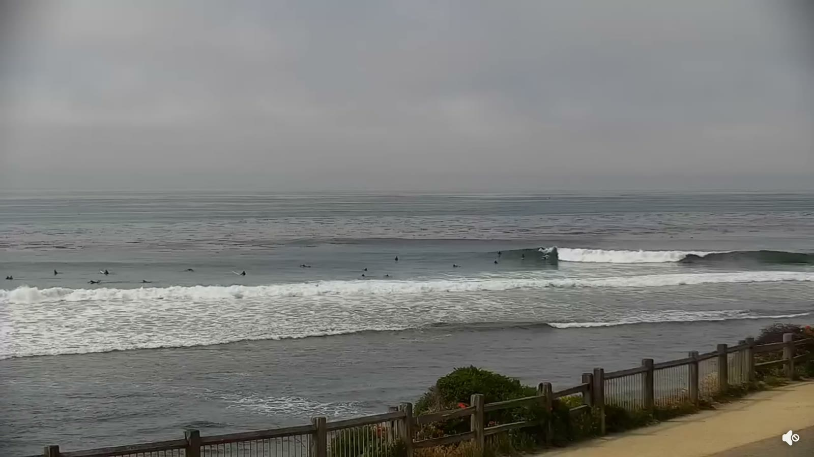
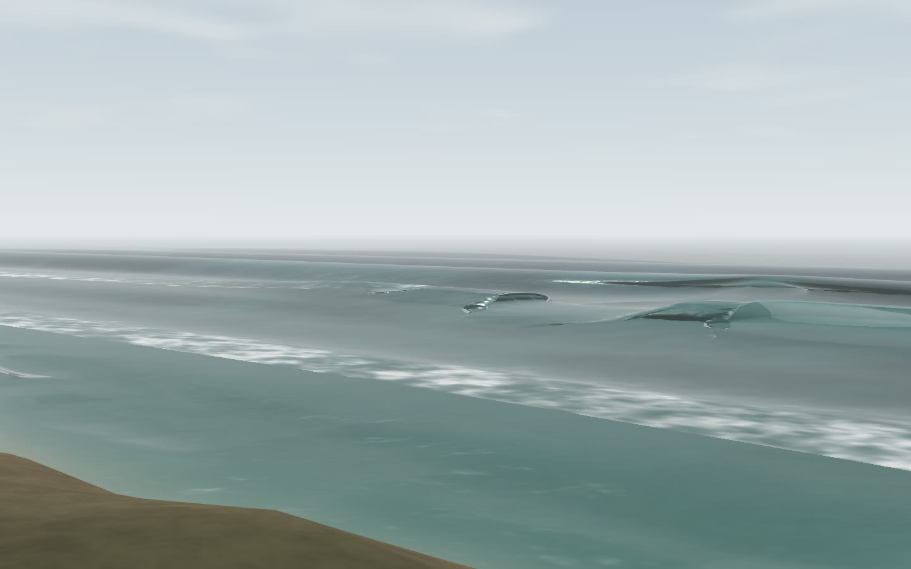
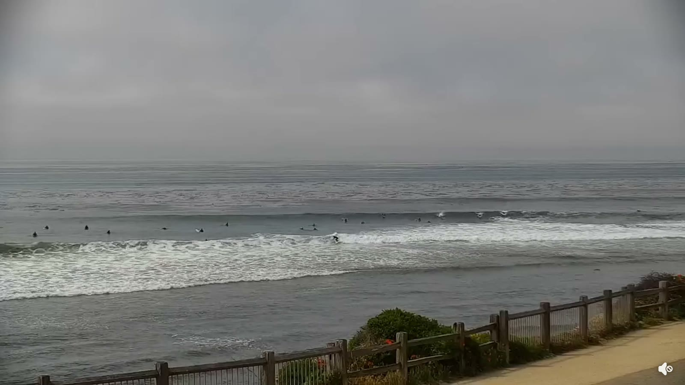
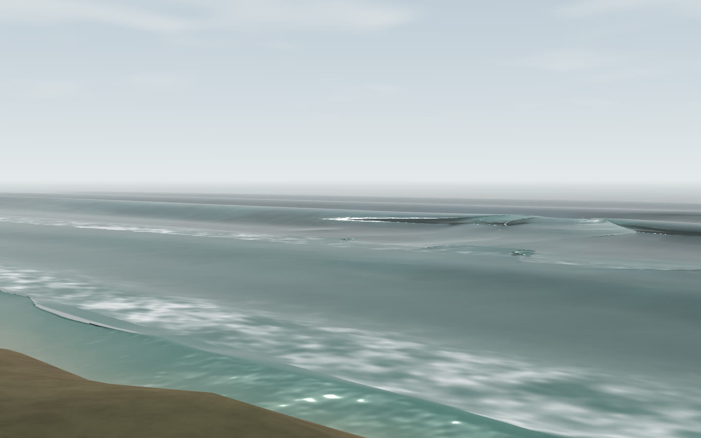
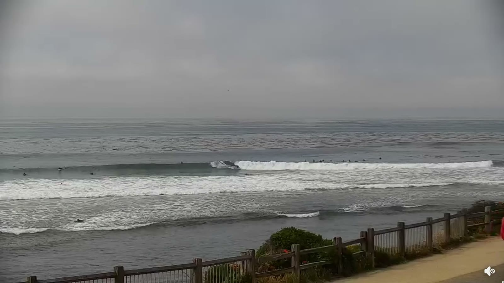
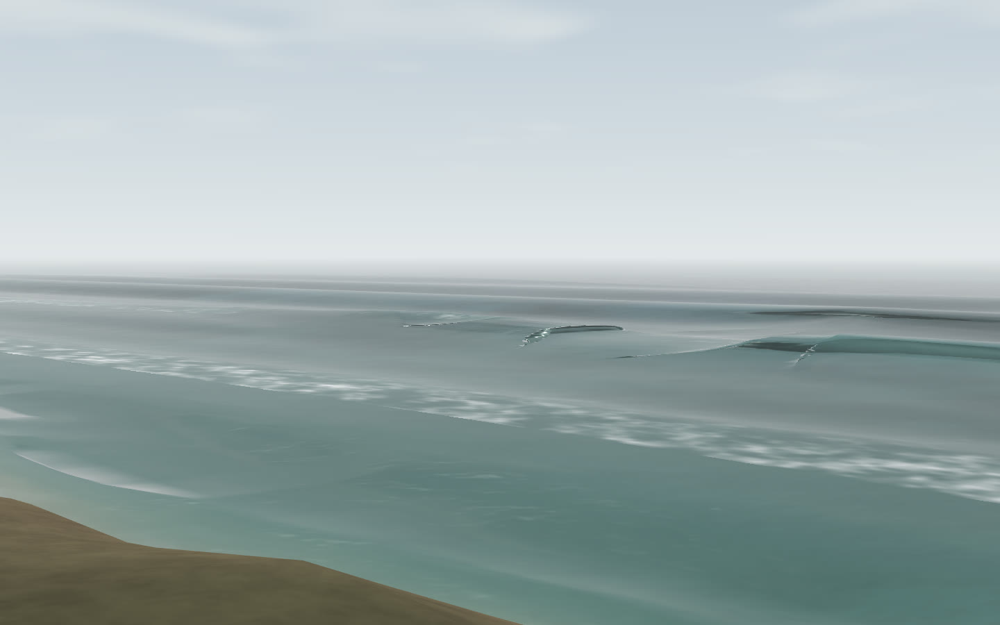
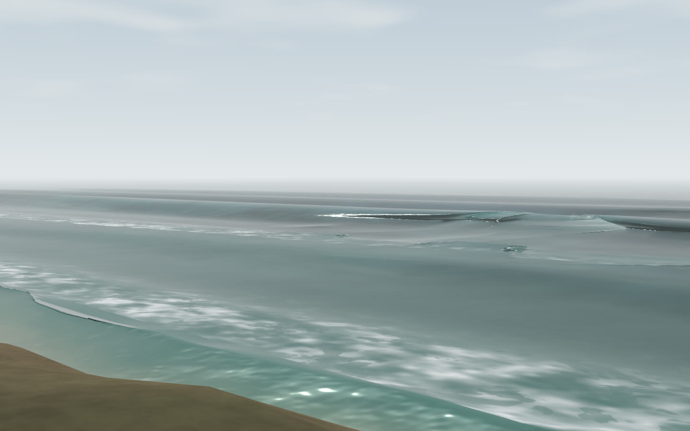
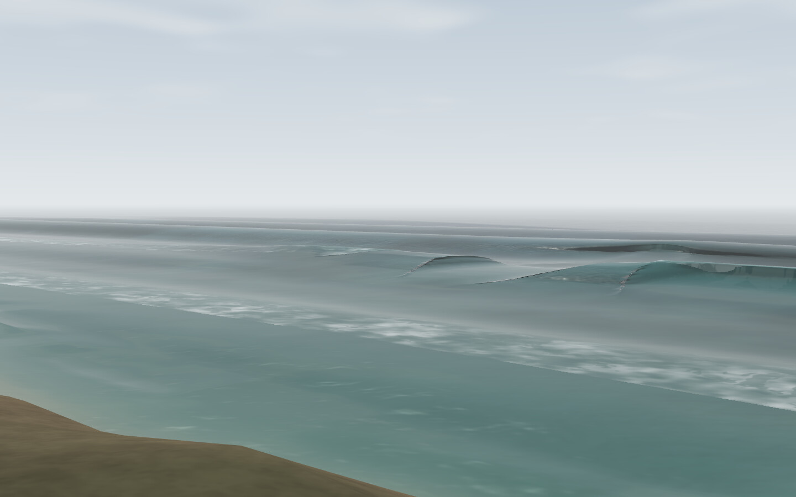

# Pleasure Point field observations and visual-fidelity probe — 2026-08-15

This note records the morning conditions used for the 2026-08-15 Pointbreak
social capture, the larger afternoon field recording, and the first reversible
renderer comparison derived from it. The renders are reproducible model
configurations, not validation results.

## Morning observation supplied with the social capture

The field reference was a screen recording titled
`Screen Recording 2026-08-15 at 7.36.25 AM.mov`. The recorded page periodically
auto-scrolled, approximately once per minute, so those interludes are not ocean
motion and must be excluded before any timing measurement.

The supplied condition snapshots were:

- nearshore report: 2 ft at observation time, forecast 4 ft at 2 pm;
- wind: NNW 1 mph;
- primary swell: SSW (198 degrees), 1.7 ft at 15 s;
- secondary swell: W (279 degrees), 2.4 ft at 8 s;
- tide: incoming, 2.4 ft;
- NDBC 46042 (36.787 N, 122.408 W), 6:40 am: significant wave height 4.6 ft,
  dominant period 17 s, mean direction SSW 208 degrees;
- the 46042 history held at 4.6 ft / 17 s for most half-hour samples from
  1:10–6:40 am, with short departures to 3.9–4.3 ft / 16–17 s.

These values are not interchangeable measurements. The 4.6 ft buoy value is
offshore significant wave height, while the nearshore 2 ft report describes
surf at the break. They are retained together as forcing and visual context,
not averaged into one wave height.

## Model mapping

The clean capture permalink is:

```text
http://localhost:8127/web-three/#preset=secondpeak&cam=cliff&day=big&h0=1.4&tide=0.732&controls=0
```

| Observation | Pointbreak setting | Boundary |
|---|---|---|
| Second Peak / Pleasure Point view | `preset=secondpeak`, `cam=cliff` | Viewpoint match, not camera calibration |
| 4.6 ft buoy significant height | `h0=1.4` m (4.59 ft) | Offshore forcing; not a claim of a 4.6 ft breaking face |
| 17 s dominant period | `day=big` gives `T=17` s | Direct carrier-period match |
| Incoming tide, 2.4 ft | `tide=0.732` m | Unit conversion; datum alignment remains approximate |
| Clean groundswell | `day=big` gives `chop=0.05`, `dF=0.004` | Authored spectral width, not measured from the recording |
| SSW 198–208 degrees | not mapped | Live incident direction is still an open model input |
| NNW/N wind | not mapped | Wind forcing is still open |

The explicit `h0` and `tide` values override those two fields from the named
`big` condition day; its 17 s period, chop, and beat spacing remain active.

## Deterministic 16-second loop

The source was rendered with `scripts/capture_temporal.mjs` from simulation
time 42 s at 30 fps, high quality, for 511 frames: one complete 17 s carrier
period plus its endpoint. The delivery file is:

```text
pointbreak-2026-08-15-loop-16s-1080-square.mp4
```

It is a silent 1080 by 1080, 30 fps, H.264/yuv420p encode at approximately
8 Mbps. A one-second wrap dissolve overlaps the end of the 17 s source with
its beginning, yielding a 16 s delivery while joining adjacent carrier phases
instead of hard-cutting the evolving foam field.

The video is a social artifact and is intentionally not committed to this
repository. The simulator URL, source clock, and encoding facts above are the
reproduction record.

## Afternoon field recording

The larger-wave reference is the screen recording
`Screen Recording 2026-08-15 at 3.28.48 PM.mov`. The original remains outside
the repository on the capture machine.

| Property | Original | Clean unique derivative |
|---|---|---|
| Filename | `Screen Recording 2026-08-15 at 3.28.48 PM.mov` | `pointbreak-pleasure-point-2026-08-15-1528-unique-clean.mp4` |
| Duration | 320.490125 s | 60.833333 s |
| Size | 1,334,915,124 bytes | 56,658,381 bytes |
| Video | H.264, 2288 by 1286, variable frame rate | H.264, 2288 by 1286, 30 fps |
| SHA-256 | `adab8793bab2b2e4dc7687eded12101d94606168e39f853449d7265d59255f92` | `11428e3fa283bea0834c724c7a6c79d6bb6b506ae9e0885525d43ee08e962695` |

The supplied/visible afternoon conditions were 3–5 ft observed surf (waist to
head, oily/fair), 3 ft at 16 s from SSW 202 degrees, 2 ft at 6 s from WNW 289
degrees, 0.3 ft at 11 s from W 271 degrees, SW wind at 7 kt cross-shore, and a
4.0 ft tide after a 5.2 ft high at 1:22 pm.

### Viewer defect and clean derivative

The five-minute file does **not** contain five independent minutes of ocean
motion. The page auto-scrolls and its viewer restarts the same approximately
61-second camera clip. Scroll intervals detected at 10 fps were:

- 38.6–40.7 s;
- 101.9–103.4 s;
- 164.7–168.1 s;
- 229.8–231.5 s;
- 292.8–294.4 s.

The clean derivative retains source interval 40.9–101.7 s. A 10 fps scroll
detector found no remaining page-motion frames. Do not join crest intervals
across the raw file's scrolls or treat its repeated viewer loops as new sets.

## What the afternoon recording establishes about periodicity

There are two different periods in play:

1. **Carrier period:** the interval between successive wave crests. The
   afternoon page reports a 16 s primary swell; the morning buoy and social
   render use 17 s.
2. **Set cadence:** the slower group envelope. Pointbreak currently authors
   this through `dF`; the supplied condition snapshots do not measure it.

The measurement uses fixed horizontal image-space transects through the outer
swell and initial breaking band, detrended and band-passed over 9–24 s. The
strongest transect, source-image `y=580`, has 16 s recurrence correlation
`r=0.942`. Comparable crests passed at source times 50.0, 65.9, and 82.5 s:
intervals of 15.9 and 16.6 s, mean 16.25 s. Neighboring high-coherence
transects returned 15.4–16.8 s.

The supported claim is therefore: **this field clip independently supports an
approximately 16-second carrier, consistent with the reported 3 ft at 16 s SSW
primary swell.** It contains only two measured intervals and no multiple
independent groups, so it cannot estimate or validate set cadence.

## Least-faithful moments

These source/simulator pairs are the visual regression brief for downstream
agents. They are deliberately selected where the current renderer is least
faithful, not as representative beauty shots. The simulator stills use one
camera and forcing hash:

```text
preset=secondpeak&cam=cliff&day=big&h0=1.4&tide=0.732&controls=0&q=high&speed=0
```

| Fidelity target | Field evidence | Current simulator evidence | Defect to preserve in view |
|---|---|---|---|
| One dominant breaking subject |  |  | Real: one active wave, dark lane, subordinate aftermath. Current: several equal-value parallel bands compete. |
| Granular foam that ages into lace |  |  | Real: aerated clumps and dark perforations. Current: broad low-frequency blur with little material distinction. |
| Dark face under a narrow broken lip |  |  | Real: readable sloped face and thin irregular edge. Current: smooth pale face plus a dark folded ribbon/polygon. |

The surfers, rail, and vegetation in the field stills are also strong scale and
place cues. They are not part of this renderer probe; do not mistake their
absence for a foam or wave-timing defect.

## Reversible renderer probe

`#look=` exposes three non-destructive states; the default remains the shipped
renderer:

| Hash | Meaning | Evidence |
|---|---|---|
| `look=current` or omitted | Shipped/current renderer |  |
| `look=foam` | Domain-warped isotropic cellular foam; age opens holes into lace |  |
| `look=full` | Foam plus lifecycle hierarchy and the connected face/thin-lip treatment below |  |

Run `node scripts/capture_fidelity_ab.mjs [outdir]` to capture all three looks
at simulation times 42, 48, 54, and 58 in the fixed 1440 by 900 cliff view. The
script asserts clock, look, camera, and viewport provenance in `manifest.json`.

### Connected face / thin lip follow-up

The strongest mismatch in the first full probe was the breaker silhouette:
the dark pocket split into isolated black ribbons or manta-like polygons. A
diagnostic render proved those ribbons were back-facing fragments from the
broad, self-intersecting thrown sheet. The large pale wall at the right-hand
peak was front-facing, so it was a separate value/shape problem.

The revised `look=full` treatment is deliberately visual and reversible:

- keep the convergence just below the cusp and replace most of the thrown
  sheet with a wider, shallower face-to-crest hinge;
- reduce only the full state's broad approach convergence from `0.42` to
  `0.22`, while retaining pocket-owned break sharpening; this stops several
  shore-normal rows bunching into the front-facing planar wall;
- reject back-facing fold fragments in the full material, removing the
  detached silhouettes without changing `current` or `foam`;
- darken the surviving steep front face after pocket tinting, then lay a fine
  crest-derived white edge directly over it.

Matched Cliff captures at simulation times 42, 48, 54, and 58 remove the
isolated black undersides without exposing visible holes. The result is closer
to the field frame's one dark face / one light lip hierarchy. At the strongest
sim-42 moment, reducing approach convergence replaces the front-facing planar
wall with a rounded sloping face; the other three clocks retain the connected
silhouette. This is still not a full geometry validation: the lip remains
cleaner and less aerated than the footage.

This is an experiment, not a default decision. The cellular material produces
a more perforated band and the full state reduces equal-weight aftermath and
detached fold silhouettes. Scale cues and aerated foam volume remain open gaps.

## Social copy

> Pleasure Point, reconstructed from this morning's conditions: 4.6 ft at 17
> seconds, SSW swell, incoming tide.
>
> A 16-second loop from Pointbreak, our open-source, still-unvalidated ocean
> model. Field comparison is underway.
>
> https://github.com/andyed/pointbreak
