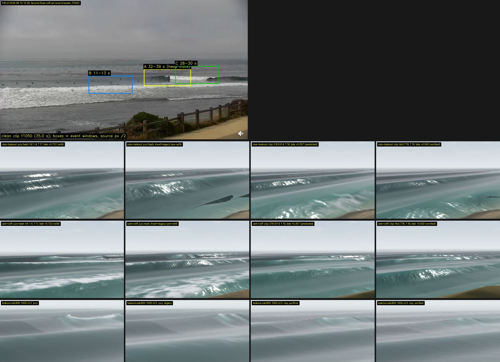

# Second Peak on the field day — why "nothing breaks" — 2026-09-24

Track J of the second curl wave. CURL_JURY_2026-09-24 §1/§3.1 found that at
`#preset=secondpeak&cam=lookout&day=big&h0=1.4&tide=0.732` every lip arm is
pixel-identical and "nothing breaks", and ranked "make the model break at
Second Peak on the field day" first. This note bakes that hash, bakes the
clip's own forcing, projects the baked line through the live camera, and
puts the frames beside the footage. Instruments:
`scripts/measure_secondpeak_fieldday.mjs` (headless bake, both reef arms,
Lookout geometry), `scripts/capture_secondpeak_fieldday.mjs` (frames with
the line projected to pixels), `scripts/build_secondpeak_fieldday_sheet.py`.
Evidence in `qa/secondpeak-fieldday-2026-09-24/` (`bake.json`,
`manifest.json`, 25 frames, `sheet.jpg`). Model at `a3de204`.

## Finding

**The model breaks at Second Peak on the field day. It was breaking in the
jury's own frame.** At the jury's exact hash the shipped (refit) bake reads
stage-median α **40.3°** (q1–q3 18–43), **99 %** of stage stations on the
wedge, Vp **6.9 m/s**, c 4.6 — a peel by the floor's criterion and past
Walker's 30°. The frame captured here at that hash is **pixel-identical to
the jury's `secondpeak_lookout_default_48.jpg`** (max |ΔL| 0 over the whole
1000 × 625; the jury's file is byte-identical to the tube rig's
`secondpeak_lookout_off_48.jpg`, both on a main that already carried the
refit). What the jury called "a 3–5 px white line at the far head" is the
Second Peak peel: `cam=lookout` is the 38th Avenue fixture pose (main.js
`LOOKOUT`, absolute ENU), which under the Second Peak preset stands at stage
(474, 13.2, 57) — **478 m from the node** — so the whole Second Peak line
projects into columns 836–999 of the frame, rows 235–287, at 184–501 m
range, and a 1.4 m face there is **3.9 px** tall. The three "glassy walls"
filling the rest of the frame are Jack's water at stage x 160–470, where the
Second Peak preset has no wedge and `reefWindow(x) = 0`, which every lip,
crash and splash term multiplies — so no arm could differ there, and none
did. The jury's "α 3.9°, Vp 37 m/s" is the `#reef=legacy` arm's number at
this hash (browser `stageAlpha` 3.93° on legacy, 39.8° on the shipped arm),
quoted from the 09-23 fidelity audit, which measured the pre-refit wedge.

Three separate mistakes stacked in the rig, none in the model:

1. **The forcing is the morning loop's, not the clip's.**
   `day=big&h0=1.4&tide=0.732` was built on 2026-08-15 for the 16 s social
   loop (PLEASURE_POINT_CAPTURE_2026-08-15 "Model mapping", `cam=cliff`):
   `h0=1.4` is the 46042 offshore buoy's 4.6 ft Hs; `tide=0.732` is
   "incoming 2.4 ft" converted to metres with the note's own caveat "datum
   alignment remains approximate" (2.4 ft is an MLLW reading; on the model's
   MSL axis it is **−0.130 m**, not +0.732). The 15:28 clip the jury judged
   against was 3 ft at 16 s SSW on a 4.0 ft MLLW tide: **0.914 / 0.778 m at
   +0.357 predicted / +0.500 verified, T 16** (FORCING_AUDIT §3).
2. **The camera is at the wrong spot.** The clip is the Surfline cam on the
   Second Peak cliff rail (SURFLINE_CAM_POSE: eye 14.85 m over the sea, the
   lineup 200–500 px below the horizon). The Lookout is a 2026-09-05 pose at
   38th Avenue framing Jack's; LOOKOUT_LOCUS_RESIDUAL §2 had already
   recorded "Second Peak is not in this frame". `#cam=cliff` at Second Peak
   (eye at stage (157, 14.9, 141)) frames the whole stage at 137–286 m.
3. **The verdict quoted the wrong arm.** The refit landed at `12ffab7`, an
   ancestor of both rigs' main; its floor and field-day cells were
   re-measured (REEF_REFIT §4.2, §5) and the jury's cited numbers predate it.

## 1. What the model declares (Q1)

`measureCell` on the bake's own code (bed.js `bakeRefraction` /
`bakeBreakLine` / `derivedPeelGeometry`, 2 m stage grid, x −47…147 m).
α = stage-median clean signed crest-relative; on-reef = fraction of stage
stations on the uplift footprint; healthy = α ≥ 10° right-handed and on-reef
≥ 0.5 (`PEEL_FLOOR_BASIS`); Walker = the same at 30°. Activation = the
wedge's own `reefActivationH0` at that T and tide.

**Shipped arm** (table; crest 0.862 m below MSL, β 44.25°; reef window
[−57.1, 17.7, 81.8, 156.6]):

| cell | H0 | T | tide | α med [q1, q3] | on-reef | Vp | c | healthy / Walker | gap | z line | depth | activation |
|---|---|---|---|---|---|---|---|---|---|---|---|---|
| **jury hash** | 1.40 | 17 | +0.732 | **40.3** [18, 43] | **0.99** | **6.9** | 4.56 | yes / yes | 0.17 | −48 | 2.80 | 0.63 |
| jury at T 16 | 1.40 | 16 | +0.732 | 41.0 [17, 44] | 0.98 | 6.8 | 4.58 | yes / yes | 0.17 | −45 | 2.73 | 0.65 |
| 2.4 ft read as MLLW | 1.40 | 17 | −0.130 | 25.3 [−3, 35] | 0.89 | 7.3 | 3.54 | yes / no | 0.04 | −78 | 2.83 | 0.21 |
| clip, Surfline 3 ft, predicted | 0.914 | 16 | +0.357 | 41.0 [14, 48] | 0.84 | 6.1 | 4.17 | yes / yes | 0.22 | −17 | 1.93 | 0.45 |
| clip, SC116 Hs, verified | 0.778 | 16 | +0.500 | 41.0 [15, 57] | 0.62 | 6.3 | 4.19 | yes / yes | 0.27 | +20 | 1.71 | 0.53 |
| clip at 17 s | 0.914 | 17 | +0.357 | 40.9 | 0.87 | 6.2 | 4.17 | yes / yes | 0.22 | −19 | 1.98 | 0.44 |
| clip at 17 s | 0.778 | 17 | +0.500 | 38.1 | 0.63 | 6.6 | 4.23 | yes / yes | 0.30 | +17 | 1.75 | 0.51 |
| E[Hmax] 1.53·0.914, verified tide | 1.40 | 16 | +0.500 | 39.5 [16, 42] | 1.00 | 6.6 | 4.24 | yes / yes | 0.14 | −55 | 2.74 | 0.53 |
| card | 1.50 | 14 | 0 | 32.1 [4, 37] | 0.93 | 6.6 | 3.69 | yes / yes | 0.07 | −73 | 2.78 | 0.30 |

**`#reef=legacy`** (crest 2.10 m, β 57.6°): the jury hash reads α 4.4°,
on-reef 0.57, Vp 39 m/s; the clip cells 7.3° / 9.7° at on-reef **0.00**, Vp
25–35 — the closeouts PEEL_BAND_FIELD §1 tabulated. Full table in `bake.json`.

Readings:

* **The refit is active at this tide.** Crest 0.862 m below MSL under
  +0.732 m of tide is 1.59 m of water over the crest; the 1.4 m / 17 s wave
  breaks in 2.80 m on the wedge's seaward flank, 99 % of stations on the
  footprint, 0.63 m above activation. `day=big`'s 17 s against 16 s moves α
  by 0.7° and nothing else; the day's own H0 2.5 and tide −0.2 are both
  overridden by the explicit `h0=` / `tide=` (main.js `applyLiveParams`:
  day, then tide, then h0).
* **The peel floor is not an actor.** `#h0=` bypasses `setDerivedH0`
  entirely (an explicit height is the author's number). Even routed, the
  floor would decline at every one of these cells — T 16/17 off the 14 s
  basis and every tide above the [−0.81, 0] band — and pass the request
  through. "Above the tide band" describes when the *clamp* speaks, not
  whether the wave breaks; the wave breaks. The fidelity audit's "+0.36 vs
  +0.01 m" is a statement about the clamp on the pre-refit floor.
* **Section gaps.** 17 % of stage stations are limiter-pinned at the jury
  cell, all at the up-point head x −15…+1 (α −64…−51° on-reef), where the
  line slews 90 m seaward from the natural bed onto the wedge: the stage
  head reversal REEF_REFIT §3 recorded at ≥ 1.1× the card is present at
  0.93× the card at this tide too. `breakMask` withdraws the zipper there,
  which is correct — it is a handoff, not a wave — and the median is not
  moved by it. This is the open reef-window feather item (TODO), not the
  cause of anything the jury saw.
* **Vp** on the jury hash is 6.9 m/s, at the top of the cam's 4.7–6.7
  bracket; the clip cells give 6.1–6.3 (REEF_REFIT §4.2's numbers
  reproduced). c 4.2–4.6 against 3.8–5.3 observed.

## 2. Why the Lookout shows a line, not a break (Q2)

`lookoutStation()` converts the absolute 38th Ave ENU pose into the active
preset's stage frame (main.js: "loaded at Second Peak it correctly stands
400 m up the point rather than teleporting"). At Second Peak:

| quantity | value |
|---|---|
| eye, stage (x, y, z) | (474.2, 13.2, 56.9) m — 478 m from the node, 318 m past the down-point stage end |
| heading in stage | (−0.808, −0.589): toward the stage and seaward |
| horizontal half-field at 1000 × 625, vfov 31.4° | 24.2° |
| stage ends x −57.1 / 156.6 | 29.6° / 26.7° off axis — **both outside the field** |
| break-line stations in frame (jury hash, live camera) | 44 of 121; the peeling part x 15–105 (α 26–48°) at **cols 850–988, rows 235–246**, 378–484 m |
| reef-window knots in frame | inner pair x 17.7 → col 856, x 81.8 → col 926; the outer knots x −57 (col 1132) and x 157 (col 1061) are off the right edge |
| face height of a 1.4 m wave at the head's median range (f = 1112 px) | **3.9 px** |
| at the clip's own forcing (0.778 / +0.500) | 10 stations in frame, cols 928–988, face 2 px; every window knot off the right edge |

So the answer is the third of the three the brief offered: **it breaks, at
the frame's right edge, at 2–4 px**. At the clip's true forcing the wedge is
essentially out of frame; at the jury's 1.4 m the peel is in frame but
below the size at which a bore or knuckle can be a shape. The foreground —
the three parallel walls the jury judged — is stage x 160–470, off the
Second Peak reef window, where `reefWindow(x) = 0` and the water is a
depth-gated bore on the natural DEM with no wedge (the Second Peak preset
bakes only Second Peak's reef). Every lip arm multiplies that window;
pixel-identical arms are the arithmetic, not a failure to break.

**Legacy vs refit at the hash**: at the Lookout the two frames differ by
135,778 pixels > 20 levels (mean |ΔL| 13), mostly the foreground water and a
set of dark triangular shards in the lower right of the legacy frame
(`lookout_jury_legacy_48.jpg`, not chased); the peel head itself is the same
few pixels either way. From the Second Peak cliff they are two different
waves (§3).

## 3. Frames

`qa/secondpeak-fieldday-2026-09-24/sheet.jpg` — field frame on top, then
`cam=lookout` and `cam=cliff` at 48 s for four arms, then 2.5× crops of the
Lookout right edge (cols 800–1000, rows 200–300) where the line projects.



Opened and read:

* `lookout_jury_48.jpg` — the jury's frame, pixel for pixel: three glassy
  walls, one white hook at cols ~900–1000, rows ~225–245. The crop shows the
  hook as a small curled head over a dark face.
* `lookout_jury_legacy_48.jpg` — same walls, a taller glassy hump at the
  right with no white; dark mesh shards lower right.
* `cliff_jury_48.jpg` — from the Second Peak rail: a dark sloped face with a
  curling lip at col ~450, a white broken head down-point (cols 780–1000),
  whitewater rows inside. This is a peeling wave (23 peeling stations in
  frame, face 7.2 px at 137–286 m).
* `cliff_jury_legacy_48.jpg` — a long wall with a thin white crest line
  across the frame and one small lip: the closeout the jury described,
  which is the pre-refit wedge.
* `cliff_clip_surfline_48.jpg`, `cliff_clip_verified_48.jpg` — the clip's
  own forcing from its own side of the point: small waves, thin white heads
  and hooks along the crests at cols 250–350 and 640–1000, faces 4.8–5.1 px
  at 74–258 m. Legible as a 2–3 ft peel; small, as the footage is small.
* `cliff_clip_setwave_52.jpg` — E[Hmax] 1.4 m at the verified tide: the
  most footage-like frame in the set — dark face, lip hooking at col ~380,
  white broken section cols 650–1000, whitewater trailing. The set wave is
  the wave the surfers in the clip are riding (LOOKOUT_LOCUS §2 made the
  same point at Jack's).
* `drone_jury_48.jpg` — plan view: a white knuckle mid-frame with a
  whitewater bore trailing down-point, the peel shape unmistakable.

What the eye still has to judge is material, not existence: the cliff
frames' heads are glassy hooks and white slabs, not the footage's aerated
knuckle over a round-topped bore (CURL_TRUTH §1.2). That is the jury's
direction 2 ("foam on the ribbon, bore behind the head") and it is a
Second Peak cliff-cam question, now that the site test can be run there.

## 4. The fix (Q3)

**No model change.** The three candidates the brief listed are inert on this
hash: the tide band governs only derived oceans and `#h0=` is not one; the
set-wave forcing is already what `h0=1.4` is (1.53 × 0.914 = 1.40); the
Second Peak feather moves the head reversal, not the median, and not the
picture at 478 m. `shared/` and `web-three/` are untouched here, so the
default is byte-identical trivially. The convicted fix is the rig:

```
# the clip's own forcing, from the clip's own side of the point
web-three/#preset=secondpeak&cam=cliff&day=overhead&h0=0.914&tide=0.357&controls=0&q=high&speed=0&sim=52   # Surfline 3 ft, predicted tide
web-three/#preset=secondpeak&cam=cliff&day=overhead&h0=0.778&tide=0.500&controls=0&q=high&speed=0&sim=52   # SC116 Hs, verified tide
web-three/#preset=secondpeak&cam=cliff&day=overhead&h0=1.40&tide=0.500&controls=0&q=high&speed=0&sim=52    # E[Hmax], the ridden wave
```

`day=overhead` supplies T 16 (the clip's period; `big` is 17 s); the
explicit `h0=`/`tide=` override its own height and tide as they did in the
old hash. `cam=cliff` at Second Peak stands 14.9 m over the water at the
down-point stage end, the nearest shipped pose to the Surfline rail's
14.85 ± 0.9 m; a solved Surfline pose would be a new `CAM_PRESETS` entry,
which SURFLINE_CAM_POSE says the frame does not yet support (no control
points, f bracketed 1300–2500 px).

**The jury should be re-run at those hashes**, sampling 52–56 s as it asked,
before any lip arm is judged again. The jury's five arms were compared on a
frame in which the only Second Peak pixels were a 3.9 px head; every
discriminating ratio it reported for Second Peak (bore thickness, knuckle
width, hook cycle) was measured on Jack's unreefed water.

### The decision for Andy

**Which forcing and which camera define "the field day".** Two hashes are
in the record and they are different days: the morning loop
(`day=big&h0=1.4&tide=0.732`, T 17, a buoy Hs and a mis-datumed tide) and
the 15:28 clip (0.914 / 0.778 m, T 16, +0.357 / +0.500). Every rig since
2026-09-15 (`CLASSIC_WAVE_PROGRESS`, `capture_tube_ab.mjs`,
`capture_curl_jury_matrix.mjs`, `TUBE_MESH`) has typed the morning hash and
called it the clip. One of:

* (a) **Adopt the clip's forcing** at `cam=cliff` as the field-day permalink
  (the three lines above) and retire `tide=0.732` from the rigs. The
  cheapest form is a note in CONTROLS.md / the capture note; a named
  `#day=fieldday` in `conditions.js` (0.914 m, 16 s, +0.357, chop 0.05,
  `good: false` so the drift curator never cycles it) would make it
  un-mistypeable, at the cost of one runtime constant — not done here
  because it is this decision.
* (b) Keep `h0=1.4` as "the wave the surfers ride" (E[Hmax] of the clip's
  sea) but at the clip's tide and period: `day=overhead&h0=1.4&tide=0.500`.
  That frame reads most like the footage in this set.

Either way `cam=lookout` should be reserved for the Jack's preset it was
measured at. Whether `#cam=lookout` under another preset should keep
standing at 38th Ave (correct, and a trap) or fall back to that preset's
cliff is a product call; the absolute pose is doing what its comment says.

## 5. Consistency

* REEF_REFIT §4.2's field-day cells reproduce here to the published digit
  (0.778 / +0.500: 41.0 / 6.3 / 4.19 / 0.62; 0.914 / +0.357: 41.0 / 6.1 /
  4.17 / 0.84), and the legacy arm reproduces PEEL_BAND_FIELD §1's
  (9.7 / 24.2 / 0.00; 7.3 / 34.7 / 0.00).
* Browser vs bake at the jury hash: `stageAlpha` 39.8° in the page against
  40.3° headless (the page's grid runs the full 600 m bake's stage read at
  a different station set; the legacy arm gives 3.93° vs 4.4°).
* `tests/secondpeak-fieldday.test.js` pins: the shipped arm peels (healthy,
  Walker, Vp < 10, above activation) at the jury hash and both clip cells;
  the legacy arm does not at any; the floor is not routed on any; the
  Lookout eye under the Second Peak preset is > 400 m from the node with
  both stage ends outside the horizontal field. `npm test` green.

## 6. What would falsify this

* A `cam=cliff` capture at the clip's forcing that Andy's eye reads as a
  closeout would move the question back to the model (the numbers say α
  41°, Vp 6.1–6.3; the eye has not judged the cliff frames yet —
  [visual-work-needs-his-eye]).
* The jury's frame turning out not to be the tube rig's: `cmp` says
  byte-identical, and this rig's refit frame matches both to max |ΔL| 0.
* A solved Surfline pose that puts the 08-15 head outside what `cam=cliff`
  frames — then the permalink needs a new camera, not a new forcing.

## 7. Reproduction

```sh
node scripts/measure_secondpeak_fieldday.mjs                 # < 5 s: both arms, all cells, Lookout geometry -> qa/.../bake.json
python3 scripts/serve.py 8141 &
PLAYWRIGHT_DIR=.../playwright/index.mjs BASE_URL=http://127.0.0.1:8141 node scripts/capture_secondpeak_fieldday.mjs qa/secondpeak-fieldday-2026-09-24
python3 scripts/build_secondpeak_fieldday_sheet.py
node --test tests/secondpeak-fieldday.test.js
```
