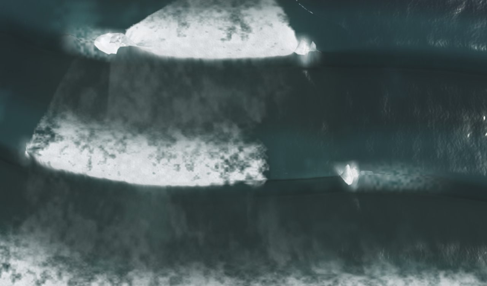
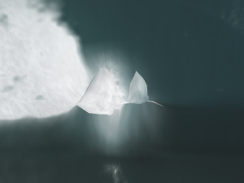
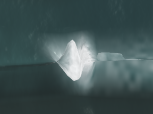
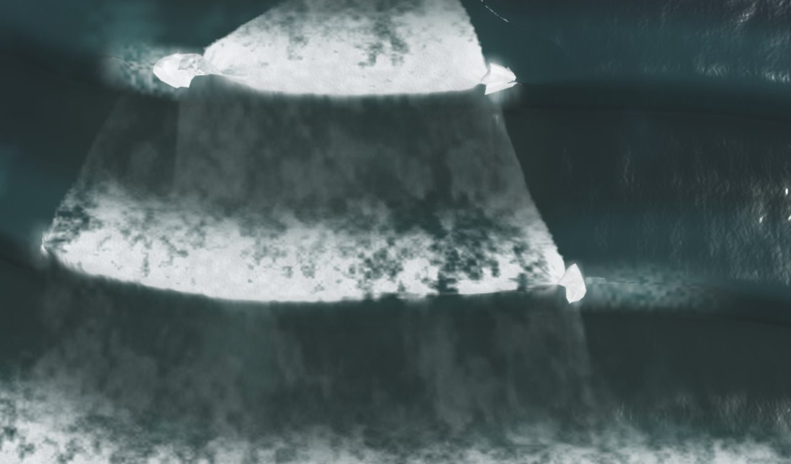
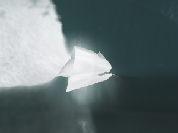
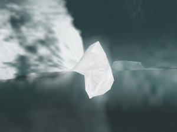
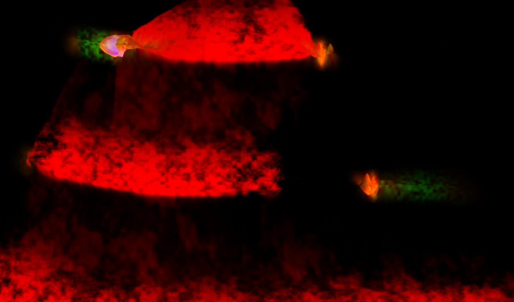
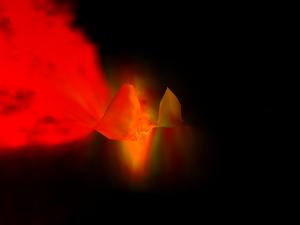
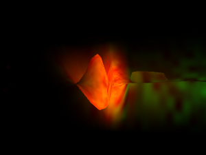
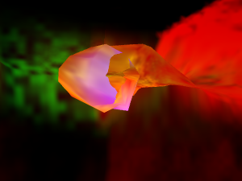

# Section gaps: painted and folded as breaking crests (2026-09-24)

Verification of the Track D side finding
([LIP_FACETS_2026-09-24](LIP_FACETS_2026-09-24.md) §3): at Sewers, sim 42,
two of the three folded heads sit where `breakMask(x) = 0` — a baked section
gap, which the model defines as line transport, not a breaking crest — yet
carry `pocket` 0.75–0.99 and `foam` 0.56–0.87 at the fold, while the aerated
lip reads 0 there.

**Verdict: (a) confirmed, and general.** The section mask is honoured by
exactly one family of consumers — the breaker lifecycle (impact, bore, trail
bands, the structural mound, the crash burst, the comet, the spray) and the
two lip terms wired after it (the aerated lip `aer` and the curtain gate). It
is ignored by everything keyed to `pocket`, which is `crestNear · bell · env² ·
reef` with no mask (`shared/model-glsl.js:1586`): the fold reach `Sover`, the
bend's `kEff` and earn floor, the legacy throw/drop, the model's `lipFoam`,
and the fragment's pocket floor, fresh core, pocket tint and pocket-lip white.
It is also ignored, by design and by comment, by `brk` itself: at a mapped spot
`brkW = max(reef·mask, gate)` (`:1444`), and the depth gate saturates inside
every gap, so `brk` = 1 on **100 % of gap columns in all nine cells probed**
(three presets × three clocks). `bed.js:987` documents a gap texel as
"rendered as NOT BREAKING"; the render disagrees with that sentence, and the
model's own comment at `:1429` says why ("depth's own permission stands"). Two
documented claims, one field, no arbitration — MODEL.md §4.5's defect class.
The result on screen is the og hero's heads B and C: a white polygon capping a
whitewater block that has correctly stopped at the gap edge, with the
pocket-lip paint running on into dark water beyond it.

## 1. Consumers of the section field

`breakMask(x)` (`shared/model-glsl.js:477`) reads the B channel of the 128×1
break bake; `bed.js:1332–1362` sets it to 0 where the baked line's along-shore
slope exceeds `GAP_SLOPE` = 2.9 (a slew-clamp ramp) and feathers 3 texels out.
`#gap=0` (`u_gapMask`, `main.js:283, 2732`) reverts it to 1 everywhere. It is
**not** the `sections` σ_h preset knob (`u_sections`, `breakLine():489`), which
shifts the line seaward and is on at every spot; `#section=1` is the
cross-section chart overlay (`CONTROLS.md:86`) and irrelevant here.

| term | what it drives | gated by `breakMask`? | where |
|---|---|---|---|
| `breakerLifecycleAtX` `activity` | impact / bore / trail bands, structural mound height, spray launch | **yes** | `model-glsl.js:934` |
| `breakerImpactPeakAtX` (ROLLER) | roller strength | **yes** | `:1013` |
| `brkZip` | zipper's own claim | yes | `:1431–1432` |
| `brkW`, `brk` | whitewater permission, `crest = crestNear·(1−brk)`, `reBrk` residue, hump gate | **no in effect**: `mix(reef·mask, max(reef·mask, gate), u_depthMix)`; the depth gate wins at every mapped spot | `:1444, :1456` |
| `pocket` | the crest-at-the-line bell; every consumer below | **no** — `crestNear · bell · env2 · reef` | `:1586` |
| `crashAmp` → `splashBurst` | impact burst | yes | `:1655` |
| `cometFoam` | comet head | yes (`* mask`) | `:1805` |
| `residue` (`reBrk`) | sustained whitewater floor | no (via `brk`) | `:1876–1878` |
| `foam` mix | `vFoam` | structural half yes, residue half no | `:1886` |
| `foamPocket` → `lipFoam` | the head's pocket whitewater | **no** | `:1913–1915, :1968–1969` |
| `crumb` | spilling dribble | no (`crestNear·(1−brk)`) | `:1972` |
| `Sover` | choppy fold reach `S`, `lam·grad` | **no** (pocket) | `shaders.js:585, :659–674` |
| `throwMag`, `dropMag` | legacy lip (throw not applied with `#curl`) | no (pocket) | `:766–769, :834–838` |
| `kEff` (bend), `earnG` (earn floor) | overturn angle `th`, `curl` | **no** (pocket) | `:939–940, :979` |
| `aer` | aerated lip mask `vAerLip` | **yes** | `:1048` |
| GRID_FRAG `foamM` floor | pocket foam floor | no (`vPocket · pocketGateF`) | `:1711, :1745` |
| GRID_FRAG `freshCore` | dense white core | no (`foamPocketF`) | `:2128–2129` |
| GRID_FRAG pocket tint, `lip`/`lipMask` | the `vec3(0.98)` pocket-lip white | **no** (`vPocket`) | `:2072, :2079–2095` |
| GRID_FRAG aerated-lip mix | | yes (via `vAerLip`) | `:2176–2181` |
| CURTAIN_VERT `gate` | falling sheet | **yes** | `:2468, :2530` |

Three comments record that the split was noticed and closed on one side only:
`shaders.js:1011` ("a section gap is line transport, not a breaking crest — no
aerated lip there"), `:2423` ("breakMask is applied the same" to the curtain),
and `:895`, on the bend: "aeration still respects section gaps" — the bend
itself does not, and the sentence says so.

## 2. Reproduction on the GPU

`scripts/probe_section_gap_foam.mjs` reads `__pointbreak.curlProbe` (the
shipped `surfacePos` as a fragment pass over a float target — live uniforms,
live bed textures; `main.js:3122`) along one shore-normal transect per grid
vertex column (q=high, 1.465 m pitch, |x| ≤ 240 m, 1024 samples over z ∈
[−300, 300]) and takes per-column maxima over wet samples. `breakMask` is a
function of x alone and is read on the same column as the fold it is paired
with, so the Track D pairing is not an instrument artefact (option c). Pinned
hash: `preset=…&surfer=0&hud=0&controls=0&speed=0&q=high&cam=drone&sim=S`,
card forcing (no `month`). `qa/section-gap-foam-2026-09-24/probe.json`.

### Gap columns, per cell

"gap" = columns with `breakMask` < 0.5; "heads" = contiguous columns with
`curl` > 0.25 (Track D's definition), with the peak column's `breakMask`.

| preset (H₀, T, ξ) | sim | gap cols / run (m) | `brk` > 0.5 | `foam` > 0.5 | `pocket` > 0.7 | fold > 1.5 m | `aer` max | heads in gap / total |
|---|---:|---|---:|---:|---:|---:|---:|---|
| Sewers (2.2, 15, 1.15) | 42 | 45 · −146…−82 | **45** | 45 | 12 | 23 | 0.004 | 2 / 3 (x −133.0, −108.1) |
| | 46 | 45 | **45** | 45 | 21 | 20 | 0.193 | 1 / 2 (x −84.7, on the feather: mask 0.19) |
| | 50 | 45 | **45** | 45 | 11 | 10 | 0 | 2 / 3 (x −121.3, −93.5) |
| Second Peak (1.5, 14, 0.65) | 42 | 16 · −42…−20 | **16** | 16 | 0 | 0 | 0.002 | 0 / 0 |
| | 46 | 16 | **16** | 16 | 0 | 0 | 0.023 | 0 / 0 |
| | 50 | 16 | **16** | 16 | 0 | 0 | 0.047 | 0 / 0 |
| Sharks (1.0, 13, 0.45) | 42 | 33 · −104…−57 | **33** | 22 | 9 | 0 | 0.101 | 0 / 0 |
| | 46 | 33 | **33** | 21 | 3 | 0 | 0.029 | 0 / 0 |
| | 50 | 33 | **33** | 19 | 2 | 0 | 0 | 0 / 0 |

Reading it:

- **`brk` = 1 in every gap column, every spot, every clock.** The mask never
  reaches the whitewater permission at a mapped spot; only the lifecycle terms
  that multiply `activity` go dark in the gap. That is why the og frame's
  whitewater block ends cleanly at the gap edge (the bands obey) while the
  head at that edge is still white (the pocket terms do not).
- **`pocket` > 0.7 inside gaps is a Sewers and Sharks fact, not one clock's.**
  11–21 gap columns at Sewers and 2–9 at Sharks per clock. Second Peak's gap is
  22 m wide and its pocket peaks at 0.22–0.44 in these three clocks: the crest
  did not sit on the gap segment of the line at sim 42/46/50, so the paint
  there is `residue` only. The term is still ungated; the clock did not
  exercise it.
- **Folds inside gaps are Sewers-only, because folds are Sewers-only.** ξ 1.15
  bends far enough to fold 10–23 gap columns per clock; Second Peak (ξ 0.65)
  and Sharks (0.45) fold nothing anywhere (`fold` max 2.7 m and 0.35 m on the
  open line). Where the wave folds at all, it folds in the gap as readily as
  on the line: at Sewers sim 42 the gap's largest fold is 13.0 m against the
  open line's 14.6 m.
- **Heads in gaps at every Sewers clock probed:** 2 of 3 at sim 42 (the Track
  D pair), 1 of 2 at sim 46 (on the 3-texel feather, mask 0.19), 2 of 3 at
  sim 50. Peak-column values at sim 42: x −133.0 → curl 0.26, pocket 0.90,
  foam 0.81, brk 1, aer 0, fold 8.0 m; x −108.1 → curl 0.30, pocket 0.995,
  foam 0.86, brk 1, aer 0, fold 6.3 m; the open-line head at x 7.6 → curl
  0.52, pocket 0.97, foam 0.84, brk 1, aer 1.0, fold 14.6 m.

### `#gap=0` at Sewers sim 42 (`probe_sewers42_arms.json`)

Same clock, mask reverted to 1 everywhere. At the two gap heads `pocket` and
`foam` maxima are unchanged to three decimals (0.900 / 0.811 and 0.995 /
0.861) — they never saw the mask — while `aer` goes 0 → 1.0 at both, and the
fold grows from 8.0 → 13.8 m and 6.3 → 11.5 m (curl 0.26 → 0.37, 0.30 →
0.43). The extra reach is the lifecycle's structural mound returning under the
head: the mask does shape geometry, through `activity` → `impactBand` → `h`,
but the 6–8 m fold that remains with the mask on is the pocket-driven one.

## 3. Render evidence

Og pose (`preset=sewers&cam=drone&sim=42`, the card's 640×376 clip at DSF 2;
head crops 100×75 CSS at 3× from the same pose, boxes as
`capture_lip_facets_ab.mjs`). Head A is the open-line head at x ≈ 7.6 m; B
and C are the gap heads at x ≈ −133 and −108 m. `#facetdebug=3` is the paint
owner: R = foam mask, G = pocket-lip mask, B = aerated-lip mask.

| arm | frame | head B (gap) | head C (gap) |
|---|---|---|---|
| default |  |  |  |
| `#gap=0` |  |  |  |
| `#facetdebug=3` |  |  |  |

Head A in the paint view, for contrast: 

What the eye gets:

- **Default frame.** Two whitewater blocks (the lifecycle bands) each end at a
  sharp vertical edge on the right — the gap boundary at x ≈ −82 — and at that
  edge sits a bright angular polygon: head B on the upper block, head C on the
  lower. Beyond them, dark water where the line runs through the gap.
- **`#gap=0`.** The blocks fill rightward across the V; the polygons at B and
  C are larger and brighter (the aerated lip now paints them and the mound is
  back under them). Nothing else in the frame changes: the two arms are the
  same wave.
- **Paint owner.** Heads B and C are **orange** — foam plus pocket-lip, no
  blue — and a **green** tail runs off each into black water: the pocket-lip
  mask alone, continuing along the line through the gap, on water with no
  foam under it. Head A is pink-white: all three paints.

The brief asked for `#section=0` as the gap-disabling arm; that flag is the
cross-section overlay and there is no switch that disables the gap paint,
because nothing in the pocket path reads the mask. `#gap=0` is the only
section-gap arm, and it moves the mask in the other direction; the pair is
still decisive, because it shows the gap heads' white and fold are already
present with the mask on and merely gain the aerated lip when it is off.

## 4. Disposition

- **(a) Authority split — confirmed.** One field (`breakMask`), two classes of
  consumer, each internally consistent. The lifecycle side implements MODEL.md
  §4.5's call as `bed.js:1336` states it ("a steep line segment means NO
  BREAKING — the wave passes through unbroken"). The pocket side implements
  the crest-locus bell with no knowledge of the mask, and `brk`'s depth-gate
  union means the mask cannot reach it through `brk` either.
- **(b) Documented as intended — partly, and contradictorily.** `brk`
  surviving the gap is deliberate and commented (`model-glsl.js:1429–1444`:
  the mask "withdraws the ZIPPER's claim … depth's own permission (gate
  below) stands"). That is a defensible physical statement — the water is
  over the depth limit — but `bed.js:987` promises the opposite render, and
  no comment anywhere claims the pocket, the fold or the pocket-lip white are
  meant to survive the gap; the three comments that mention the gap near them
  (§1) each say a gap is not a breaking crest and gate only their own term.
- **(c) Instrument artefact — no.** `breakMask` is read at the transect's own
  x; `curlProbe` runs the shipped shader text; the paint view shows the same
  owners the numbers name.

## 5. Smallest candidate fix (proposal, not implemented)

Gate the pocket at its source, once:

```glsl
// shared/model-glsl.js ~:1586
pocket = crestNear * mix(pocketLegacy, pocketCompact, clamp(u_breakShape, 0.0, 1.0))
       * env2 * reef * mask;        // mask = breakMask(x), already computed at :1431
```

One multiply, one authority. Everything downstream inherits it: `Sover`
(fold), `kEff`/`earnG` (bend), throw/drop, `lipFoam`, GRID_FRAG's pocket
floor, fresh core, tint and pocket-lip white, and `aerSpill`. `crumb` is not
touched by it (it is `crestNear·(1−brk)`-keyed) and is already zero in a gap
today because `brk` = 1 there. The `crest` term (`crestNear·(1−brk)`) is a
separate question: with `brk` = 1 in the gap the unbroken-crest line is also
suppressed there, so a gap currently draws neither a broken nor an unbroken
crest; if the fix lands, consider `crest = crestNear·(1−brk·mask)·env2` so the
gap shows the crest passing through, which is what §4.5 says happens.

Expected effect: the gap heads lose their fold (Sover → 0 there), their
polygon and their pocket-lip white; the whitewater blocks keep their present
edge. Pixels move only where `breakMask` < 1 — on Sewers, the x = −146…−82
run and its feather. Unaffected: any spot with no pinned texels, the `#gap=0`
arm (mask ≡ 1), and the lifecycle terms, which already carry the mask. Should
be judged with the same og / cliff pair as Track D and with the gap-run
`cover` aim the crash-transport note flagged (`TODO.md:470`), which currently
frames these exact heads. Cost: zero new fetches — `mask` is already in scope
in `ocean()`.

Not proposed: gating `brk` by the mask. That reverses a documented decision
and would also remove the `residue` floor and the hump gate in the gap; the
pocket multiply addresses the fold and the head paint, which is what the
picture shows, without reopening depth permission.

## 6. Files

- `scripts/probe_section_gap_foam.mjs` — the per-column GPU probe
  (`--cells`, `--arms=base,gap0`).
- `qa/section-gap-foam-2026-09-24/probe.json` — nine cells, base arm;
  `probe_sewers42_arms.json` — Sewers sim 42, base vs `#gap=0`.
- `docs/research/assets/section-gap-foam-2026-09-24/` — the frames and head
  crops above (24–68 KB each).
