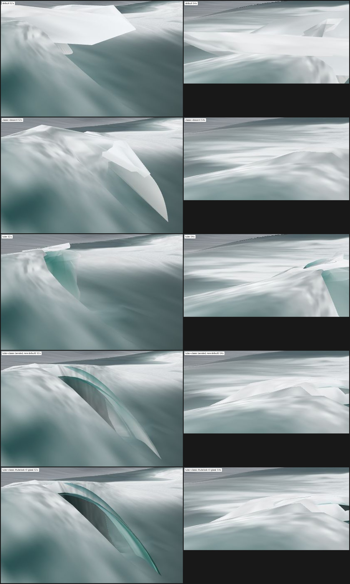
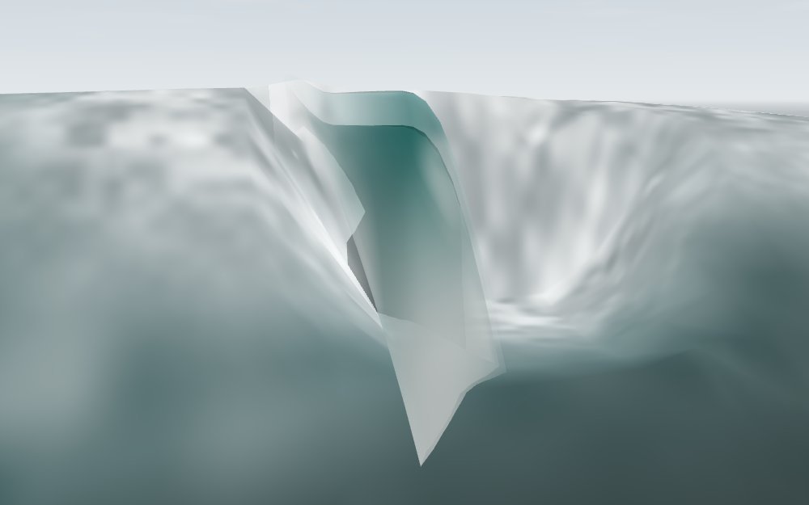
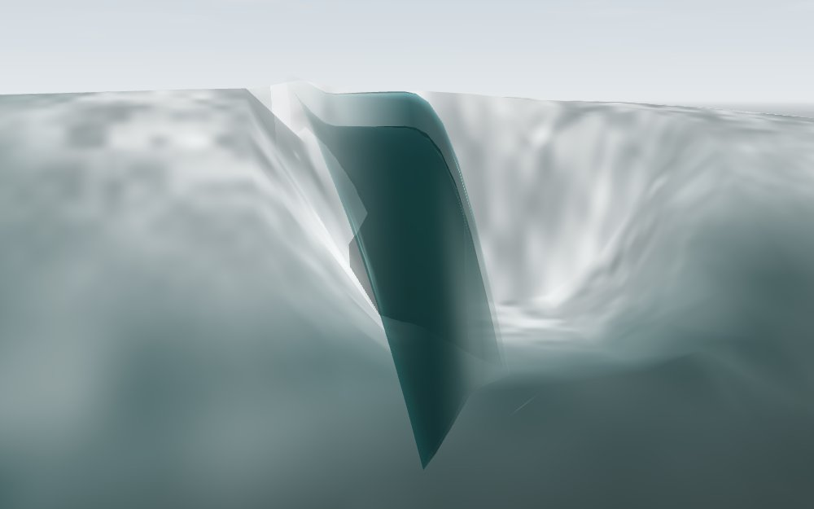
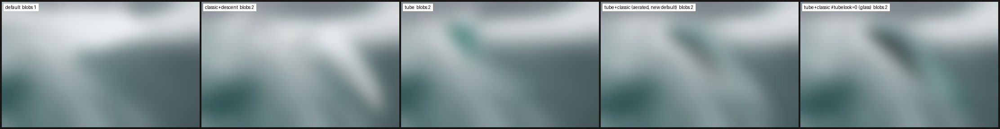

# The ribbon's material: the white (`#tube=1`, `#tubelook=`) — 2026-09-24

Track H of the second curl wave. Base `a3de204` (main). The swept breaker
ribbon (`web-three/js/tube.js`, TUBE_MESH_2026-09-24.md) keeps its geometry;
this note changes only what it is made of. Default `#tube=1` boots now draw
the aerated material; `#tubelook=0` is the 2026-09-24 glass ribbon, kept
verbatim for the A/B; `#tubelook=2` is a false-colour instrument. Default
builds (no `#tube`) are byte-identical to the pre-change tree (§4).

## 1. Why

The jury ([CURL_JURY_2026-09-24.md](CURL_JURY_2026-09-24.md)) ranked
`#tube=1&classic=1&descent=1` best-shaped among the simulation arms and
wrong in material: "dry barrel", "glass box", a clear teal sheet with no
white at the tip. The Field seat measured the build's *white* lip at
0.05–0.10 face heights — the only thing in the matrix like the footage's thin
luminous line — and the *glassy* ribbon at 1.0–1.5 H_f, which the footage
never shows. [CURL_TRUTH §1.2](CURL_TRUTH_2026-09-24.md) says what a Pleasure
Point lip is: a thin, irregular, scalloped bright line along the crest,
hooks that live 0.3–0.7 s and merge, a white descending curtain (luma > 182
in the clip), a dark face ahead and under it, foam where the fall lands. So
the white is the material and the green is what has not aerated yet.

## 2. What changed (`TUBE_FRAG`, aerated branch)

The white weight `W` is the max of six terms, each with a stated basis:

| term | where | basis |
|---|---|---|
| **lip line** | Gaussian about the tip (u = 0.45), σ 0.045 in u opening to 0.13 inside a hook | the footage's thin line. Hooks are value noise along the ribbon's alongshore coordinate on the **seconds clock** (cells ~1.4 m, ~0.55 s), so a hook lives 0.3–0.7 s and merges; a finer octave scallops the edge. Present from 0.02 s: a pitching PP lip is white, not glass. |
| **thinness** | jet legs, `smoothstep(0.04, 0.30, thin)` | `bpThickness` (shared/breaker-profile-glsl.js): the kinematic stretch of the free-falling sheet, root thickness at σ 0 thinning toward the tip. The tip is the oldest, most-stretched water and aerates first. Passed per vertex as `vTubeM.x`. Rises with age toward impact. |
| **streaks** | jet legs, CURTAIN_FRAG's recipe on σ so both sides streak the same way | value noise `(x·0.9, σ·4 − t·1.4)` — the same texture the curtain has always used, running down the fall on the simulation clock. |
| **fall** | jet legs, `smoothstep(0.12, 0.55, σ²)` | the jet is y = h_C(1 − σ²), so σ² of the crest height has fallen. The footage's curtain is white by 0.5–0.6 H_f of fall (event B); the root, having fallen nothing, stays green. |
| **landing / bore** | u → 1 from impact; the whole face leg (u 0.80–1) over 0.40–0.60 s | foam where the jet meets the face; then the water between root and landing is the collapsing bore (criterion 4: 0.4–0.65 H_f of saturated, lumpy white), dark only while the lip is still in the air over it. |
| **back seam** | u 0–0.10 | the grid's own white at the back seam and the crest anchor, read through the `surfacePos` calls the vertex shader already makes (`foam`, `aer` outputs → `vTubeM.yz`, on GRID_FRAG's mapping: `smoothstep(0.15, 0.75, 1 − e^(−1.55 foam))`, aer at value). The ribbon's white is continuous in value with the crest foam it grows out of. |

Everything else: **body** where thick is translucent green water,
`(0.10, 0.40, 0.38)·(0.55 + 0.45 λ)`, alpha 0.70 so the face shows through
the root, backlit toward the sun in proportion to thinness, a sky fresnel a
third of the glass ribbon's. **Cavity** is green-black on the concave face
leg from any side and at 0.6 on the sheet's underside seen from inside; the
white is laid over the inside at half weight, so the hollow stays dark
between streaks. **Foam colour** is CURTAIN_FRAG's two-tone by streak
(`(0.80, 0.84, 0.83) → 0.985`) under GRID_FRAG's ambient-heavy lighting
(`0.86 + 0.14 λ`), entrained 14 % darker toward the landing, and capped at a
0.95 mix so the ribbon is never whiter than the grid's crest foam. Sun spec
only where un-aerated: bubbles scatter, they do not reflect. NaN guard on the
colour. No fog, as before.

Plumbing: `u_tubeLook` (main.js uniforms; `#tubelook=0|2` boot-only;
`__pointbreak.setTubeLook`, `.tubeLook()`), one new varying `vTubeM`, and
the `f1/a1/f3/a3` outputs of the existing seam evaluations hoisted out of
their `if (live)` blocks. `shaders.js` and `shared/` untouched. Rate
independence: every clock is `u_time` (simulation seconds).

## 3. What the 52 s head looks like now



At the jury's Sewers close pose the ribbon is nearly edge-on, so its visible
area is the roof's outer edge and the mouth. Aerated: the arch's outer edge
is a pale grey-white streaked band with a translucent teal ring inside it and
a dark hollow behind; glass: a saturated teal glass arch with a bright rim
over a blacker hollow. Same shape, different material — which is the A/B the
jury asked for. Broadside (a diagnostic pose, eye stage (−22, 8, −181) →
(−26, 4, −205), the head's measured position at 52 s) the difference is the
whole ribbon: a white scalloped lip edge, a translucent green root you can
see the face through, streaked grey-white grading to a white curtain at the
foot, and the dark face under the lip — against the glass arm's opaque teal
panel.




**Measured on the 52 s close frame, the Field seat's ribbon box (x 704–947,
y 287–511):**

| arm | frac luma > 185 | > 205 | < 95 (dark) | mean |
|---|---:|---:|---:|---:|
| default | 0.258 | 0.237 | 0.065 | 149.6 |
| classic+descent | 0.377 | 0.259 | 0.005 | 170.9 |
| tube | 0.174 | 0.132 | 0.071 | 141.6 |
| **tube+classic, aerated** | **0.172** | **0.097** | **0.035** | 150.4 |
| tube+classic, glass | 0.168 | 0.095 | 0.095 | 143.5 |

Aerated vs glass at 52 s: 9,183 pixels differ by > 20 levels, all inside the
ribbon's box. The **white fraction did not move** (0.172 vs 0.168): at this
camera the white the material adds lands where the glass arm's rim and the
grid's crest foam already were. What moved is the hollow — dark pixels fell
from 9.5 % to 3.5 % of the box even after the interior was pushed back to
0.6 shadow (an earlier cut at 0.25 shadow read 1.5 %, the hollow gone).

**Squint** (1/8 BOX downscale, Gaussian r 2, blobs = 4-connected luma ≥ 0.85
max; `squint-52.json`):



| arm | bright blobs | sizes (px at 1/8) |
|---|---:|---|
| default | 1 | 375 (the sky-fused slab) |
| classic+descent | 2 | 287, 7 |
| tube | 2 | 189, 45 |
| tube+classic, aerated | 2 | 143, 83 |
| tube+classic, glass | 2 | 141, 80 |

The head survives the blur as the same picture in both tube+classic arms:
one bright crest mass, a second smaller mass, the dark hollow between them
slightly greyer on the aerated arm. **The material change is invisible at
squint scale from the jury camera.** That is the honest result: at 1/8 the
ribbon's thin edge is sub-pixel, and what reads is the grid's crest white
and the hollow, which this track did not own.

## 4. Parity

Default boots (no `#tube`) on this branch against a pre-change capture on
the same server, PNG, `cmp`: **byte-identical** at Sewers close 52 s and
54 s and Second Peak lookout (`day=big&h0=1.4&tide=0.732`) 52 s and 54 s.
The material is compiled only into `TUBE_FRAG`, which only a TUBE build
constructs; the main.js change is one uniform, one hash read and one hook.
`npm test` 242/242; `check-shader-literals` covers tube.js.

## 5. What still reads wrong

1. **Geometry, not material, is the picture.** The ribbon is still the
   1.0–1.5 H_f flap Track B diagnosed; painting it white makes it a white
   flap. The footage's curtain is 0.5–0.6 H_f and lands in 0.13–0.4 s. The
   fall-fraction term is the right key for the white, but on a sheet that
   hangs a full face height it whitens a panel. Fix the profile's post-impact
   clearing (CURL_JURY §4 item 3, `shared/breaker-profile-glsl.js`) and this
   material inherits the right proportions.
2. **The lip line is thin at the jury camera** — a few pixels, as the Field
   seat measured it on the glass arm too. Its scallop and hook cadence exist
   (watch it at speed) but a still at 1000 px does not show them. A closer
   or broadside jury pose is where the line reads.
3. **Squint-invisible from the close pose** (§3). The "one bright mass"
   criterion is decided by the grid's crest white and the carve, not by the
   ribbon; the back-seam continuity term makes the ribbon *not* a second
   object, which is a null result by construction.
4. **Interior brightness is a judgement call**: 0.6 shadow with half-weight
   streaks. The Squint seat wanted the hollow; the footage never shows one.
   `#tubelook=0` and this arm bracket it.
5. **Not tuned at Second Peak** — nothing breaks there on the field day
   (CURL_JURY §1), so the two lookout frames kept here show nothing new.
6. **Andy's eye has not seen it** ([visual-work-needs-his-eye]).

## Reproduction

```sh
python3 scripts/serve.py 8153          # 8143 was held by another worktree's server
export PLAYWRIGHT_DIR=/Users/andyed/Documents/dev/psychodeli-webgl-port/node_modules/playwright/index.mjs
BASE_URL=http://127.0.0.1:8153 node scripts/capture_tube_look_matrix.mjs qa/tube-look-2026-09-24   # 5 arms x 2 rigs x 46-56 s
python3 scripts/build_tube_look_sheets.py qa/tube-look-2026-09-24 --prune   # sheets, squint json, prune to the 12 kept frames
```

The broadside/downline diagnostics were shot at stage poses eye (−22, 8,
−181) → (−26, 4, −205) and eye (−6, 6, −195) → (−28, 5, −205), the head's
position at 52 s found by unprojecting the close frame's cavity pixel onto
the water plane. Default parity: a default boot at the two rigs, PNG, before
and after the change, `cmp`.
