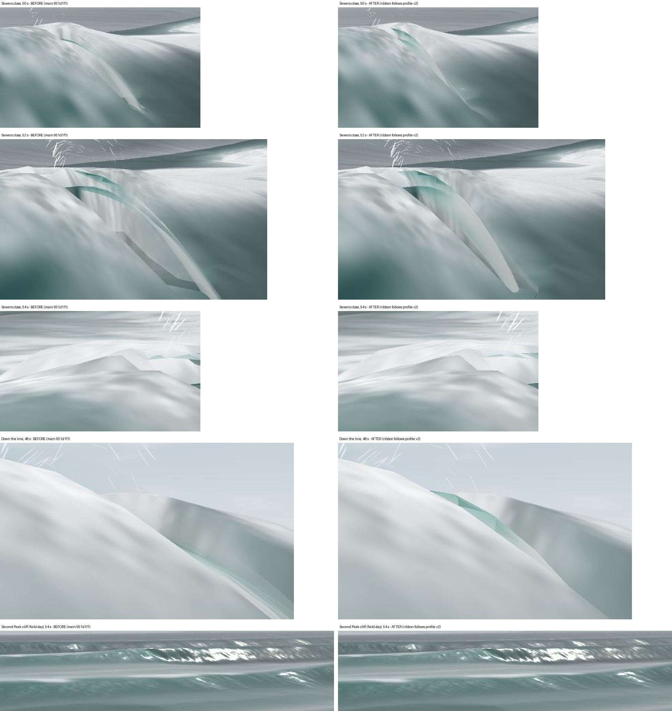

# The ribbon follows profile v2 — 2026-09-24

Track L of the second curl wave. Base `951d1f1` (main, with Track G's profile
v2 merged). Works the receiver contract Track G wrote for the mesh
([BREAKER_PROFILE_V2_2026-09-24.md](BREAKER_PROFILE_V2_2026-09-24.md) §5,
items 1–6) against `web-three/js/tube.js`, the TUBE-guarded blocks in
`shaders.js`, and one guarded edit in `shared/model-glsl.js`. The profile GLSL
is untouched. The default build is byte-identical to main (§4).

## Finding

The ribbon now draws the v2 section at its own reach and aspect. At Sewers
the landing seam sits at 0.94 hC from the crest (0.97 and 0.86 at the other
two probed stations), which is `bpReach/hC` exactly, where before it was
stretched onto the shared receiver's 1.6 hC and shrank through the life
(σ/VIS 1.68 → 0.97 over 0.05–0.70 s). The back seam holds to 0.000 m for the
whole life (before: 1.8–2.5 m adrift from 0.50 s, the v1 release acting on a
v2 roof that never left the crest). The face leg is dark where the lens is
open and white where the face has risen onto the roof, per vertex, from the
profile's own closure front. The shared receiver is plunge-scaled under TUBE
and lands 0.86–0.87 hC from the impact crest, 0.00–0.11 hC short of the
profile because the card day is height-limited at these stations. At the
Sewers close camera the 52 s head is a compact hook about half the length of
the blade it replaces, with an open teal lens under the root and no pale
panel; down the line at 48 s the roof is a short wedge at the head instead of
a ledge to the horizon. Second Peak from the cliff is unchanged to JPEG noise,
by design (weight ≤ 0.16, reach 0.12 hC).

What did not close: the `#crash=1` plume's contact still stands 3–4.7 m
behind and 4–5 m below the ribbon's foot, because the plume takes the reach in
physical metres and the ribbon and receiver take it at VIS (§3, item 6); the
receiver's source point is drawn 2.6–3.9 m behind the foot by the grid's own
choppy drift plus the crest's advance after impact; and on the `#tube=1`-alone
arm (the residual fold, TUBE_MESH) the foot's drift inversion is refused at
some ages and the face leg drags into a pale triangle — the classic arm is
still the one to judge.

## 1. What changed

| file | change |
|---|---|
| `web-three/js/tube.js` | landing seam at `bpReach·VIS` along the sweep axis from the crest source, `σ = VIS`, a two-step inverse of the grid's drift so the seam lands under the tip; back seam held for the whole life; `bpFaceClosure` per vertex into `vTubeM.w`; the aerated material keys the bore on it (was `smoothstep(0.40, 0.60, age)`) and stops darkening the inside behind the front |
| `shared/model-glsl.js` | inside `#ifdef TUBE`, gated on `u_tube`: `breakerLandingFrameAt`'s `zL` is `zc + CURT_REACH·hC·smoothstep(0.45, 1.25, u_xi)` (bpPlunge's text) and the classic 1.6 extension is retired. `u_tube` is declared in the model's own guard since the receiver reads it |
| `web-three/js/shaders.js` (TUBE guards only) | `u_tube` declaration moved to the model; the carve's `sqrt` argument is `dzCT·CURT_REACH/reachT` with `reachT = bpReach·VIS` (item 5) |
| `scripts/probe_tube.mjs` | repaired (§2.4); asserts the §5.4 contract; reads back `c`, `bpReach`, the receiver, the impact crest, the drawn receiver and the closure |
| `scripts/capture_tube_ab.mjs` | `secondpeak_cliff` rig (Track J's field-day hash) |
| `scripts/build_tube_v2_sheet.py` | the before/after head-crop sheet |

## 2. The contract, item by item

Numbers are the Sewers card day (H0 2.2 m, T 15 s), stations x = −84, −52,
−20, `#tube=1&classic=1&descent=1`, from
`qa/tube-v2-2026-09-24/probe-tubeclassic/probe.json` (this tree) and the same
probe run against `git archive 951d1f1` (before). hC is the physical ceiling
(2.33–2.44 m), hCd = hC·VIS the displayed one (7.47–7.81 m).

**1. Landing seam follows `bpReach` — done.** `sL = bpReach(u_xi, hC, c)`;
the seam source is `sL·VIS` along the sweep axis from the crest source and
`σ = VIS`, the receiver's own anisotropy (its hC is displayed). Readback:
`landRatio` 0.970 / 0.943 / 0.862 at the three stations, equal to the GPU's
`bpReach` to 1e-4 and to `0.5·plunge·c·√(2hC/g)` re-derived from the read-back
c (6.86 / 6.70 / 6.23 m/s) to 2e-3; `σ/VIS` 1.000 at every age. Before:
`landRatio` was the same 0.94 (the profile was already v2) but `σ/VIS` ran
1.684 → 0.970 across the life and the drawn reach 1.59 → 0.91 hCd, the
stretch §5.1 describes.

The grid's choppy offset draws a source point ahead of the crest pulled back
toward it: a single `surfacePos` at the seam source landed 2.4 m behind the
tip's plan position. Two fixed-point steps, each bounded by the reach, bring
the plan miss to 0.11–0.18 m on this arm (median over visible ages). The
vertical miss, 2.1–3.1 m, is the carved face standing at its 0.35 hCT floor
above the profile's y = 0 landing — the §6 contract (§5 below), absorbed by
the seam blend on the face leg's flat run.

**Receiver.** Under TUBE, gated on `u_tube`, `zL = zc + CURT_REACH·hC·plunge`
with the classic 1.6 extension off. `(zL − zc_impact)/hCd` reads 0.873 /
0.867 / 0.863 against the profile's 0.970 / 0.943 / 0.862: the coincidence
Track G derived (0.895 vs 0.9) holds at depth-limited pairs, and this card
day is height-limited at x = −84 and −52 (`H0·Ks < GAMMA·dep`, so hC sits
below the depth-limited ceiling and the reach in hC units is larger). The
probe bounds it at 0.15, the doc's sheet-case bracket. In drawn metres the
receiver's source point is 2.6–3.9 m behind the ribbon's foot over 0.40–0.65 s:
~2 m of choppy drift (the receiver is a source point; the foot is
drift-inverted onto the tip), 0.6 m from the ratio gap, and after impact the
crest's advance `c·(age − 0.42)` — the receiver is authored about the crest at
impact and stays where the deposit lands; the ribbon rides the live crest.
Which frame the landed water should follow is the open question, not a
number to tune.

**2. Back seam attached for the whole life — done.** `wB = 1 − smoothstep(0,
0.15, u)`, no release. Before: back-seam gap 0.08 m at 0.45 s and 1.77 / 2.28 /
2.30 / 2.32 m at 0.50 / 0.55 / 0.60 / 0.65 s (x = −52; 1.86–2.51 m at x = −20).
After: 0.000 m at every age at every station, asserted for all ages with
alpha > 0.02.

**3. Face leg keyed on `bpFaceClosure` — done.** The vertex evaluates
`bpFaceClosure(u, age)` on the face leg and, on the sheet legs, the closure of
the face point at the same σ (the face rises to the underside at σ = f, so the
roof's underside and the risen face, coincident there, whiten together).
`TUBE_FRAG`'s bore term is `(1 − onBack)·closure·(0.70 + 0.30·lump)` in place
of `onFace·smoothstep(0.40, 0.60, age)`; the seen-from-inside darkening
(`0.60·inside`, and the halving of white inside) fades with closure, since
behind the front there is no hollow. Readback at the six face-leg vertices
u = 0.8 … 1.0: 0.45 s → 0, 0, 0, 0, 0, 0.02; 0.55 s → 0, 0, 0, 0.31, 0.88, 1;
0.65 s → 0, 0.98, 1, 1, 1, 1. The age window would have whitened the whole
leg 0.25 at 0.45 s and 1.0 from 0.60 s. The glass look (`#tubelook=0`) is
untouched.

**4. `probe_tube.mjs` — done, and repaired.** The probe had not compiled since
Track H landed: it turns `TUBE_VERT` into a fragment pass by stripping a fixed
list of varyings, and Track H's `vTubeM` was not on it (`l-value required
(can't modify an input "vTubeM")`). It now strips every `vTube*` varying by
pattern. Assertions: `landRatio == bpReach/hC` (GPU) and `== 0.5·plunge·c·
√(2hC/g)/hC` (formula from the GLSL constants and the read-back c, hC);
`σ == VIS`; back seam < 0.05 m for the whole life; landing seam < 0.05 m from
impact; receiver within 0.15 hC of the profile in the impact frame; cavity
> 0.3 hC; no folds on the classic arm; seek independence. Both arms pass:

| | classic arm | `#tube=1` alone |
|---|---|---|
| landRatio (x −84 / −52 / −20) | 0.970 / 0.943 / 0.862 | same |
| receiver ratio | 0.873 / 0.867 / 0.863 | same |
| back seam, max over life | 0.000 m | 0.000 m |
| landing seam from impact | 0.000 m | 0.000 m |
| cavity max | 0.61 / 0.62 / 0.63 hC | 0.65 / 0.66 / 0.67 hC |
| largest grid fold under the ribbon (on / off) | 0 / 1.8–4.2 m | 1.3–4.5 / 7.9–13.8 m |
| tip-to-seam plan miss, median (max) | 0.11–0.17 m (0.18) | 0.06–0.29 m (7.5–8.5) |
| tip-to-seam vertical miss | 2.1–3.1 m | 2.1–4.5 m |

The cavity is unchanged from Track B's 0.62–0.67 hC. The tube-alone maximum
is the fold: where the source→drawn map folds, the first miss reads 4–8 m,
the bound refuses it, and the seam blend drags the face leg's last 15% back
under the crest (§4, the pale triangle).

**5. Carve extent follows `bpReach` — done as a horizontal scale.** The
carve's `sqrt` argument is `dzCT·CURT_REACH/reachT` with `reachT = bpReach·VIS`
(floored at 0.05 hCT): text-for-value where the reach is 0.9 hCT, so at
Sewers (reachT/0.9 hCT = 1.05) the face reaches its 0.35 floor at 0.25 hCT
instead of 0.24 and the cavity is unchanged; at Second Peak (0.12 hC) the fall
compresses 7.5× under a gate that is ≤ 0.16 anyway. A hard end to the carve
at the landing was not done: beyond the foot the un-carved grid is the
sharpened carrier crest, well above the 0.35 floor, so ending the carve there
would stand a step up a few metres ahead of the foot. The 0.35 shelf continues
to the pocket gate's end, as shipped.

**6. Plume contact vs the ribbon foot — measured, not closed.**
`scripts/probe_crash.mjs` re-run on this tree: all assertions pass, default
parity 0 pixels at 4 frames. Against the ribbon probe at the same stations and
clocks (`qa/tube-v2-2026-09-24/probe-tubeclassic/probe.rows.json` vs the
crash probe's rows), at 0.45 s:

| x | foot ahead of lip | contact ahead of lip | plan gap | foot above contact |
|---|---|---|---|---|
| −84 | 4.47 m | 2.65 m | 3.00 m | 4.00 m |
| −52 | 6.44 m | 2.66 m | 4.72 m | 4.93 m |
| −20 | 6.06 m | 2.74 m | 3.85 m | 4.84 m |

The contact is at the `PLUME_REACH_MIN_HC` floor (0.35 hCd = 2.65–2.74 m)
because the plume takes `bpReach(ξ, hC/VIS, c)` in physical metres (2.2 m at
Sewers) and the floor binds; the ribbon and the receiver take the reach at
VIS (7.1 m). The contact's level is `lip − hC` (still water under the crest);
the foot is on the carved face 0.35 hCT up. I1's 3–5 m disagreement is
therefore the anisotropy, not the profile, and it survives v2. The fix is in
`PLUME_VERT` (Track I1's block, not edited here): `sL = max(bpReach(u_xi,
hC/VIS, cPh)*VIS, PLUME_REACH_MIN_HC*hC)` puts the contact 7.1 m ahead and the
floor stops binding; the level should be the drawn landing (the ribbon's PL,
or `surfacePos` at the receiver's source) rather than `lip − hC` if the plume
is to erupt from the foot.

## 3. Frames

`qa/tube-v2-2026-09-24/`: `before/` is `git archive 951d1f1` served on a
second port, `after/` and `after-secondpeak/` this tree, all
`scripts/capture_tube_ab.mjs`, 1000 × 625, camera drift 0.000 m per manifest.
Arms: `off`, `on` (`#tube=1`), `tubeclassic` (`#tube=1&classic=1&descent=1`).
The 2× head crops, before left and after right, tube+classic arm:



Having opened them:

- **Sewers close, 52 s** (eye [12, 11, −190] → [−52, 4, −229] stage). Before:
  a long grey glassy blade from the crest running ~250 px down the face to
  the lower right, two thin edges over a pale panel with a dark shadow line
  under it. After: a compact grey-white hook about half that length, curling
  from the crest to a foot on the face; under its root two teal bands, the
  open lens seen through the sheet; no panel, no shadow line. It reads as a
  curl at the head rather than a slab laid down the face.
- **Sewers close, 50 s**: the same in a younger head — before a thin
  diagonal blade, after a short teal-white arc hugging the crest.
- **Sewers close, 54 s**: identical before and after but for 948 pixels at
  the right edge; the head has run past this fixed camera and the frame is
  the bore, as Track G found.
- **Down the line, 48 s** (eye [−36, 6, −222] → [−48, 6, −233]). Before: the
  roof as a thin glassy ledge with a teal underside line running from the
  head toward the horizon (the stretched reach at every station). After: a
  short teal-and-white wedge at the head and the crest line beyond it bare.
  The ribbon is as long along the line as the lifecycle makes it (~V_p ×
  0.7 s), not longer.
- **`#tube=1` alone, 52 s** (`after/sewers_close_on_52.jpg`, opened at 2×): a
  pale near-vertical translucent triangle hangs from the crest to the water
  under it. That is the seam dragging the face leg where the fold refuses
  the drift inversion (§2.4). The arm has the residual fold Track B measured
  and was not the arm to judge before this track; it still is not.
- **Second Peak, cliff, field day** (`#preset=secondpeak&cam=cliff&day=
  overhead&h0=0.914&tide=0.357`, 52–56 s): before and after differ by 7–37
  pixels at ≤ 21 levels (JPEG noise); off vs tube+classic differ by 3.7–6.4 k
  pixels, all of it the classic arm's shoulder. The ribbon at ξ 0.65 is
  weight ≤ 0.16 and 0.12 hC of reach and is not resolvable from the cliff.
  The frame shows the peeling line with its white lip band at the right;
  nothing here tests the section against the clip.

## 4. Parity

Default boot (no `#tube`) on this tree against `git archive 951d1f1`:
`scripts/capture_tube_ab.mjs` `ONLY_PARITY=1` PNGs **byte-identical** at the
Sewers close camera (48 s), Sewers `#cam=cliff` (42 s) and Second Peak
`#cam=lookout` (48 s) (`qa/tube-v2-2026-09-24/parity/parity.json`);
`scripts/probe_crash.mjs` pixel parity **0 pixels** at four frames (close 48 s
and 47.66 s, lookout 48 and 51 s). The model edit is inside `#ifdef TUBE` and
gated on `u_tube`, so a `#crash=1` boot without `#tube` (the plume material
defines TUBE privately) keeps the shipped receiver; `tests/breaker-anatomy`'s
"landing derived in exactly one place" still holds. `npm test` 248/248.

## 5. Limits and what still reads wrong

- **The foot is on the face, not at still water, by 2.1–3.1 m.** The
  profile's L = (sL, 0) meets a grid whose carved face stands at 0.35 hCT;
  the seam blend hides the difference on the face leg's flat run. Track G's
  §6 asks for the seam on the face ~0.5 H_f below the crest; that needs the
  profile to take a landing height — `L = (sL, yL)` with the face Bezier's
  control on `yL` rather than still water, and `bpReach` unchanged — a
  `shared/breaker-profile-glsl.js` change (not made here). A mesh-only
  `#tubefoot=face` was tried on paper and rejected: with the interior legs
  still descending to y = 0 the seam would fold the face leg's end back up
  over the sheet's tip.
- **Receiver drawn 2.6–3.9 m behind the foot** (§2.1): drift, the height-
  limited ratio gap, and the impact-frame vs live-crest question.
- **Plume 3–4.7 m behind and 4–5 m below the foot** (§2.6): one line in
  `PLUME_VERT`.
- **The tube-alone arm's triangle** (§3): the fold, not the seam; judge the
  classic arm.
- **Coincident surfaces after closure.** Where the face has risen onto the
  underside the mesh draws two sheets in one place; both are white there, so
  no fight is visible in the frames, but the face leg could be faded where
  closure = 1 and the sheet is gone.
- The carve's floor still runs to the pocket gate's end beyond the foot (§2.5).

## 6. Reproduction

```sh
python3 scripts/serve.py 8147                                       # this tree
# git archive 951d1f1 into a scratch dir, python3 scripts/serve.py 8148 there   # before / parity
export PLAYWRIGHT_DIR=/Users/andyed/Documents/dev/psychodeli-webgl-port/node_modules/playwright/index.mjs
BASE_URL=http://127.0.0.1:8147 FLAGS='&classic=1&descent=1' TUBE_S_SWEEP=0.3 node scripts/probe_tube.mjs qa/tube-v2-2026-09-24/probe-tubeclassic
BASE_URL=http://127.0.0.1:8147 TUBE_S_SWEEP=0.3 node scripts/probe_tube.mjs qa/tube-v2-2026-09-24/probe-tube
BASE_URL=http://127.0.0.1:8147 RIGS=sewers_close,diag_downline SIMS=48,50,52,54 \
  'ARMS=off:,on:&tube=1,tubeclassic:&tube=1&classic=1&descent=1' node scripts/capture_tube_ab.mjs qa/tube-v2-2026-09-24/after
BASE_URL=http://127.0.0.1:8147 RIGS=secondpeak_cliff SIMS=52,54,56 \
  'ARMS=off:,on:&tube=1,tubeclassic:&tube=1&classic=1&descent=1' node scripts/capture_tube_ab.mjs qa/tube-v2-2026-09-24/after-secondpeak
BASE_URL=http://127.0.0.1:8147 MAIN_URL=http://127.0.0.1:8148 ONLY_PARITY=1 node scripts/capture_tube_ab.mjs qa/tube-v2-2026-09-24/parity
node scripts/probe_crash.mjs --base-url=http://127.0.0.1:8147 --baseline-url=http://127.0.0.1:8148 --out=/tmp/probe-crash
python3 scripts/build_tube_v2_sheet.py
npm test
```
